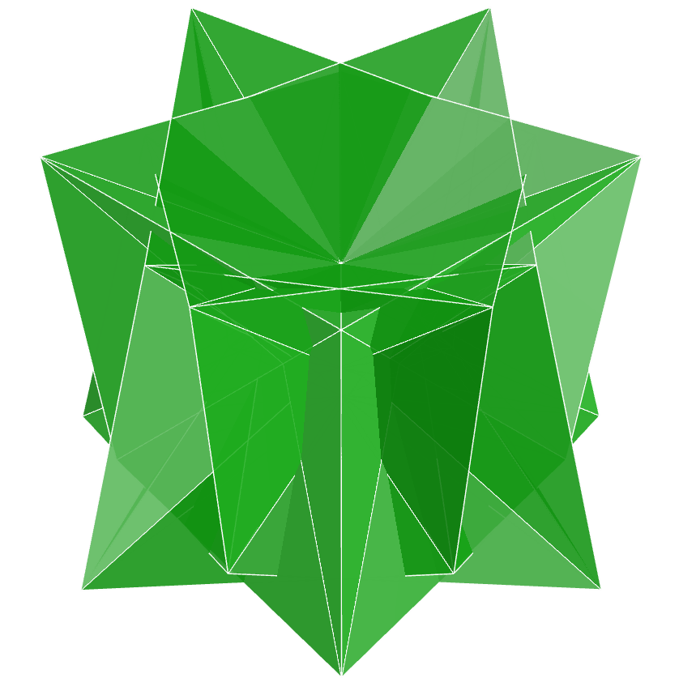
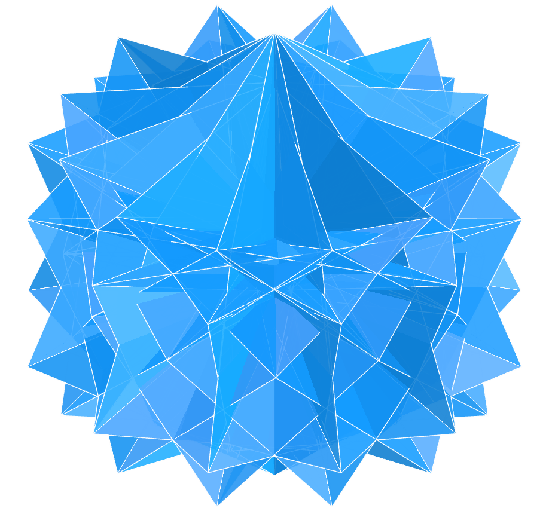
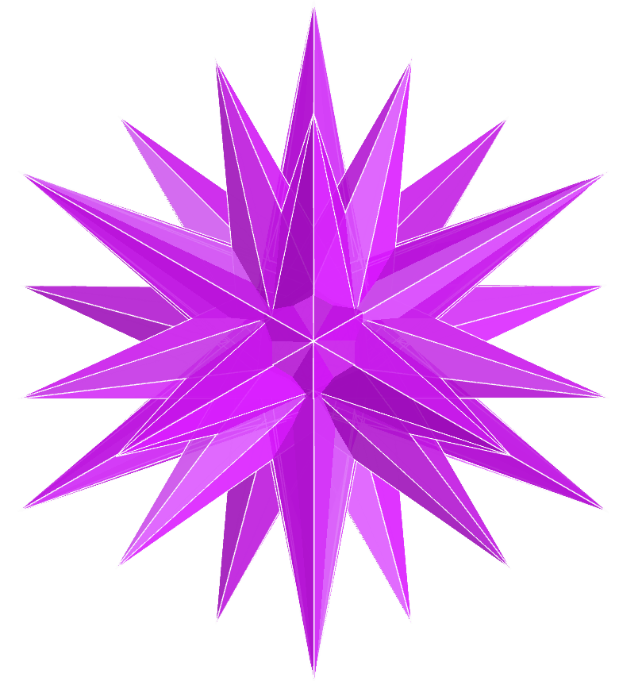
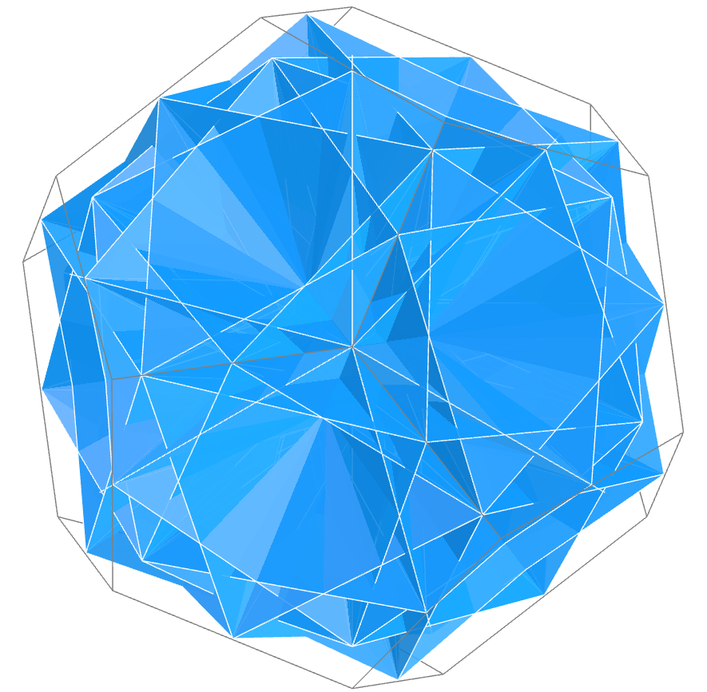
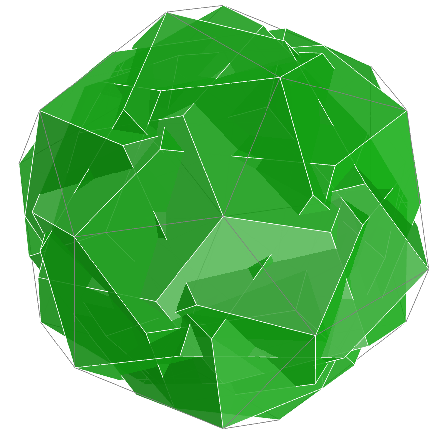
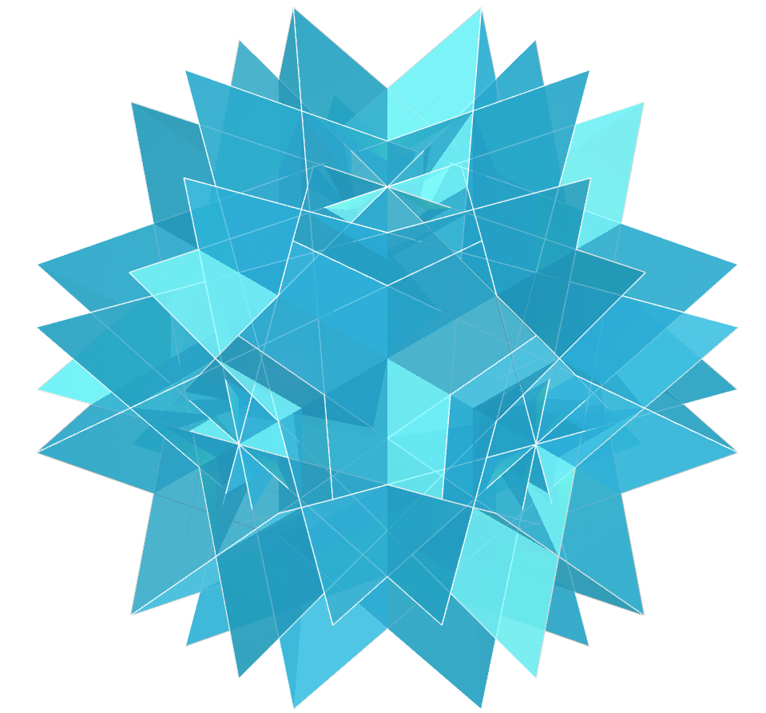
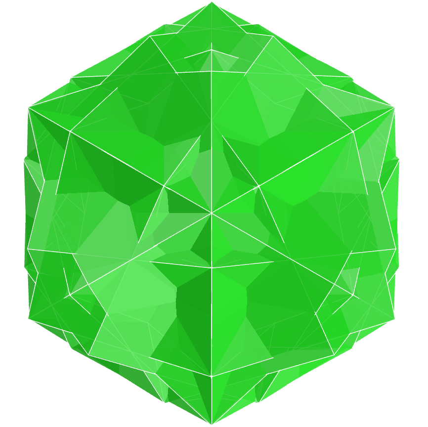
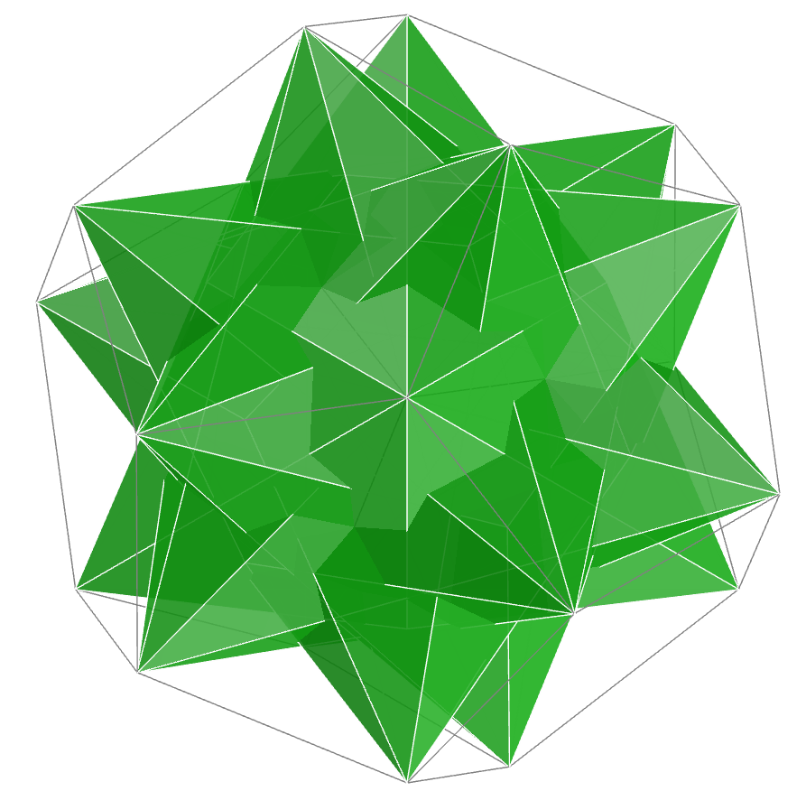
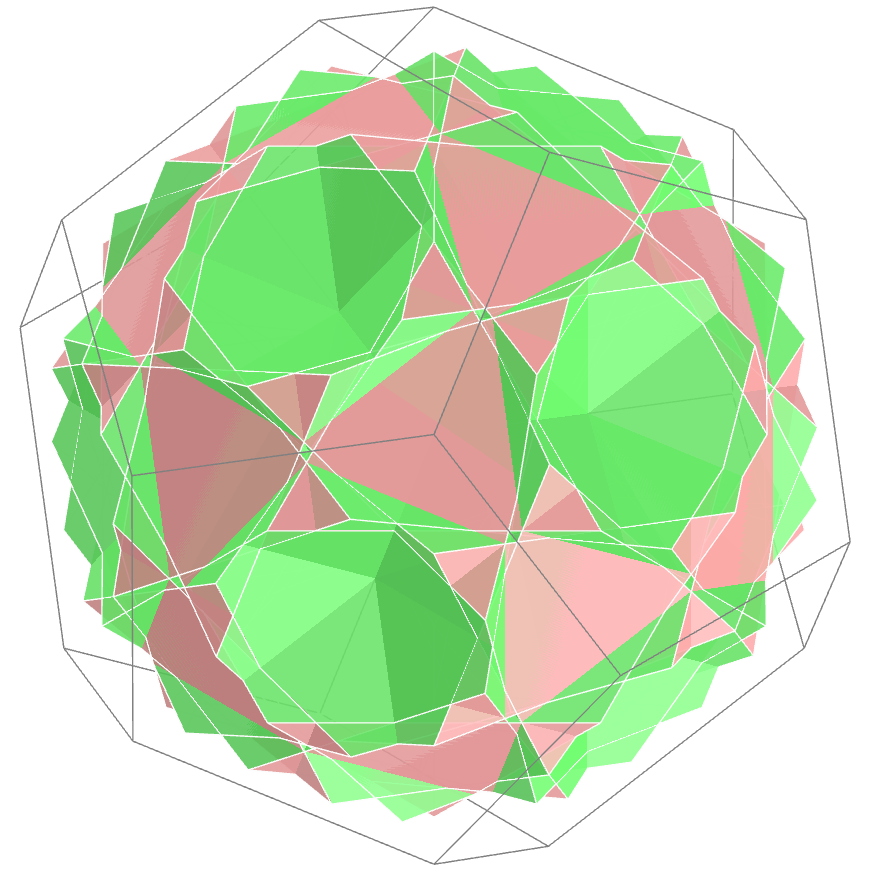

<link rel="stylesheet" href="../scripts/style.css">
<meta charset="utf-8">
<link rel="icon" type="image/png" href="vr/salas/imagens/icone.png">
<h2>Visualization of Polyhedra with Virtual Reality (VR) in A-frame</h2>
 <b>author:</b> Paulo Henrique Siqueira - Universidade Federal do Paraná
  <b>contact:</b> <a href="#">paulohscwb@gmail.com</a>
  <a href="https://paulohscwb.github.io/polycompound/compounds1/pt-br/">versão em português</a>
 <form style="margin: 0 auto; float:right; text-align:right; width:100%; margin-bottom:15px;">
	<select id="url" onchange="urlHandler(this.value)" style="color:royalblue;">
		<option disabled selected value>More solids:</option>
		<option disabled value="../compounds1/">Tetrahedra family</option>
		<option value="../compounds2/">Cube family</option>
		<!--<option value="../compounds3/">Octahedra family</option>
		<option value="../compounds4/">Compounds of dual polyhedra</option>
		<option value="../compounds5/">Compounds of two polyhedra</option>-->
	</select>
</form>

  <h2 align="center"> Tetrahedra family</h2>
A polyhedral compound is an arrangement of several interpenetrating polyhedra, all the same or of distinct types. Polyhedral compounds often have visually interesting symmetrical properties. Compounds of multiple Platonic and Archimedean solids can be especially appealing, as can compounds of these solids and their duals.
 This work shows polyhedral compounds, modeled for viewing in Virtual Reality.

<a href="#m3d">3D Models</a>&nbsp;&nbsp;|&nbsp;&nbsp;<a href="../">Home</a>

 

<h3 id="m3d" align="center">3D models</h3>
<iframe width="560" height="315" style="max-width:100%" src="https://www.youtube.com/embed/videoseries?list=PLy0I_lGW8HxXSZ0YVJejbOVBsCkdJDlhl" title="YouTube video player" frameborder="0" allow="accelerometer; autoplay; clipboard-write; encrypted-media; gyroscope; picture-in-picture; web-share" allowfullscreen></iframe>
<h4>1. Chamfered tetrahedron</h4>

  The chiricosahedron is composed of five polyhedra and can be considered regular. In this compound, we have the vertices of the five chosen polyhedra forming a convex hull with common vertices, or with correspondence with the faces of a regular dodecahedron.
  

<h4>2. Hexakis Tetrahedron 1</h4>

  The result of "Compound 1" of 4 polyhedra is a stellated polyhedron, resembling stellated pyramids.
  

<h4>3. Hexakis Tetrahedron 2</h4>

  The result of "Compound 2" of 3 polyhedra is a stellated polyhedron, resembling stellated trapezohedrons.
  

<h4>4. Hexakis Tetrahedron 3</h4>

  The result of "Compound 3" of 14 polyhedra is a stellated polyhedron, resembling double stellated pyramids.
  

<h4>5. Hexakis Tetrahedron 4</h4>

  The Escher compound can be adapted to the tetrahedra family using 10 polyhedra. The result of this composition is a solid that resembles the Escher solid. The central image of the 1948 engraving Stars popularized the Escher compound of octahedra.
  

<h4>6. Joined Truncated Tetrahedron</h4>

  The disnubahedron is a compound of twelve polyhedra, forming a uniform polyhedron. This is a special case of the small snubahedron, with double symmetry and rotation angles of 30&ordm; or 45&ordm;.
  

<h4>7. Möbius Deltahedron</h4>

  The icosicosahedron is a compound of ten polyhedra and can be considered as a regular compound of polyhedra. The vertices coincide in pairs, and form a convex hull with the vertices of a regular dodecahedron.
  

<h4>8. Möbius Deltahedron Dual</h4>

  The small snubahedron is a compound of six polyhedra with rotational freedom. The examples in this work show rotations with angles of 30&ordm;.
  

<a href="#p1" class="topo">back to top</a>

<h4>9. Propellor Tetrahedron</h4>

  The snubahedron is a compound of six polyhedra, with rotation angles of 45&ordm;.
  

<h4>10. Tetartoid</h4>

  The chiricosahedron is composed of five polyhedra and can be considered regular. In this compound, we have the vertices of the five chosen polyhedra forming a convex hull with common vertices, or with correspondence with the faces of a regular dodecahedron.
  

<h4>11. Tetrahedron</h4>

  The disnubahedron is a compound of twelve polyhedra, forming a uniform polyhedron. This is a special case of the small snubahedron, with double symmetry and rotation angles of 30&ordm; or 45&ordm;.
  

<h4>12. Trapezohedral Tristetrahedron 1</h4>

  The small snubahedron is a compound of six polyhedra with rotational freedom. The examples in this work show rotations with angles of 30&ordm;.
  

<h4>13. Trapezohedral Tristetrahedron 2</h4>

  The Escher compound can be adapted to the tetrahedra family using 10 polyhedra. The result of this composition is a solid that resembles the Escher solid. The central image of the 1948 engraving Stars popularized the Escher compound of octahedra.
  

<h4>14. Triakis Tetrahedron</h4>

  The chiricosahedron is composed of five polyhedra and can be considered regular. In this compound, we have the vertices of the five chosen polyhedra forming a convex hull with common vertices, or with correspondence with the faces of a regular dodecahedron.
  

<h4>15. Truncated Tetrahedron</h4>

  The icosicosahedron is a compound of ten polyhedra and can be considered as a regular compound of polyhedra. The vertices coincide in pairs, and form a convex hull with the vertices of a regular dodecahedron.
  

<a href="#p1" class="topo">back to top</a>

  Polyhedral Compound - Tetrahedra family: visualization with Virtual Reality by <a xmlns:cc="http://creativecommons.org/ns#" href="https://paulohscwb.github.io/polycompound/compounds1/" property="cc:attributionName" rel="cc:attributionURL">Paulo Henrique Siqueira</a> is licensed with a license <a rel="license" href="http://creativecommons.org/licenses/by-nc-nd/4.0/">Creative Commons Attribution-NonCommercial-NoDerivatives 4.0 International</a>.

<h4>How to cite this work:</h4> 

Siqueira, P.H., "Polyhedral Compound - Tetrahedra family: visualization with Virtual Reality". Available in: <https://paulohscwb.github.io/polycompound/compounds1/>, March 2025.

<!---->
  <b>References:</b>
 Weisstein, Eric W. "Polyhedron Compound" From MathWorld-A Wolfram Web Resource. <a href="https://mathworld.wolfram.com/ArchimedeanDual.html" target="_blank">https://mathworld.wolfram.com/PolyhedronCompound.html</a>
 Weisstein, Eric W. "Uniform Polyhedron." From MathWorld--A Wolfram Web Resource. <a href="https://mathworld.wolfram.com/UniformPolyhedron.html" target="_blank">https://mathworld.wolfram.com/UniformPolyhedron.html</a>
 McCooey, David I. "Visual Polyhedra". <a href="http://dmccooey.com/polyhedra/" target="_blank">http://dmccooey.com/polyhedra/</a>
