<link rel="stylesheet" href="../../scripts/style.css">
<meta charset="utf-8">
<link rel="icon" type="image/png" href="../vr/salas/imagens/icone.png">
<h2>Visualização de Poliedros com Realidade Virtual (RV) em A-frame</h2>
<b>autor:</b> Paulo Henrique Siqueira - Universidade Federal do Paraná
 <b>contato:</b> <a href="#"> paulohscwb@gmail.com </a>
 <a href="https://paulohscwb.github.io/polycompound/compounds1/">english version</a>
<form style="margin: 0 auto; float:right; text-align:right; width:100%; margin-bottom:15px;">
	<select id="url" onchange="urlHandler(this.value)" style="color:royalblue;">
		<option disabled selected>Mais sólidos:</option>
		<option disabled value="../../compounds1/pt-br/">Família dos tetraedros</option>
		<!--<option value="../../compounds2/pt-br/">Família dos cubos</option>
		<option value="../../compounds3/pt-br/">Família dos octaedros</option>
		<option value="../../compounds4/pt-br/">Compostos de poliedros duais</option>
		<option value="../../compounds5/pt-br/">Compostos de dois poliedros</option>-->
	</select>
</form>

  <h2 align="center">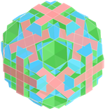 Família dos tetraedros</h2>
  Um composto poliédrico é um arranjo de vários poliedros interpenetrantes, todos iguais ou de tipos distintos. Os compostos poliédricos geralmente têm propriedades simétricas visualmente interessantes. Compostos de múltiplos sólidos Platônicos e Arquimedianos podem ser especialmente atraentes, assim como compostos desses sólidos e seus duais.
 Este trabalho mostra os compostos de poliedros, modelados para visualização em Realidade Virtual.
 
<a href="#m3d">Modelos 3D</a>&nbsp;&nbsp;|&nbsp;&nbsp;<a href="../../pt-br/">Página Inicial</a>

  
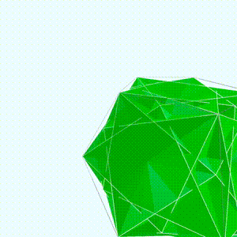
 

<h3 id="m3d" align="center">Modelos 3D</h3>
<iframe width="560" height="315" style="max-width:100%" src="https://www.youtube.com/embed/videoseries?list=PLy0I_lGW8HxXSZ0YVJejbOVBsCkdJDlhl" title="YouTube video player" frameborder="0" allow="accelerometer; autoplay; clipboard-write; encrypted-media; gyroscope; picture-in-picture; web-share" allowfullscreen></iframe>
<h4>1. Tetraedro Chanfrado</h4>
<a href="../vr/ChamferedTetrahedron.htm" target="_blank" title="modelo 3D" class="fotoA">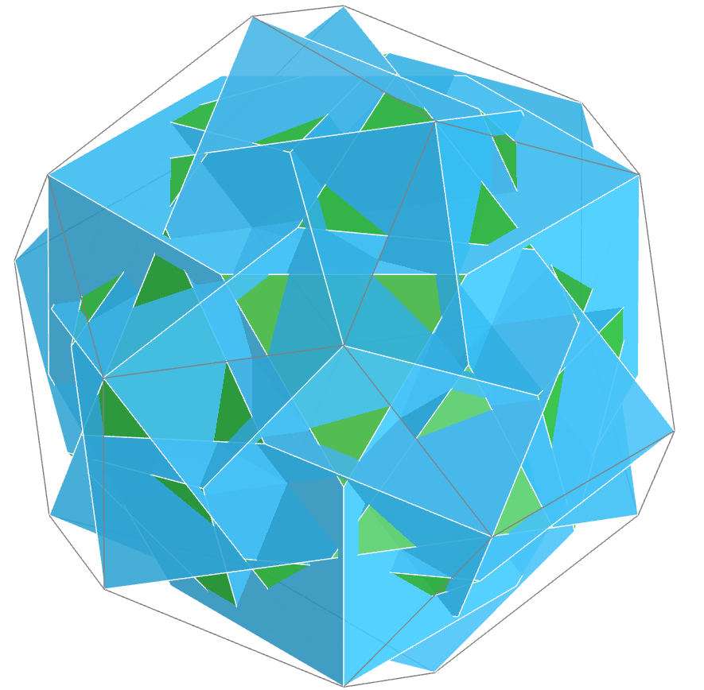</a>
  O quiricosaedro é composto de cinco poliedros e pode ser considerado regular. Neste composto, temos os vértices dos cinco poliedros escolhidos formando um casco convexo com vértices comuns, ou com correspondência com as faces de um dodecaedro regular
  

<h4>2. Tetraedro Hexakis 1</h4>
<a href="../vr/HexakisTetrahedron1.htm" target="_blank" title="modelo 3D" class="fotoA">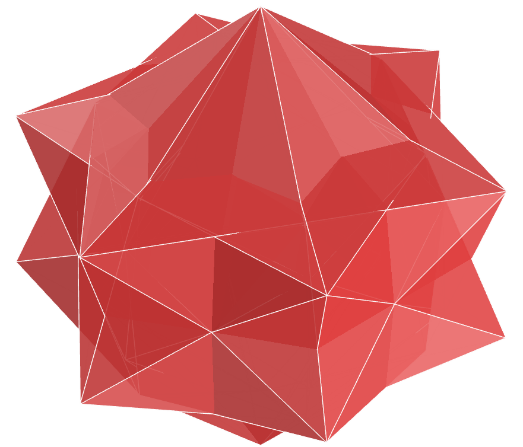</a>
  O resultado do "Composto 1" (Compound 1) de 4 poliedros é um poliedro estrelado, lembrando pirâmides estreladas duplas.
  

<h4>3. Tetraedro Hexakis 2</h4>
<a href="../vr/HexakisTetrahedron2.htm" target="_blank" title="modelo 3D" class="fotoA">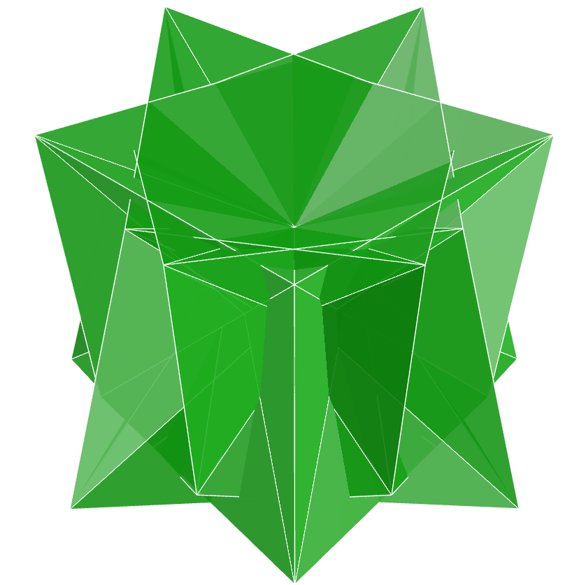</a>
  O resultado do "Composto 2" (Compound 2) de 3 poliedros é um poliedro estrelado, lembrando trapezoedros estrelados.
  

<h4>4. Tetraedro Hexakis 3</h4>
<a href="../vr/HexakisTetrahedron3.htm" target="_blank" title="modelo 3D" class="fotoA">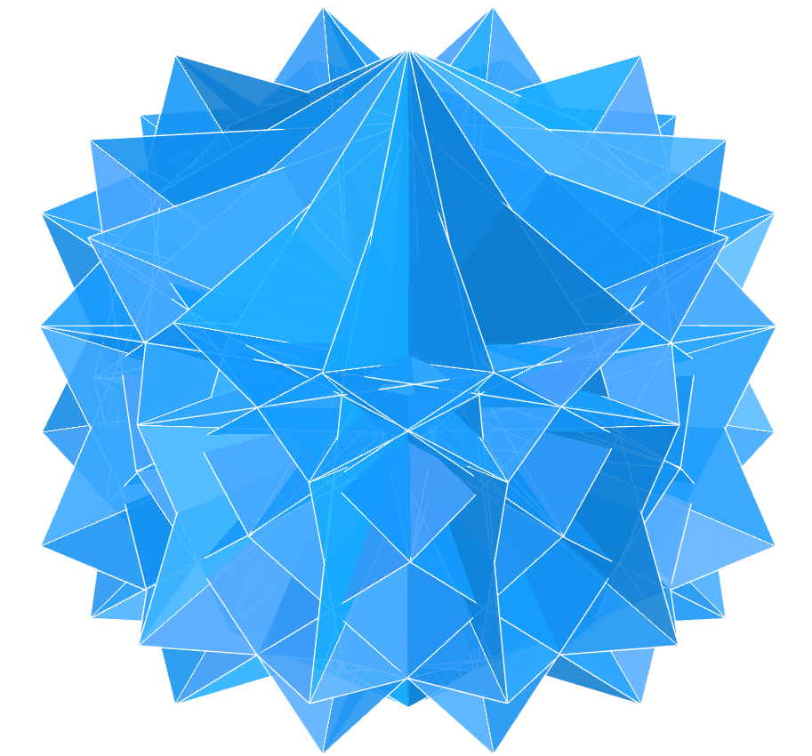</a>
  O resultado do "Composto 3" (Compound 3) de 14 poliedros é um poliedro estrelado, lembrando pirâmides estreladas duplas.
  

<h4>5. Tetraedro Hexakis 4</h4>
<a href="../vr/HexakisTetrahedron4.htm" target="_blank" title="modelo 3D" class="fotoA">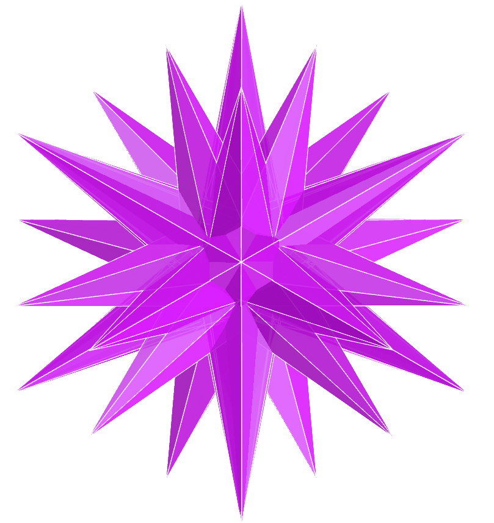</a>
  O composto de Escher pode ser adaptado para a família de tetraedros utilizando-se 10 poliedros. O resultado desta composição é um sólido que lembra o sólido de Escher. A imagem central da gravura Stars de 1948 popularizou o composto de Escher de octaedros.
  

<h4>6. Tetraedro Truncado Combinado</h4>
<a href="../vr/JoinedTruncatedTetrahedron.htm" target="_blank" title="modelo 3D" class="fotoA">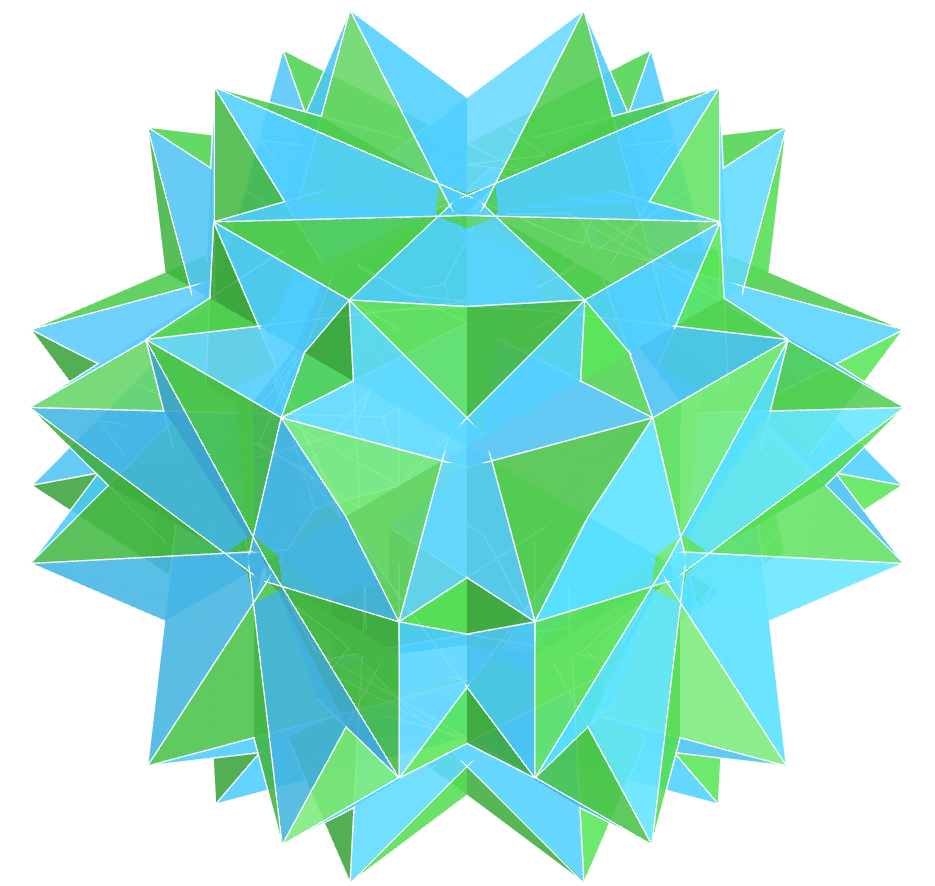</a>
  O disnubaedro é um composto de doze poliedros, formando um poliedro uniforme. Este é um caso especial do pequeno snubaedro, com simetria dupla e ângulos de rotação de de 30&ordm; ou 45&ordm;.
  

<h4>7. Deltaedro de Möbius</h4>
<a href="../vr/MobiusDeltahedron.htm" target="_blank" title="modelo 3D" class="fotoA">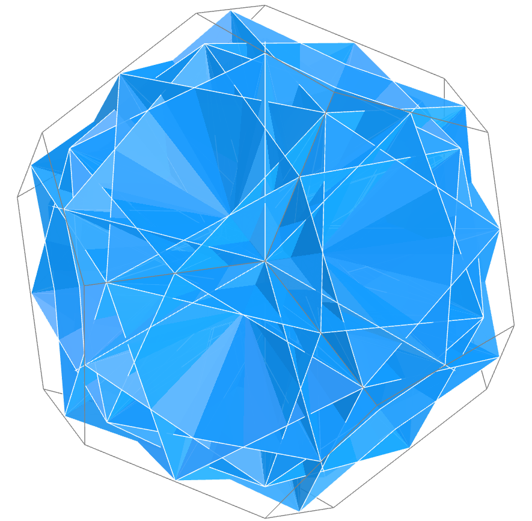</a>
  O icosicosaedro é um composto de dez poliedros e pode ser considerado como um composto regular de poliedros. Os vértices coincidem em pares, e formam um casco convexo com os vértices de um dodecaedro regular.
  

<h4>8. Dual do Deltaedro de Möbius</h4>
<a href="../vr/MobiusDeltahedronDual.htm" target="_blank" title="modelo 3D" class="fotoA">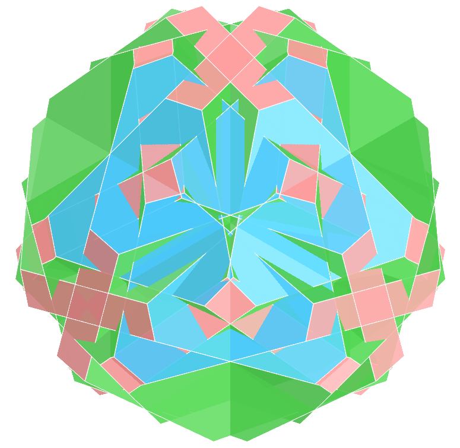</a>
  O pequeno snubaedro é um composto de seis poliedros com liberdade rotacional. Os exemplos neste trabalho mostram rotações com ângulos de 30&ordm;.
  

<a href="#p1" class="topo">voltar ao topo</a>

<h4>9. Tetraedro de hélice</h4>
<a href="../vr/PropellorTetrahedron.htm" target="_blank" title="modelo 3D" class="fotoA">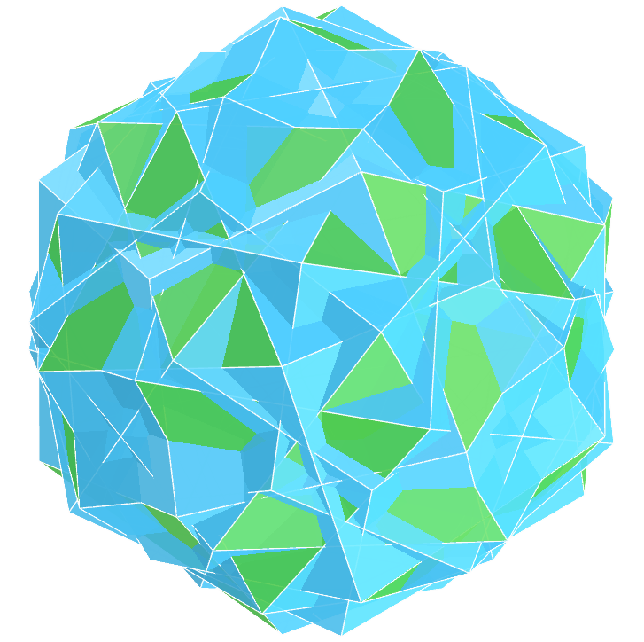</a>
  O snubaedro é um composto de seis poliedros, com ângulos de rotação de 45&ordm;.
  

<h4>10. Tetartoide</h4>
<a href="../vr/Tetartoid.htm" target="_blank" title="modelo 3D" class="fotoA">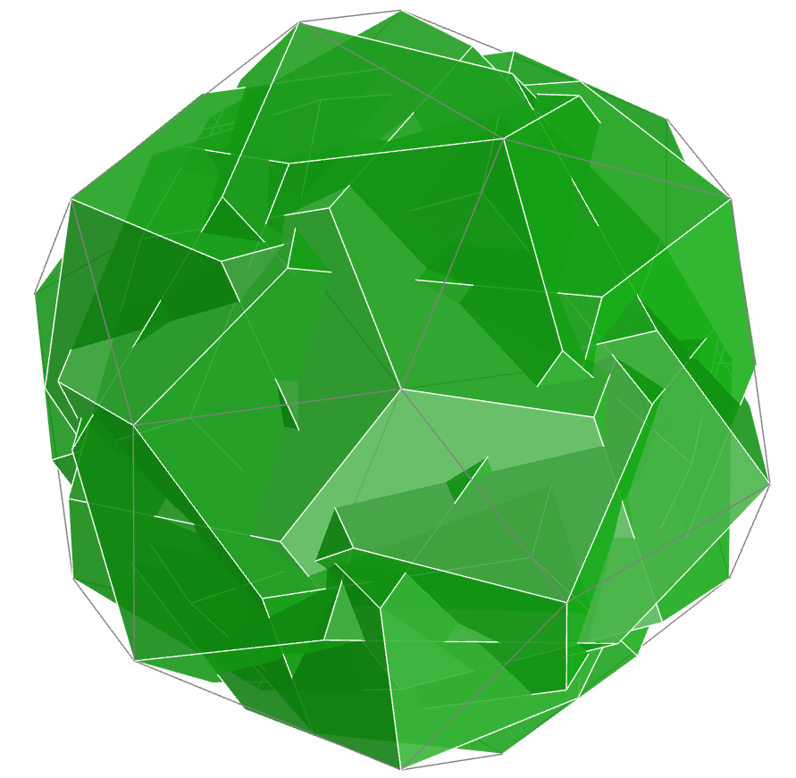</a>
  O quiricosaedro é composto de cinco poliedros e pode ser considerado regular. Neste composto, temos os vértices dos cinco poliedros escolhidos formando um casco convexo com vértices comuns, ou com correspondência com as faces de um dodecaedro regular
  

<h4>11. Tetraedro</h4>
<a href="../vr/Tetrahedron.htm" target="_blank" title="modelo 3D" class="fotoA">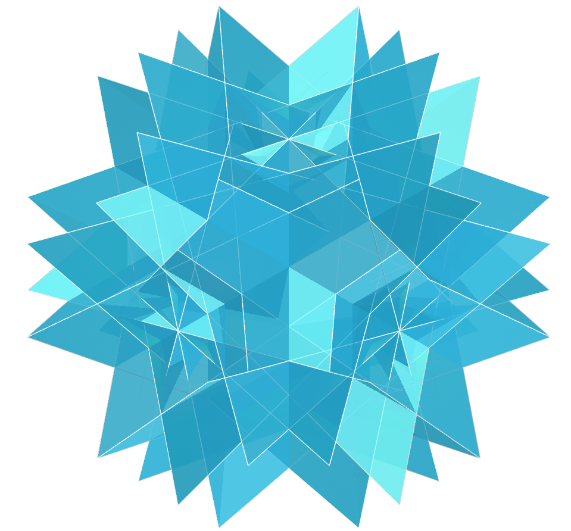</a>
  O disnubaedro é um composto de doze poliedros, formando um poliedro uniforme. Este é um caso especial do pequeno snubaedro, com simetria dupla e ângulos de rotação de de 30&ordm; ou 45&ordm;.
  

<h4>12. Tristetraedro Trapezoédrico 1</h4>
<a href="../vr/TrapezohedralTristetrahedron.htm" target="_blank" title="modelo 3D" class="fotoA">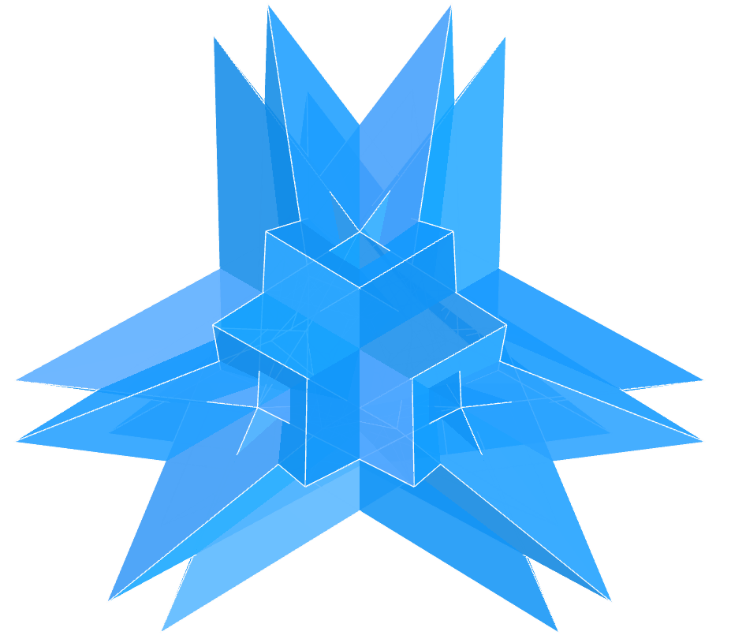</a>
  O pequeno snubaedro é um composto de seis poliedros com liberdade rotacional. Os exemplos neste trabalho mostram rotações com ângulos de 30&ordm;.
  

<h4>13. Tristetraedro Trapezoédrico 2</h4>
<a href="../vr/TrapezohedralTristetrahedron2.htm" target="_blank" title="modelo 3D" class="fotoA">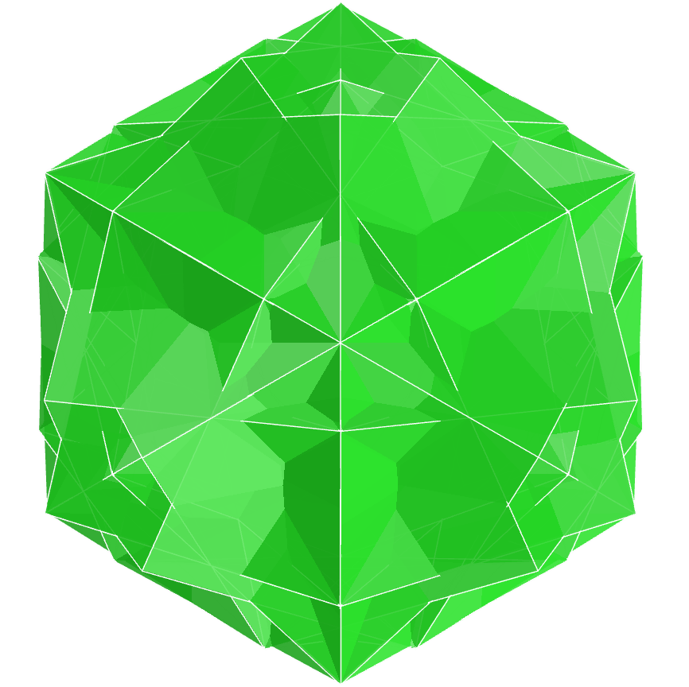</a>
  O composto de Escher pode ser adaptado para a família de tetraedros utilizando-se 10 poliedros. O resultado desta composição é um sólido que lembra o sólido de Escher. A imagem central da gravura Stars de 1948 popularizou o composto de Escher de octaedros.
  

<h4>14. Tetraedro triakis</h4>
<a href="../vr/TriakisTetrahedron.htm" target="_blank" title="modelo 3D" class="fotoA">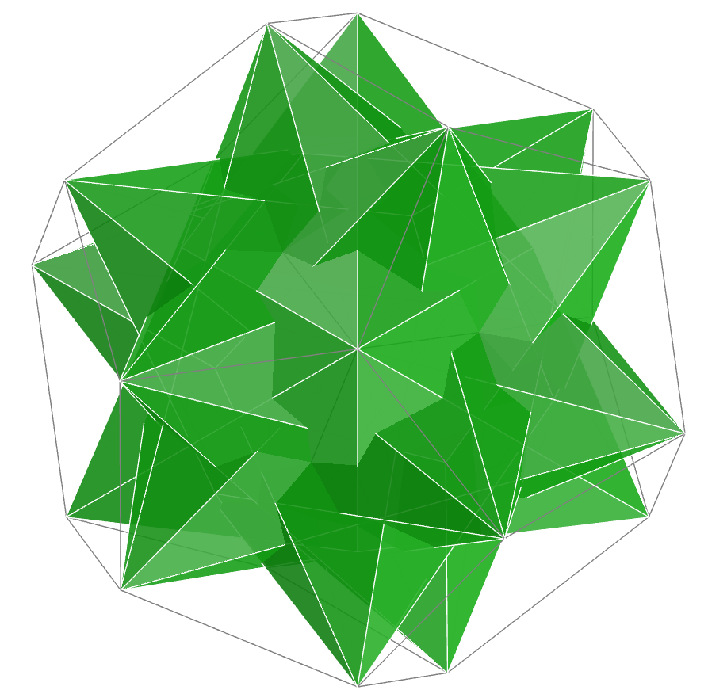</a>
  O quiricosaedro é composto de cinco poliedros e pode ser considerado regular. Neste composto, temos os vértices dos cinco poliedros escolhidos formando um casco convexo com vértices comuns, ou com correspondência com as faces de um dodecaedro regular 
  

<h4>15. Tetraedro truncado</h4>

  O icosicosaedro é um composto de dez poliedros e pode ser considerado como um composto regular de poliedros. Os vértices coincidem em pares, e formam um casco convexo com os vértices de um dodecaedro regular. 
  

<a href="#p1" class="topo">voltar ao topo</a>

  Polyhedral Compound - Tetrahedra family: visualization with Virtual Reality de <a xmlns:cc="http://creativecommons.org/ns#" href="https://paulohscwb.github.io/polycompound/compounds1/pt-br/" property="cc:attributionName" rel="cc:attributionURL">Paulo Henrique Siqueira</a> está licenciado com uma Licença <a rel="license" href="http://creativecommons.org/licenses/by-nc-nd/4.0/">Creative Commons Atribuição-NãoComercial-SemDerivações 4.0 Internacional</a>.

<h4>Como citar este trabalho:</h4> 

Siqueira, P.H., "Polyhedral Compound - Tetrahedra family: visualization with Virtual Reality". Disponível em: <https://paulohscwb.github.io/polycompound/compounds1/pt-br/>, Março de 2025.

<!---->
  <b>Referências:</b>
 Weisstein, Eric W. "Polyhedron Compound" From MathWorld-A Wolfram Web Resource. <a href="https://mathworld.wolfram.com/ArchimedeanDual.html" target="_blank">https://mathworld.wolfram.com/PolyhedronCompound.html</a>
 Weisstein, Eric W. "Uniform Polyhedron." From MathWorld--A Wolfram Web Resource. <a href="https://mathworld.wolfram.com/UniformPolyhedron.html" target="_blank">https://mathworld.wolfram.com/UniformPolyhedron.html</a>
 McCooey, David I. "Visual Polyhedra". <a href="http://dmccooey.com/polyhedra/" target="_blank">http://dmccooey.com/polyhedra/</a>
