<link rel="stylesheet" href="../scripts/style.css">
<meta charset="utf-8">
<link rel="icon" type="image/png" href="vr/salas/imagens/icone.png">
<h2>Visualization of Polyhedra with Virtual Reality (VR) in A-frame</h2>
 <b>author:</b> Paulo Henrique Siqueira - Universidade Federal do Paraná
  <b>contact:</b> <a href="#">paulohscwb@gmail.com</a>
  <a href="https://paulohscwb.github.io/polycompound/compounds2/pt-br/">versão em português</a>
 <form style="margin: 0 auto; float:right; text-align:right; width:100%; margin-bottom:15px;">
	<select id="url" onchange="urlHandler(this.value)" style="color:royalblue;">
		<option disabled selected value>More solids:</option>
		<option value="../compounds1/">Tetrahedra family</option>
		<option disabled value="../compounds2/">Cube family</option>
		<option value="../tetrahedra/">Tetrahedra packings</option>
		<option value="../vesica/">Vesica piscis and Trinexus</option>
		<!--<option value="../compounds3/">Octahedra family</option>
		<option value="../compounds4/">Dodecahedra and icosahedra family 1</option>
		<option value="../compounds5/">Dodecahedra and icosahedra family 2</option>
		<option value="../compounds6/">Compounds of dual polyhedra</option>
		<option value="../compounds7/">Compounds of two polyhedra</option>-->
	</select>
</form>

  <h2 align="center"> Cube family</h2>
A polyhedral compound is an arrangement of several interpenetrating polyhedra, all the same or of distinct types. Polyhedral compounds often have visually interesting symmetrical properties. Compounds of multiple Platonic and Archimedean solids can be especially appealing, as can compounds of these solids and their duals.
 This work shows polyhedral compounds, modeled for viewing in Virtual Reality.

<a href="#m3d">3D Models</a>&nbsp;&nbsp;|&nbsp;&nbsp;<a href="../">Home</a>

 

<h3 id="m3d" align="center">3D models</h3>
<iframe width="560" height="315" style="max-width:100%" src="https://www.youtube.com/embed/videoseries?list=PLy0I_lGW8HxUNlFkcmo7my5krrhVG2_BH" title="YouTube video player" frameborder="0" allow="accelerometer; autoplay; clipboard-write; encrypted-media; gyroscope; picture-in-picture; web-share" allowfullscreen></iframe>
<h4>1. Concave Dodecahedron</h4>
<a href="vr/ConcaveDodecahedron.htm" target="_blank" title="3D model" class="fotoA">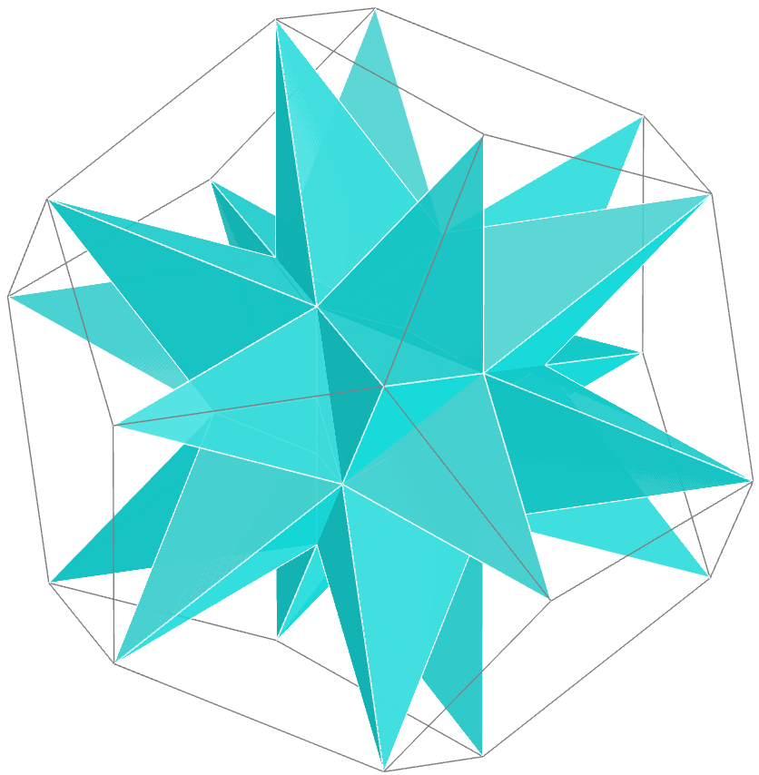</a>
  The chiricosahedron is composed of five polyhedra and can be considered regular. In this compound, we have the vertices of the five chosen polyhedra forming a convex hull with common vertices, or with correspondence with the faces of a regular dodecahedron.
  

<h4>2. Concave Dyakis Dodecahedron</h4>

  The result of "Compound 1" of 3 polyhedra is a stellated polyhedron, resembling stellated pyramids.
  

<h4>3. Cube</h4>
<a href="vr/Cube.htm" target="_blank" title="3D model" class="fotoA">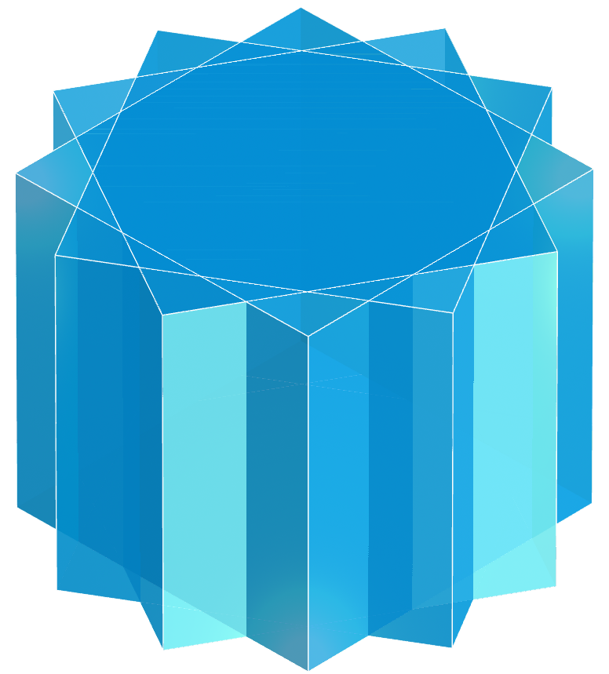</a>
  The result of "Compound 2" of 3 polyhedra is a stellated polyhedron, resembling stellated trapezohedrons.
  

<h4>4. Cube kites</h4>
<a href="vr/CubeKites.htm" target="_blank" title="3D model" class="fotoA">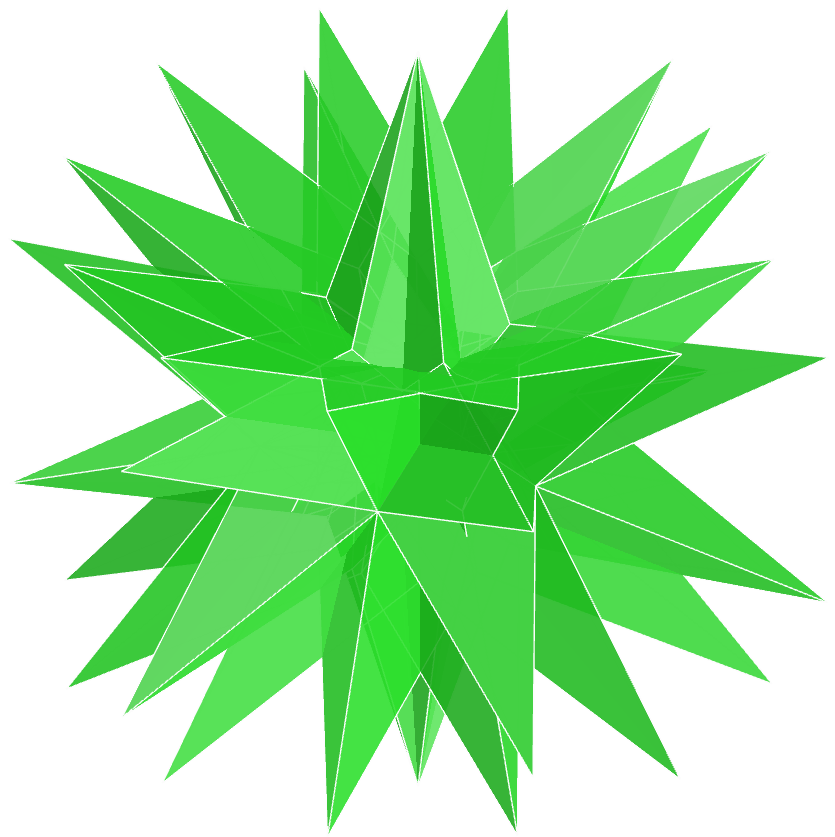</a>
  The result of "Compound 3" of 5 polyhedra is a stellated polyhedron, resembling double stellated pyramids.
  

<h4>5. Cubitruncated Cuboctahedron</h4>

  The result of "Compound 4" of 20 polyhedra is a stellated polyhedron, resembling Kepler-Poinsot polyhedra.
  

<h4>6. Cuboctahedron</h4>

  The Escher compound can be adapted to the cube family using 5 polyhedra. The result of this composition is a solid that resembles the Escher solid. The central image of the 1948 engraving Stars popularized the Escher compound of octahedra.
  

<h4>7. Cubohemioctahedron</h4>
<a href="vr/Cubohemioctahedron.htm" target="_blank" title="3D model" class="fotoA">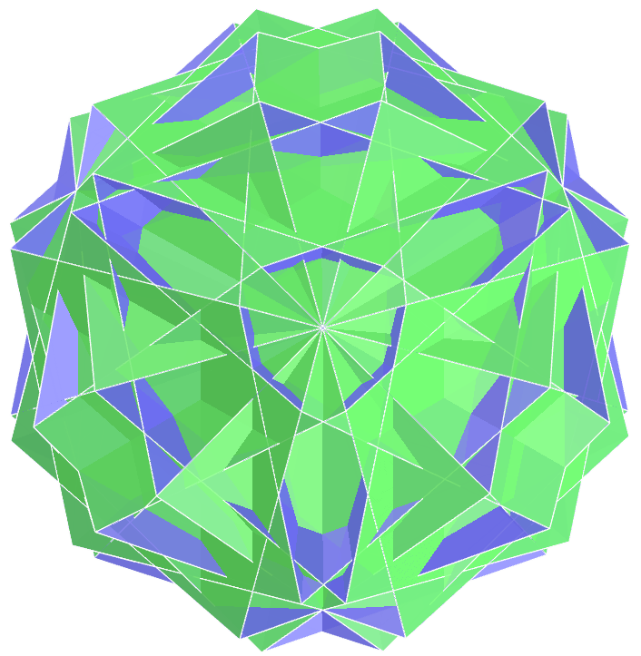</a>
  The disnubahedron is a compound of six polyhedra, with rotation angles of 30&ordm; or 45&ordm;, forming a uniform polyhedron. 
  

<h4>8. Escher Solid</h4>
<a href="vr/Escher.htm" target="_blank" title="3D model" class="fotoA">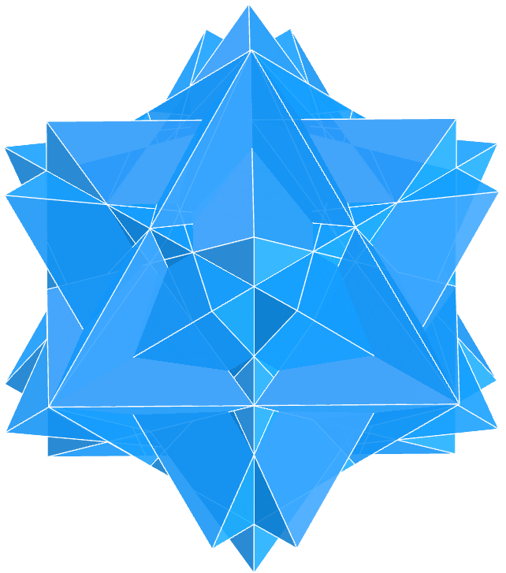</a>
  The snubahedron is a compound of three polyhedra, with rotation angles of 45&ordm;, forming a uniform polyhedron.
  

<h4>9. Escher Solid Dual</h4>
<a href="vr/EscherDual.htm" target="_blank" title="3D model" class="fotoA">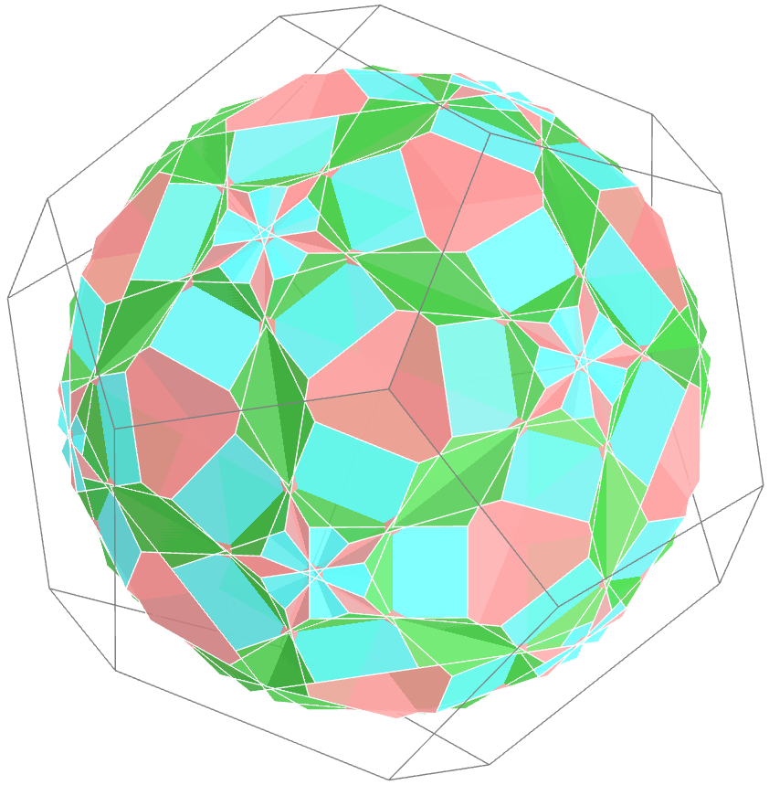</a>
  The chiricosahedron is composed of five polyhedra and can be considered regular. In this compound, we have the vertices of the five chosen polyhedra forming a convex hull with common vertices, or with correspondence with the faces of a regular dodecahedron.
  

<h4>10. Great Cubicuboctahedron</h4>
<a href="vr/GreatCubicuboctahedron.htm" target="_blank" title="3D model" class="fotoA">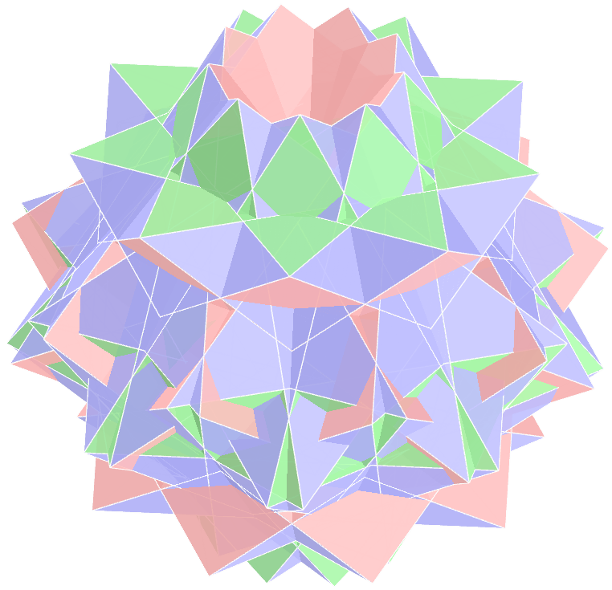</a>
  The result of "Compound 1" of 3 polyhedra is a stellated polyhedron, resembling stellated pyramids.
  

<a href="#p1" class="topo">back to top</a>

<h4>11. Great Deltoidal Icositetrahedron</h4>
<a href="vr/GreatDeltoidalIcositetrahedron.htm" target="_blank" title="3D model" class="fotoA">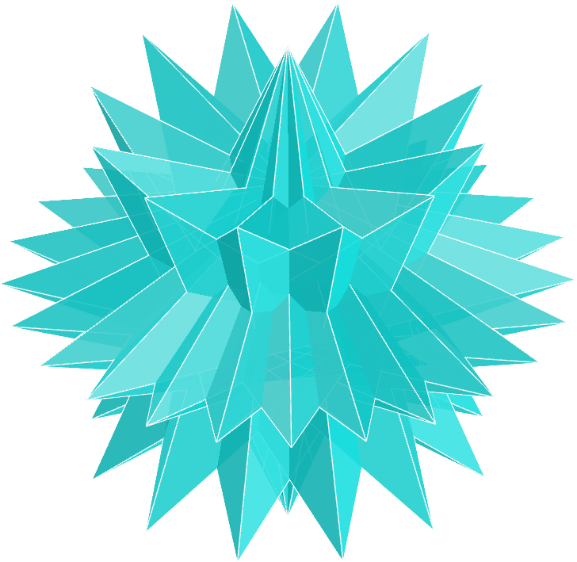</a>
  The result of "Compound 2" of 3 polyhedra is a stellated polyhedron, resembling stellated trapezohedrons.
  

<h4>12. Great Disdyakis Dodecahedron</h4>
<a href="vr/GreatDisdyakisDodecahedron.htm" target="_blank" title="3D model" class="fotoA">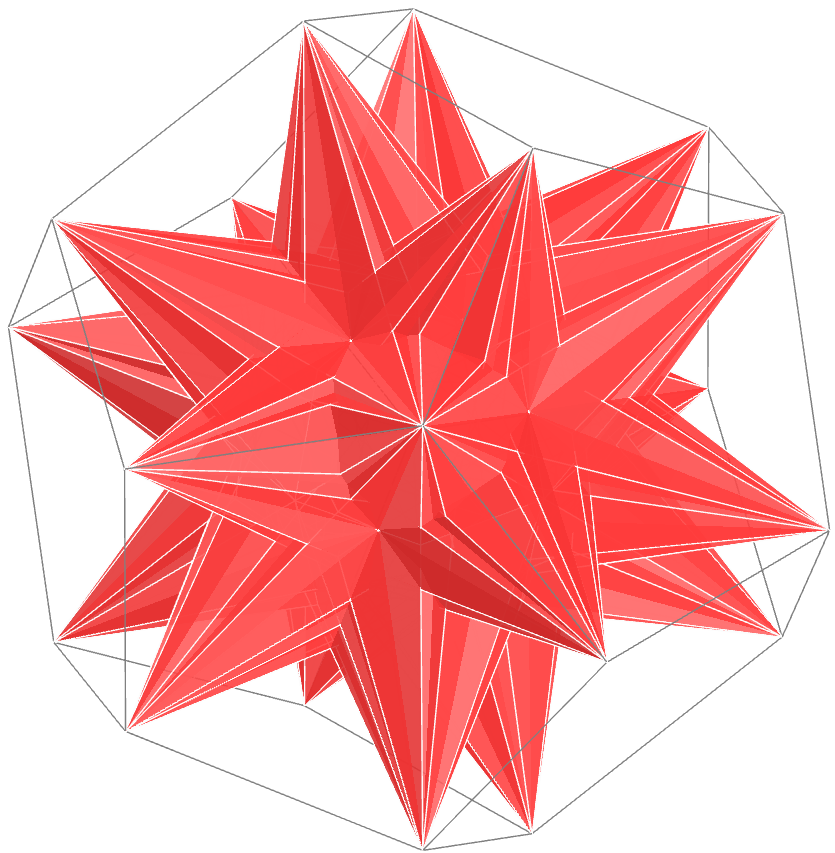</a>
  The chiricosahedron is composed of five polyhedra and can be considered regular. In this compound, we have the vertices of the five chosen polyhedra forming a convex hull with common vertices, or with correspondence with the faces of a regular dodecahedron.
  

<h4>13. Great Rhombihexacron</h4>
<a href="vr/GreatRhombihexacron.htm" target="_blank" title="3D model" class="fotoA">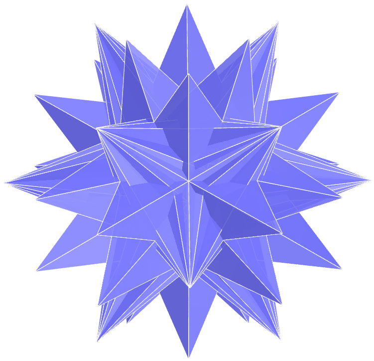</a>
  The Escher compound can be adapted to the cube family using 5 polyhedra. The result of this composition is a solid that resembles the Escher solid. The central image of the 1948 engraving Stars popularized the Escher compound of octahedra.
  

<h4>14. Great Rhombihexahedron</h4>
<a href="vr/GreatRhombihexahedron.htm" target="_blank" title="3D model" class="fotoA">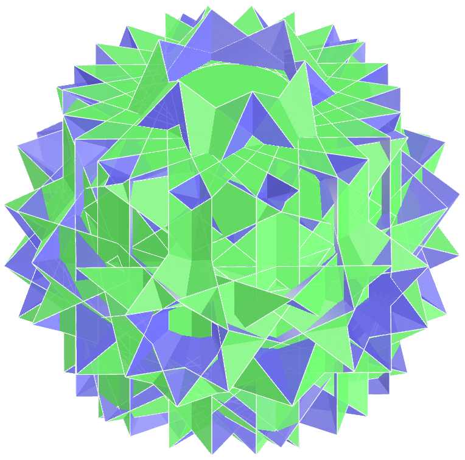</a>
  The result of "Compound 3" of 5 polyhedra is a stellated polyhedron, resembling double stellated pyramids.
  

<h4>15. Great Triakis Octahedron</h4>

  The result of "Compound 4" of 20 polyhedra is a stellated polyhedron, resembling Kepler-Poinsot polyhedra.
  

 <h4>16. Great Truncated Cuboctahedron</h4>
<a href="vr/GreatTruncatedCuboctahedron.htm" target="_blank" title="3D model" class="fotoA">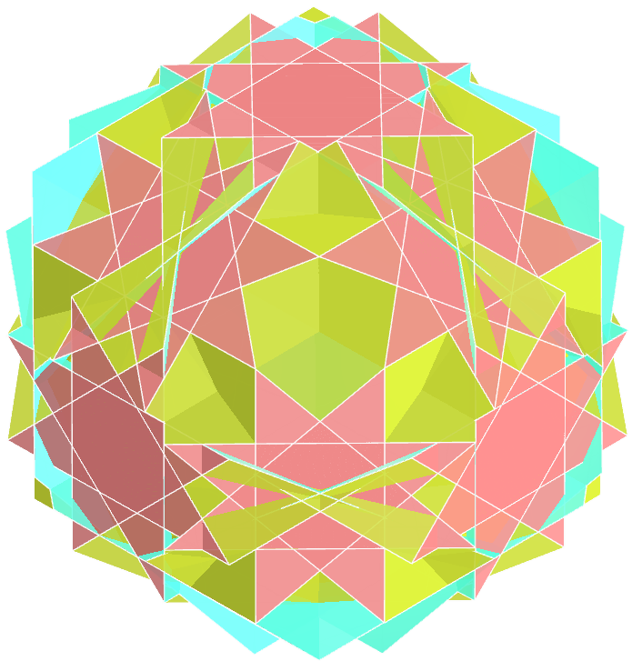</a>
  The snubahedron is a compound of three polyhedra, with rotation angles of 45&ordm;, forming a uniform polyhedron.
  

<h4>17. Joined Rhombicuboctahedron</h4>

  The result of "Compound 1" of 3 polyhedra is a stellated polyhedron, resembling stellated pyramids.
  

<h4>18. Joined Snub Cube</h4>

  The result of "Compound 4" of 20 polyhedra is a stellated polyhedron, resembling Kepler-Poinsot polyhedra.
  

<h4>19. Joined Truncated Octahedron</h4>
<a href="vr/JoinedTruncatedOctahedron.htm" target="_blank" title="3D model" class="fotoA">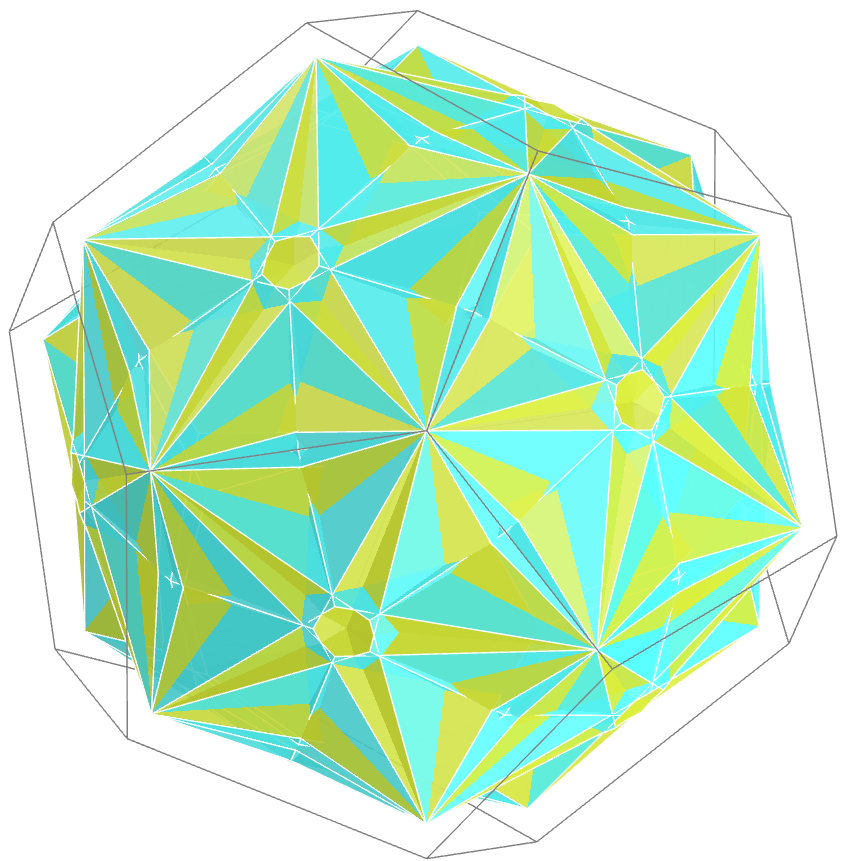</a>
  The chiricosahedron is composed of five polyhedra and can be considered regular. In this compound, we have the vertices of the five chosen polyhedra forming a convex hull with common vertices, or with correspondence with the faces of a regular dodecahedron.
  

<h4>20. Möbius Hexakis Octahedron</h4>
<a href="vr/MobiusHexakisOctahedron.htm" target="_blank" title="3D model" class="fotoA">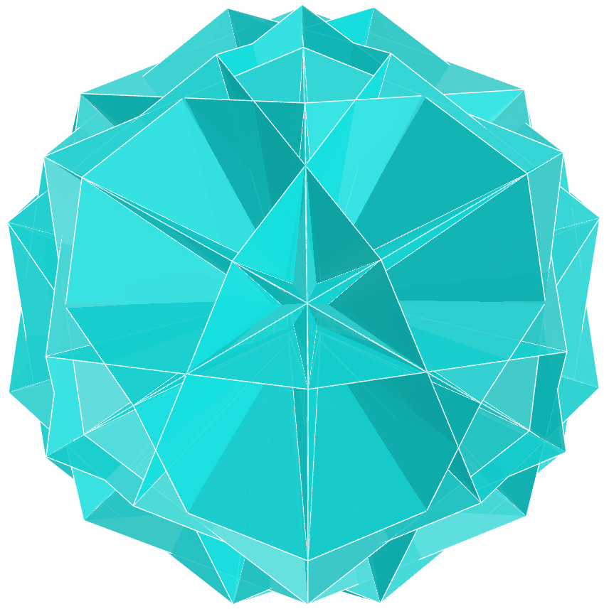</a>
  The Escher compound can be adapted to the cube family using 5 polyhedra. The result of this composition is a solid that resembles the Escher solid. The central image of the 1948 engraving Stars popularized the Escher compound of octahedra.
  
 

<a href="#p1" class="topo">back to top</a>

<h4>21. Möbius Octakis Hexahedron</h4>
<a href="vr/MobiusOctakisHexahedron.htm" target="_blank" title="3D model" class="fotoA">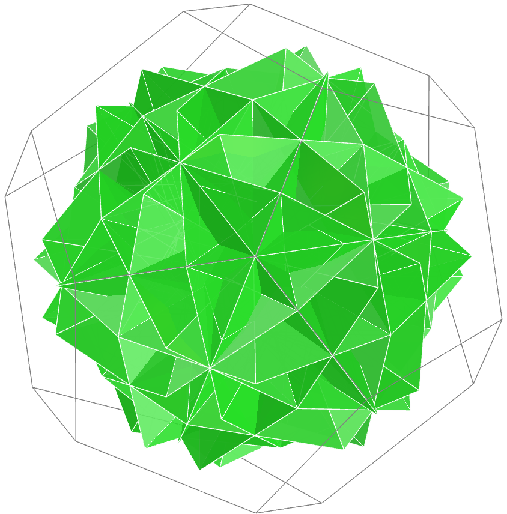</a>
  The chiricosahedron is composed of five polyhedra and can be considered regular. In this compound, we have the vertices of the five chosen polyhedra forming a convex hull with common vertices, or with correspondence with the faces of a regular dodecahedron.
  

<h4>22. Octahemioctacron</h4>
<a href="vr/Octahemioctacron.htm" target="_blank" title="3D model" class="fotoA">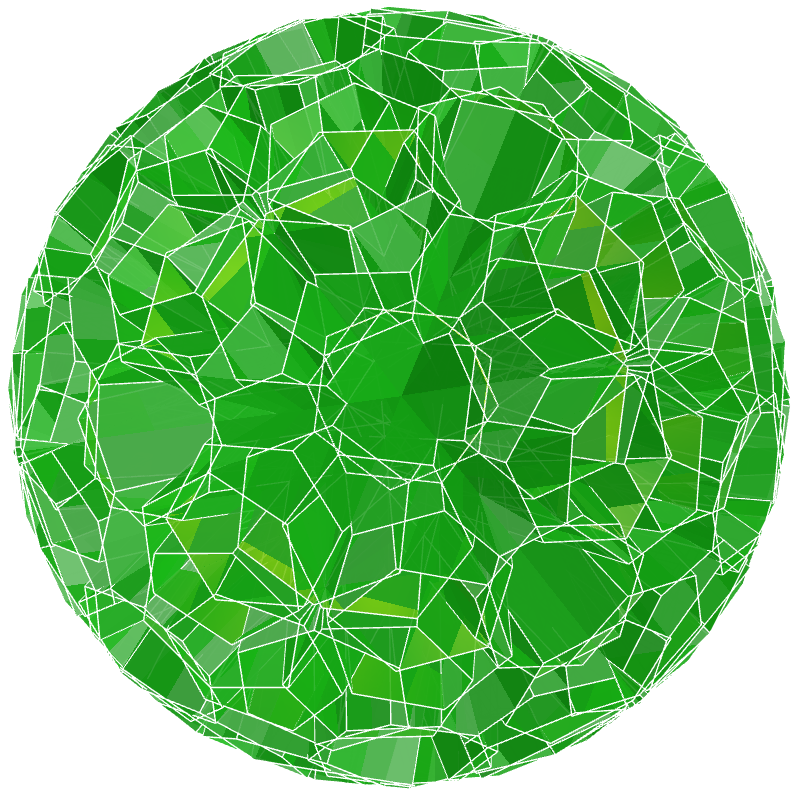</a>
  The result of "Compound 4" of 20 polyhedra is a stellated polyhedron, resembling Kepler-Poinsot polyhedra.
  

<h4>23. Octahemioctahedron</h4>

  The result of "Compound 2" of 3 polyhedra is a stellated polyhedron, resembling stellated trapezohedrons.
  

<h4>24. Rhombicuboctahedron</h4>
<a href="vr/Rhombicuboctahedron.htm" target="_blank" title="3D model" class="fotoA">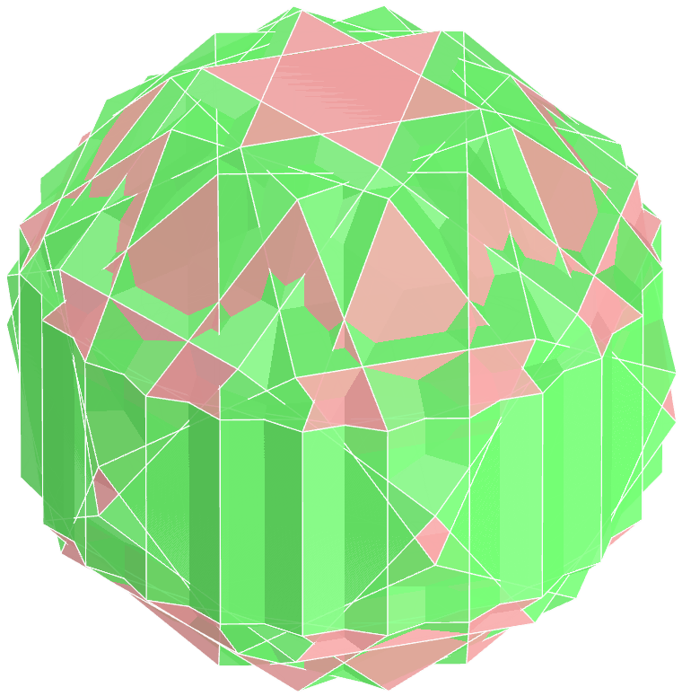</a>
  The result of "Compound 3" of 5 polyhedra is a stellated polyhedron, resembling double stellated pyramids.
  

<h4>25. Small Cubicuboctahedron</h4>
<a href="vr/SmallCubicuboctahedron.htm" target="_blank" title="3D model" class="fotoA">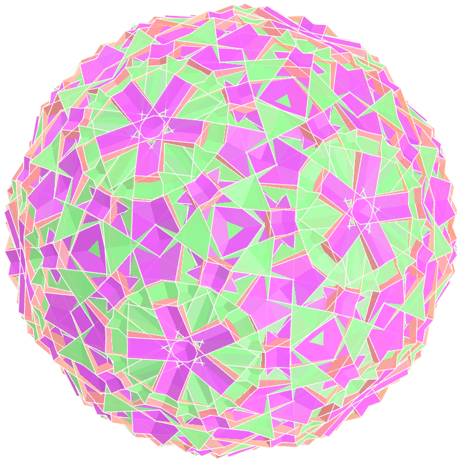</a>
  The result of "Compound 4" of 20 polyhedra is a stellated polyhedron, resembling Kepler-Poinsot polyhedra.
  

<h4>26. Small Rhombihexahedron</h4>

  The Escher compound can be adapted to the cube family using 5 polyhedra. The result of this composition is a solid that resembles the Escher solid. The central image of the 1948 engraving Stars popularized the Escher compound of octahedra.
  

<h4>27. Snub Cube</h4>
<a href="vr/SnubCube.htm" target="_blank" title="3D model" class="fotoA">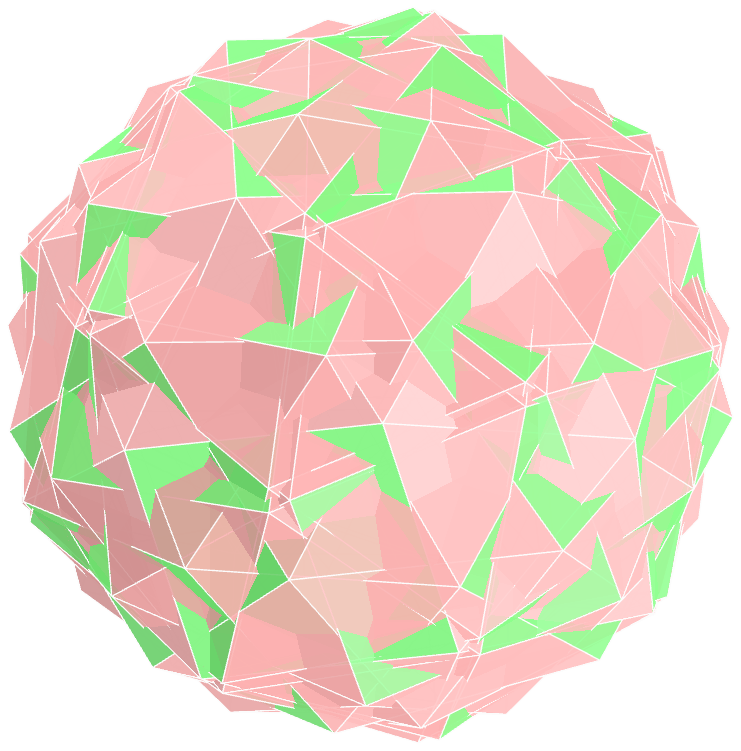</a>
  The disnubahedron is a compound of six polyhedra, with rotation angles of 30&ordm; or 45&ordm;, forming a uniform polyhedron. 
  

<h4>28. Stellated Truncated Hexahedron</h4>
<a href="vr/StellatedTruncatedHexahedron.htm" target="_blank" title="3D model" class="fotoA">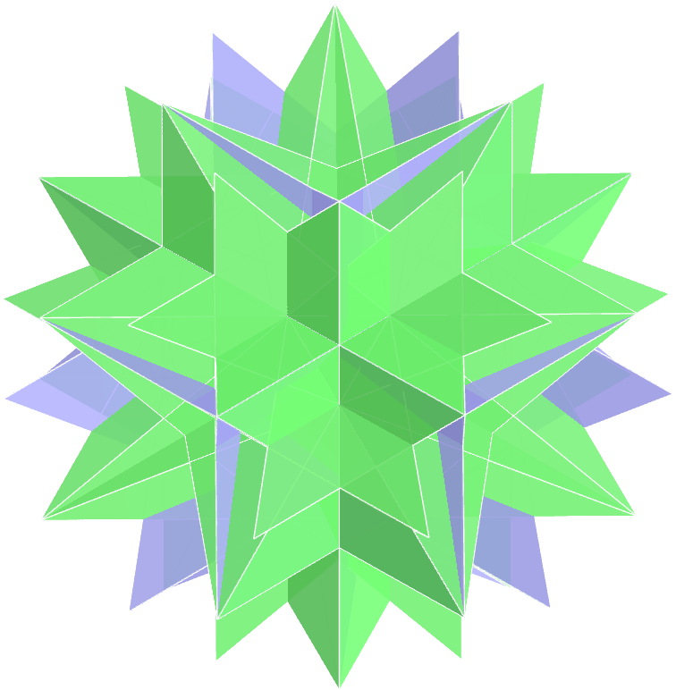</a>
  The snubahedron is a compound of three polyhedra, with rotation angles of 45&ordm;, forming a uniform polyhedron.
  

<h4>29. Tetrakis Hexahedron</h4>

  The chiricosahedron is composed of five polyhedra and can be considered regular. In this compound, we have the vertices of the five chosen polyhedra forming a convex hull with common vertices, or with correspondence with the faces of a regular dodecahedron.
  

<h4>30. Truncated Cube</h4>
<a href="vr/TruncatedCube.htm" target="_blank" title="3D model" class="fotoA">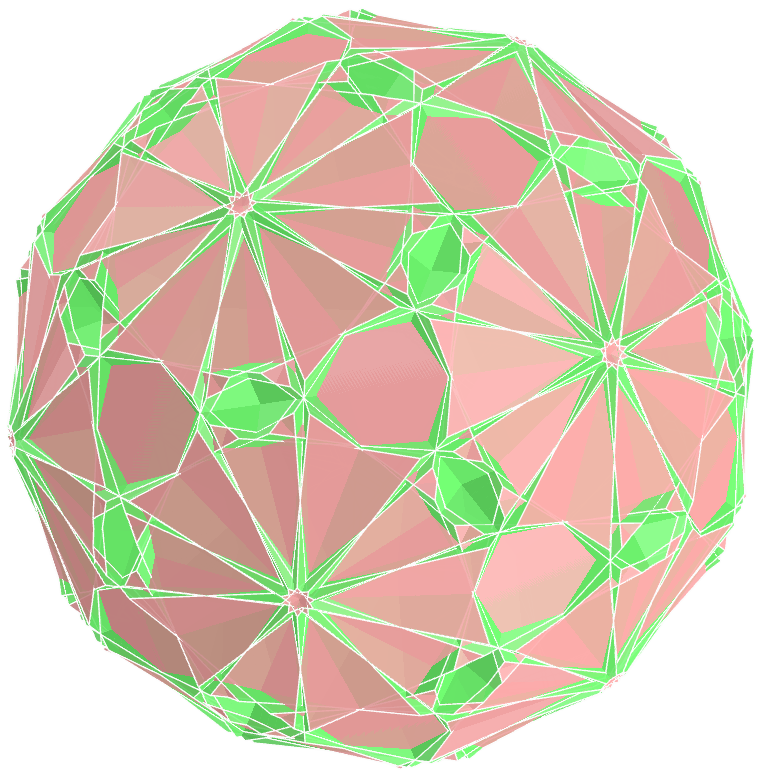</a>
  The result of "Compound 4" of 20 polyhedra is a stellated polyhedron, resembling Kepler-Poinsot polyhedra.
  

<a href="#p1" class="topo">back to top</a>

<h4>31. Truncated Cuboctahedron</h4>
<a href="vr/TruncatedCuboctahedron.htm" target="_blank" title="3D model" class="fotoA">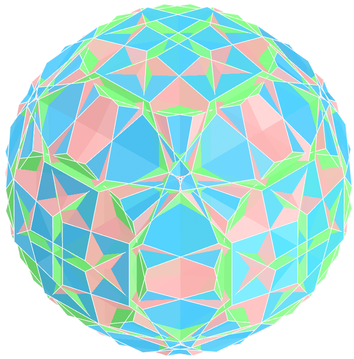</a>
  The disnubahedron is a compound of six polyhedra, with rotation angles of 30&ordm; or 45&ordm;, forming a uniform polyhedron. 
  

<h4>32. Uniform Great Rhombicuboctahedron</h4>
<a href="vr/UniformGreatRhombicuboctahedron.htm" target="_blank" title="3D model" class="fotoA">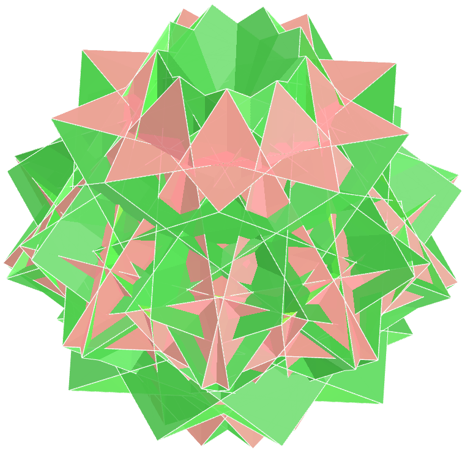</a>
  The result of "Compound 1" of 3 polyhedra is a stellated polyhedron, resembling stellated pyramids.
  

<h4>33. Cuboctahedron Kites</h4>

  The result of "Compound 4" of 20 polyhedra is a stellated polyhedron, resembling Kepler-Poinsot polyhedra.
  

<h4>34. Rhombicuboctahedron Kites</h4>

  The chiricosahedron is composed of five polyhedra and can be considered regular. In this compound, we have the vertices of the five chosen polyhedra forming a convex hull with common vertices, or with correspondence with the faces of a regular dodecahedron.
  

<h4>35. Snub Cube Kites</h4>

  The snubahedron is a compound of three polyhedra, with rotation angles of 45&ordm;, forming a uniform polyhedron.
  

<h4>36. Truncated Cube Kites</h4>

  The disnubahedron is a compound of six polyhedra, with rotation angles of 30&ordm; or 45&ordm;, forming a uniform polyhedron. 
  

<h4>37. Truncated Cuboctahedron Kites</h4>
<a href="vr/TruncatedCuboctahedronKites.htm" target="_blank" title="3D model" class="fotoA">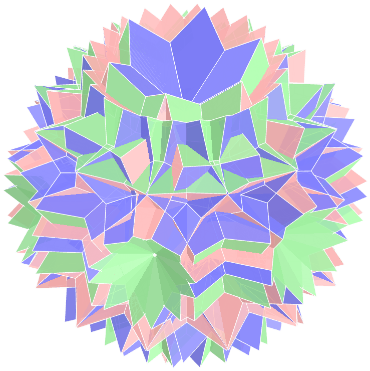</a>
  The result of "Compound 3" of 5 polyhedra is a stellated polyhedron, resembling double stellated pyramids. 
  

<a href="#p1" class="topo">back to top</a>

  Polyhedral Compound - Cube family: visualization with Virtual Reality by <a xmlns:cc="http://creativecommons.org/ns#" href="https://paulohscwb.github.io/polycompound/compounds2/" property="cc:attributionName" rel="cc:attributionURL">Paulo Henrique Siqueira</a> is licensed with a license <a rel="license" href="http://creativecommons.org/licenses/by-nc-nd/4.0/">Creative Commons Attribution-NonCommercial-NoDerivatives 4.0 International</a>.

<h4>How to cite this work:</h4> 

Siqueira, P.H., "Polyhedral Compound - Cube family: visualization with Virtual Reality". Available in: <https://paulohscwb.github.io/polycompound/compounds2/>, June 2025.

<!---->
  <b>References:</b>
 Weisstein, Eric W. "Polyhedron Compound" From MathWorld-A Wolfram Web Resource. <a href="https://mathworld.wolfram.com/ArchimedeanDual.html" target="_blank">https://mathworld.wolfram.com/PolyhedronCompound.html</a>
 Weisstein, Eric W. "Uniform Polyhedron." From MathWorld--A Wolfram Web Resource. <a href="https://mathworld.wolfram.com/UniformPolyhedron.html" target="_blank">https://mathworld.wolfram.com/UniformPolyhedron.html</a>
 McCooey, David I. "Visual Polyhedra". <a href="http://dmccooey.com/polyhedra/" target="_blank">http://dmccooey.com/polyhedra/</a>
