<link rel="stylesheet" href="../../scripts/style.css">
<meta charset="utf-8">
<link rel="icon" type="image/png" href="../vr/salas/imagens/icone.png">
<h2>Visualização de Poliedros com Realidade Virtual (RV) em A-frame</h2>
<b>autor:</b> Paulo Henrique Siqueira - Universidade Federal do Paraná
 <b>contato:</b> <a href="#"> paulohscwb@gmail.com </a>
 <a href="https://paulohscwb.github.io/polycompound/compounds2/">english version</a>
<form style="margin: 0 auto; float:right; text-align:right; width:100%; margin-bottom:15px;">
	<select id="url" onchange="urlHandler(this.value)" style="color:royalblue;">
		<option disabled selected>Mais sólidos:</option>
		<option value="../../compounds1/pt-br/">Família dos tetraedros</option>
		<option disabled value="../../compounds2/pt-br/">Família dos cubos</option>
		<!--<option value="../../compounds3/pt-br/">Família dos octaedros</option>
		<option value="../../compounds4/pt-br/">Família dos dodecaedros e icosaedros 1</option>
		<option value="../../compounds5/pt-br/">Família dos dodecaedros e icosaedros 2</option>
		<option value="../../compounds6/pt-br/">Compostos de poliedros duais</option>
		<option value="../../compounds7/pt-br/">Compostos de dois poliedros</option>-->
	</select>
</form>

  <h2 align="center">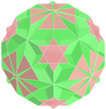 Família dos cubos</h2>
  Um composto poliédrico é um arranjo de vários poliedros interpenetrantes, todos iguais ou de tipos distintos. Os compostos poliédricos geralmente têm propriedades simétricas visualmente interessantes. Compostos de múltiplos sólidos Platônicos e Arquimedianos podem ser especialmente atraentes, assim como compostos desses sólidos e seus duais.
 Este trabalho mostra os compostos de poliedros, modelados para visualização em Realidade Virtual.
 
<a href="#m3d">Modelos 3D</a>&nbsp;&nbsp;|&nbsp;&nbsp;<a href="../../pt-br/">Página Inicial</a>

  
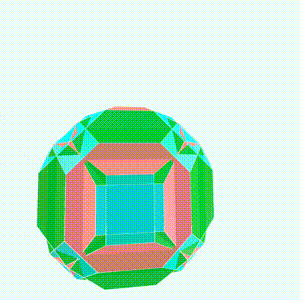
 

<h3 id="m3d" align="center">Modelos 3D</h3>
<iframe width="560" height="315" style="max-width:100%" src="https://www.youtube.com/embed/videoseries?list=PLy0I_lGW8HxUNlFkcmo7my5krrhVG2_BH" title="YouTube video player" frameborder="0" allow="accelerometer; autoplay; clipboard-write; encrypted-media; gyroscope; picture-in-picture; web-share" allowfullscreen></iframe>
<h4>1. Dodecaedro Côncavo</h4>

  O quiricosaedro é composto de cinco poliedros e pode ser considerado regular. Neste composto, temos os vértices dos cinco poliedros escolhidos formando um casco convexo com vértices comuns, ou com correspondência com as faces de um dodecaedro regular.
  

<h4>2. Dodecaedro Diakis Côncavo</h4>
<a href="../vr/ConcaveDyakisDodecahedron.htm" target="_blank" title="modelo 3D" class="fotoA">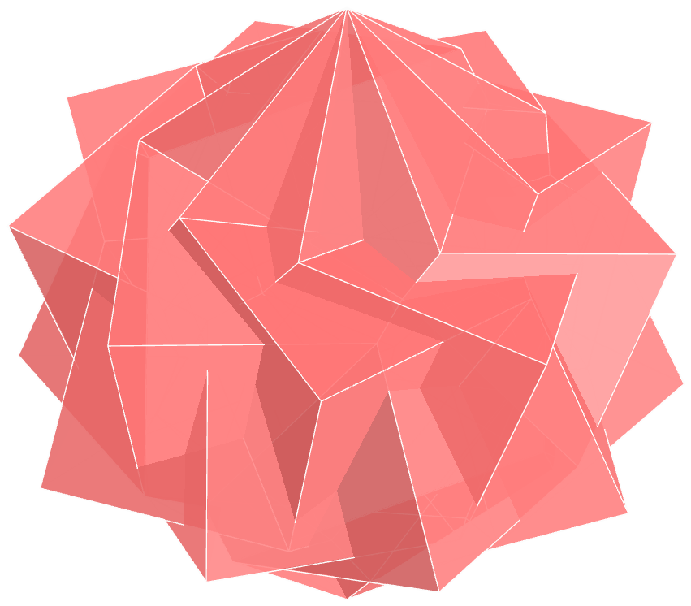</a>
  O resultado do "Composto 1" (Compound 1) de 3 poliedros é um poliedro estrelado, lembrando pirâmides estreladas duplas.
  

<h4>3. Cubo</h4>
<a href="../vr/Cube.htm" target="_blank" title="modelo 3D" class="fotoA">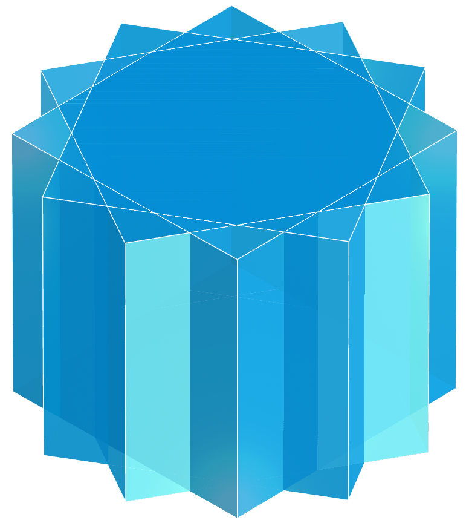</a>
  O resultado do "Composto 2" (Compound 2) de 3 poliedros é um poliedro estrelado, lembrando trapezoedros estrelados.
  

<h4>4. Cubo com pipas</h4>
<a href="../vr/CubeKites.htm" target="_blank" title="modelo 3D" class="fotoA">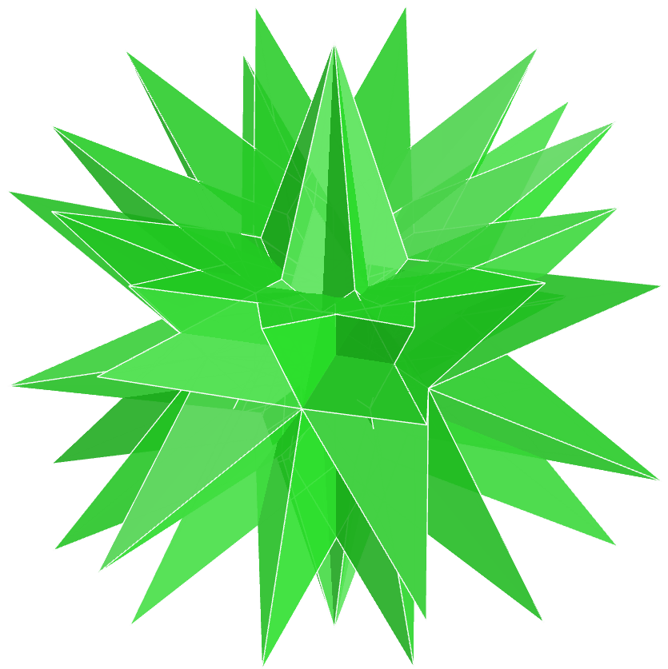</a>
  O resultado do "Composto 3" (Compound 3) de 5 poliedros é um poliedro estrelado, lembrando pirâmides estreladas duplas.
  

<h4>5. Cuboctaedro Cubitruncado</h4>
<a href="../vr/CubitruncatedCuboctahedron.htm" target="_blank" title="modelo 3D" class="fotoA">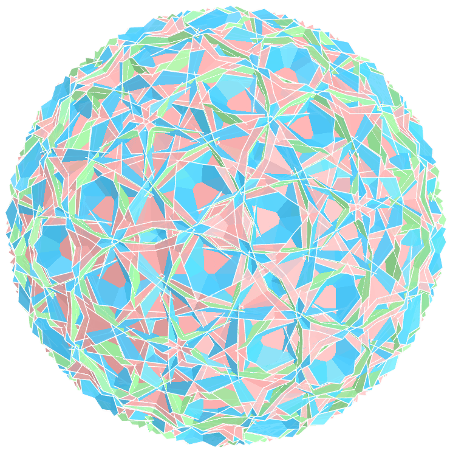</a>
  O resultado do "Composto 4" (Compound 4) de 20 poliedros é um poliedro estrelado, lembrando poliedros de Kepler-Poinsot. 
  

<h4>6. Cuboctaedro</h4>
<a href="../vr/Cuboctahedron.htm" target="_blank" title="modelo 3D" class="fotoA">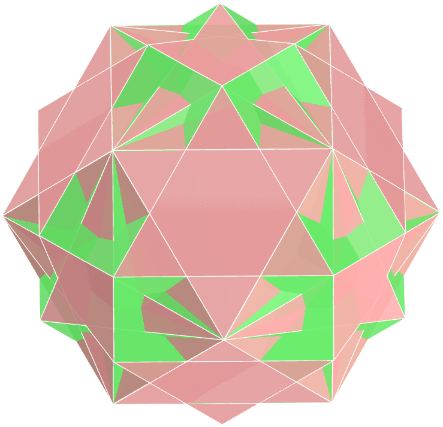</a>
  O composto de Escher pode ser adaptado para a família de cubos utilizando-se 5 poliedros. O resultado desta composição é um sólido que lembra o sólido de Escher. A imagem central da gravura Stars de 1948 popularizou o composto de Escher de octaedros.
  

<h4>7. Cubohemioctaedro</h4>
<a href="../vr/Cubohemioctahedron.htm" target="_blank" title="modelo 3D" class="fotoA">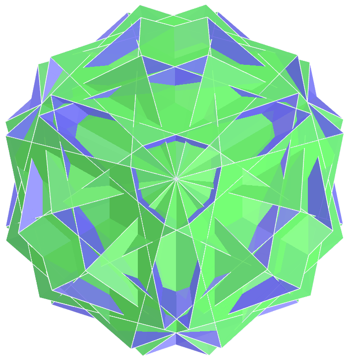</a>
  O disnubaedro é um composto de seis poliedros, com ângulos de rotação de 30&ordm; ou 45&ordm;, formando um poliedro uniforme. 
  

<h4>8. Sólido de Escher</h4>
<a href="../vr/Escher.htm" target="_blank" title="modelo 3D" class="fotoA">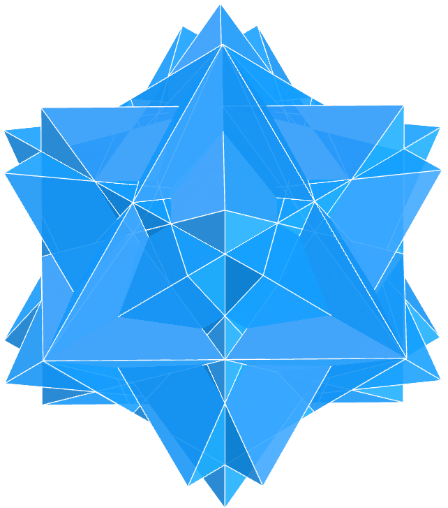</a>
  O snubaedro é um composto de três poliedros, com ângulos de rotação de 45&ordm;, formando um poliedro uniforme.
  

<h4>9. Dual do Sólido de Escher</h4>
<a href="../vr/EscherDual.htm" target="_blank" title="modelo 3D" class="fotoA">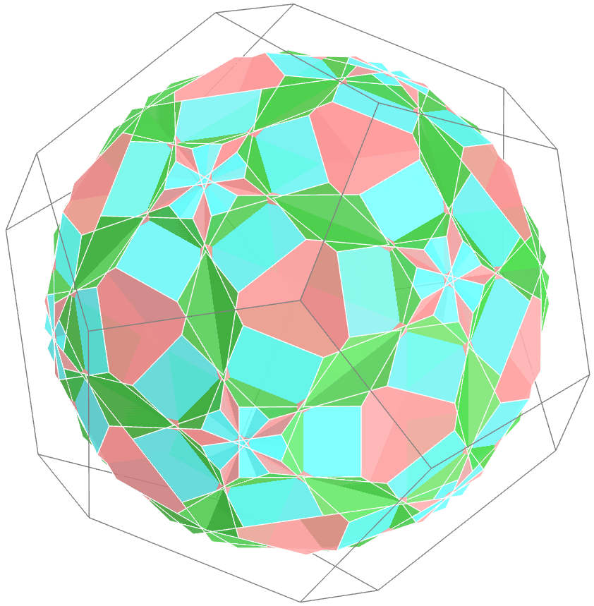</a>
  O quiricosaedro é composto de cinco poliedros e pode ser considerado regular. Neste composto, temos os vértices dos cinco poliedros escolhidos formando um casco convexo com vértices comuns, ou com correspondência com as faces de um dodecaedro regular.
  

<h4>10. Grande Cubicuboctaedro</h4>
<a href="../vr/GreatCubicuboctahedron.htm" target="_blank" title="modelo 3D" class="fotoA">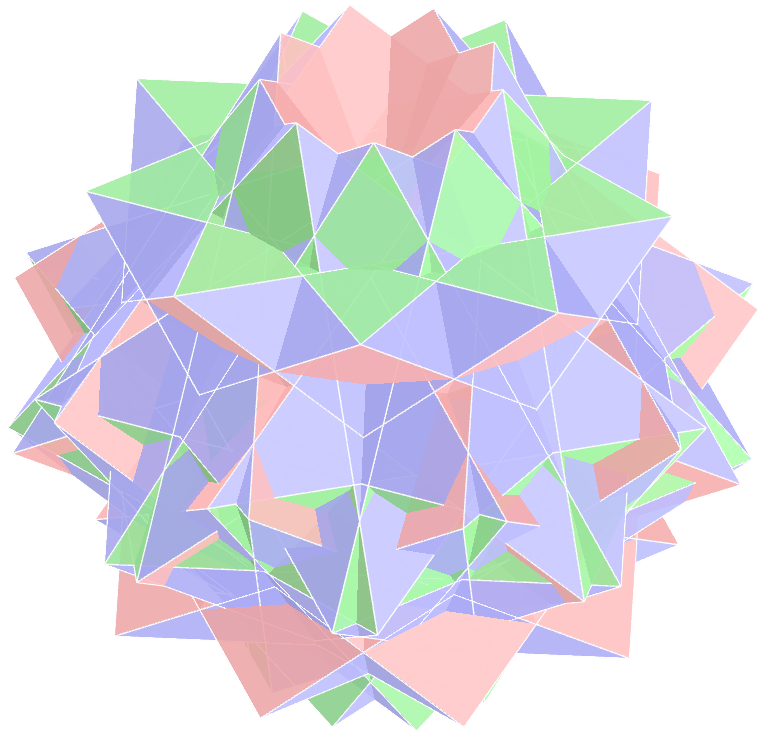</a>
  O resultado do "Composto 1" (Compound 1) de 3 poliedros é um poliedro estrelado, lembrando pirâmides estreladas duplas.
  

<a href="#p1" class="topo">voltar ao topo</a>

<h4>11. Grande Icositetraedro Deltoidal</h4>
<a href="../vr/GreatDeltoidalIcositetrahedron.htm" target="_blank" title="modelo 3D" class="fotoA">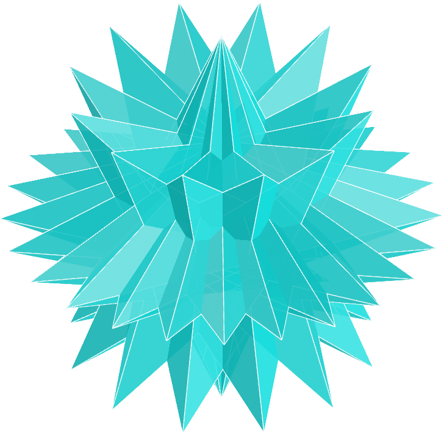</a>
  O resultado do "Composto 2" (Compound 2) de 3 poliedros é um poliedro estrelado, lembrando trapezoedros estrelados.
  

<h4>12. Grande Dodecaedro Disdiakis</h4>
<a href="../vr/GreatDisdyakisDodecahedron.htm" target="_blank" title="modelo 3D" class="fotoA">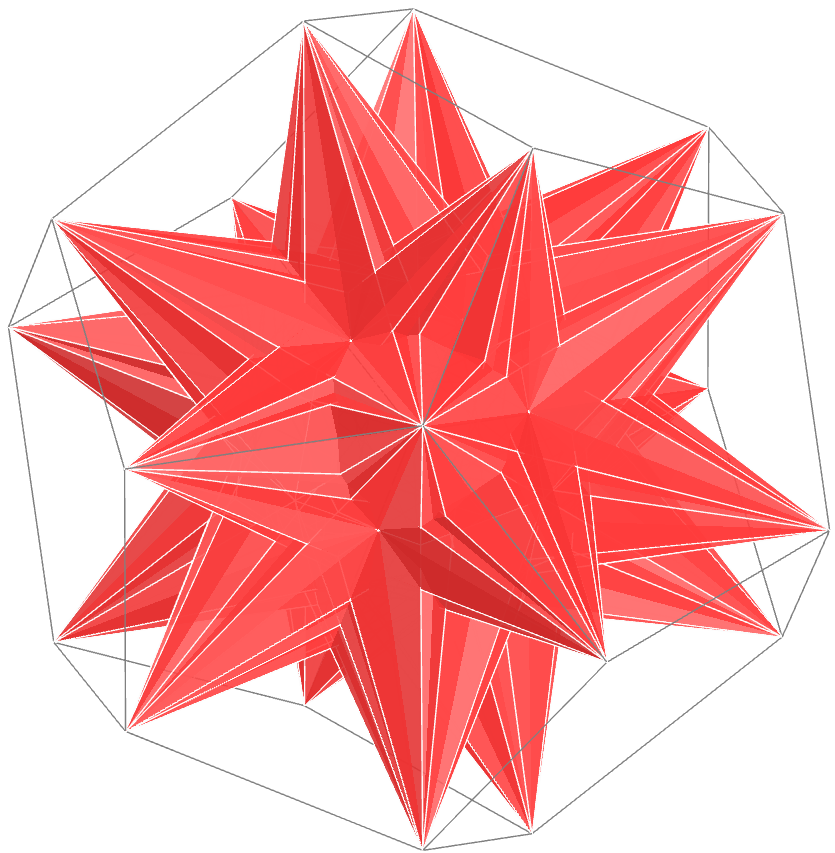</a>
  O quiricosaedro é composto de cinco poliedros e pode ser considerado regular. Neste composto, temos os vértices dos cinco poliedros escolhidos formando um casco convexo com vértices comuns, ou com correspondência com as faces de um dodecaedro regular.
  

<h4>13. Grande Rombihexacro</h4>
<a href="../vr/GreatRhombihexacron.htm" target="_blank" title="modelo 3D" class="fotoA">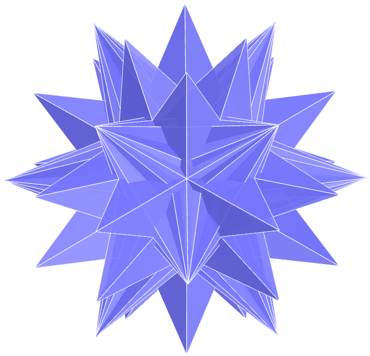</a>
  O composto de Escher pode ser adaptado para a família de cubos utilizando-se 5 poliedros. O resultado desta composição é um sólido que lembra o sólido de Escher. A imagem central da gravura Stars de 1948 popularizou o composto de Escher de octaedros.
  

<h4>14. Grande Rombihexaedro</h4>
<a href="../vr/GreatRhombihexahedron.htm" target="_blank" title="modelo 3D" class="fotoA">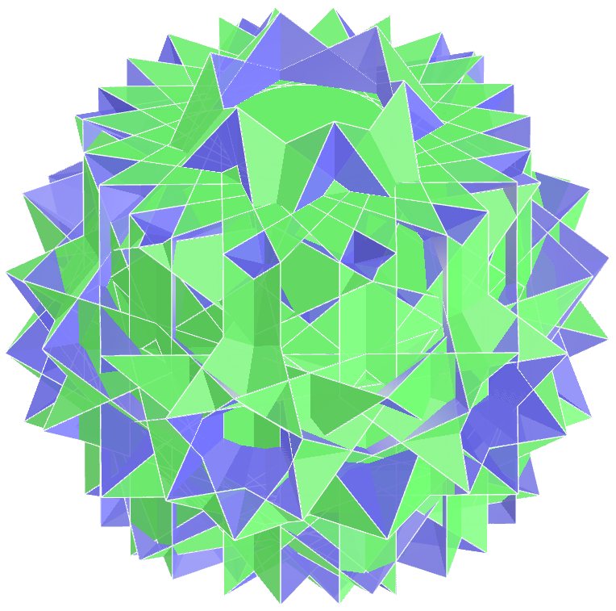</a>
  O resultado do "Composto 3" (Compound 3) de 5 poliedros é um poliedro estrelado, lembrando pirâmides estreladas duplas.
  

<h4>15. Grande Octaedro Triakis</h4>
<a href="../vr/GreatTriakisOctahedron.htm" target="_blank" title="modelo 3D" class="fotoA">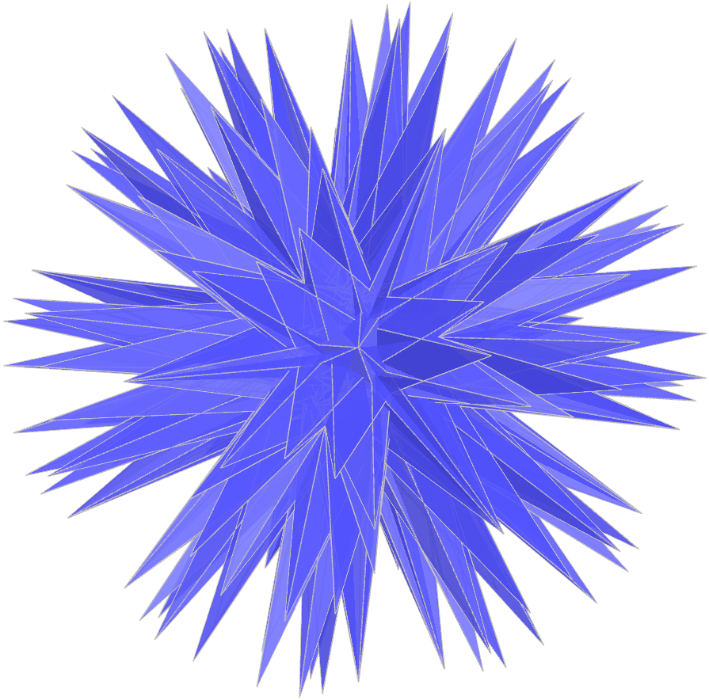</a>
  O resultado do "Composto 4" (Compound 4) de 20 poliedros é um poliedro estrelado, lembrando poliedros de Kepler-Poinsot. 
  
 

<h4>16. Grande Cuboctaedro Truncado</h4>
<a href="../vr/GreatTruncatedCuboctahedron.htm" target="_blank" title="modelo 3D" class="fotoA">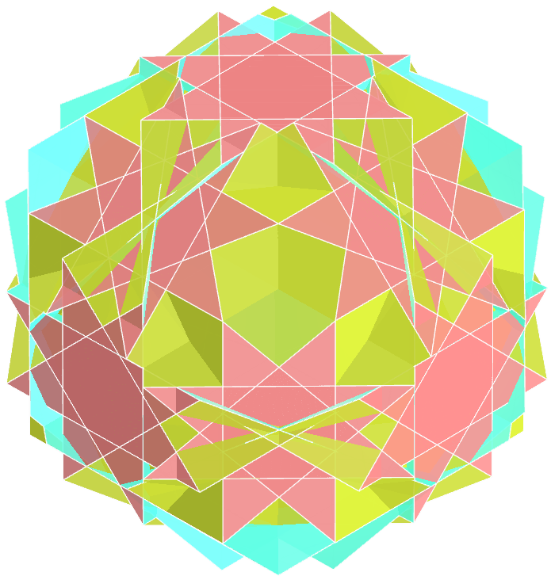</a>
  O snubaedro é um composto de três poliedros, com ângulos de rotação de 45&ordm;, formando um poliedro uniforme.
  

<h4>17. Rombicuboctaedro combinado</h4>
<a href="../vr/JoinedRhombicuboctahedron.htm" target="_blank" title="modelo 3D" class="fotoA">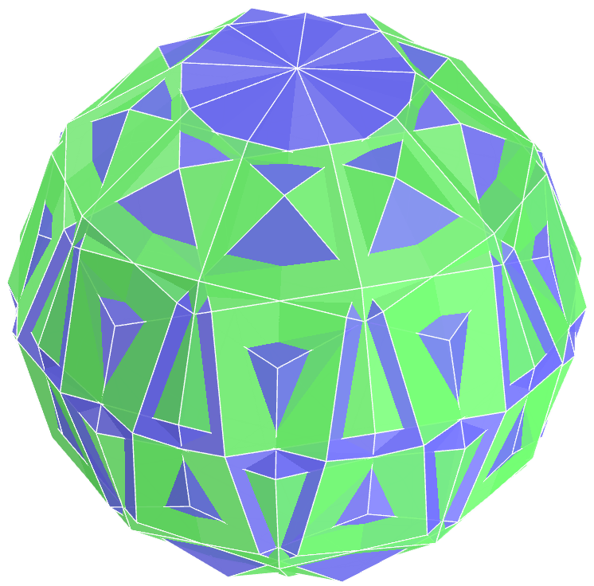</a>
  O resultado do "Composto 1" (Compound 1) de 3 poliedros é um poliedro estrelado, lembrando pirâmides estreladas duplas.
  

<h4>18. Cubo Snub combinado</h4>
<a href="../vr/JoinedSnubCube.htm" target="_blank" title="modelo 3D" class="fotoA">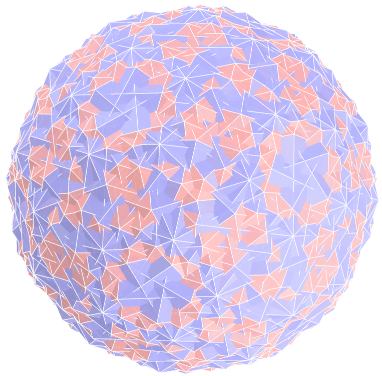</a>
  O resultado do "Composto 4" (Compound 4) de 20 poliedros é um poliedro estrelado, lembrando poliedros de Kepler-Poinsot.
  

<h4>19. Octaedro Truncado combinado</h4>
<a href="../vr/JoinedTruncatedOctahedron.htm" target="_blank" title="modelo 3D" class="fotoA">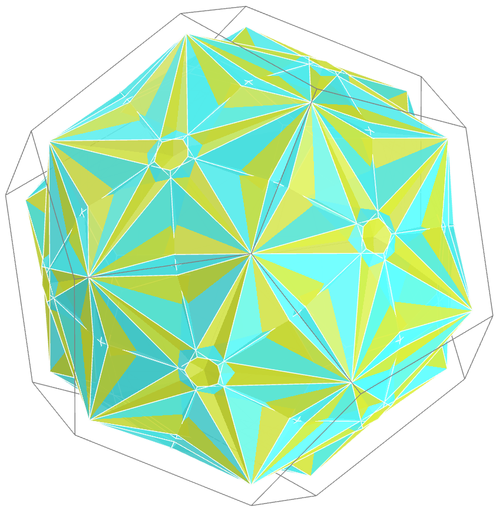</a>
  O quiricosaedro é composto de cinco poliedros e pode ser considerado regular. Neste composto, temos os vértices dos cinco poliedros escolhidos formando um casco convexo com vértices comuns, ou com correspondência com as faces de um dodecaedro regular.
  

<h4>20. Octaedro Hexakis de Möbius</h4>
<a href="../vr/MobiusHexakisOctahedron.htm" target="_blank" title="modelo 3D" class="fotoA">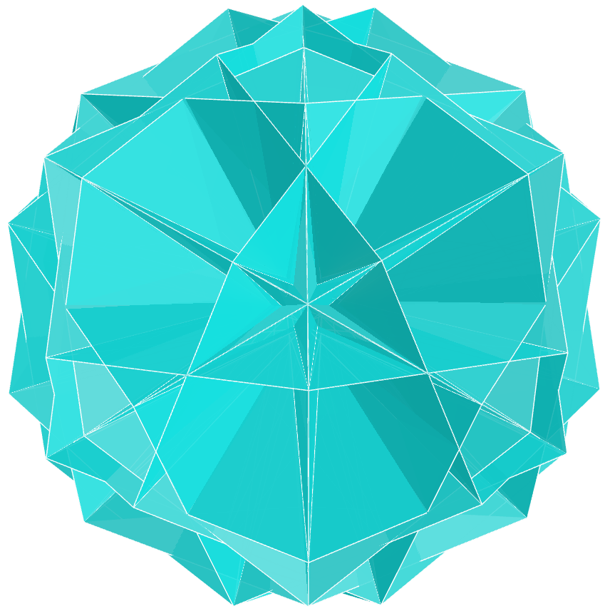</a>
  O composto de Escher pode ser adaptado para a família de cubos utilizando-se 5 poliedros. O resultado desta composição é um sólido que lembra o sólido de Escher. A imagem central da gravura Stars de 1948 popularizou o composto de Escher de octaedros. 
  
 

<a href="#p1" class="topo">voltar ao topo</a>

<h4>21. Hexaedro Octakis de Möbius</h4>
<a href="../vr/MobiusOctakisHexahedron.htm" target="_blank" title="modelo 3D" class="fotoA">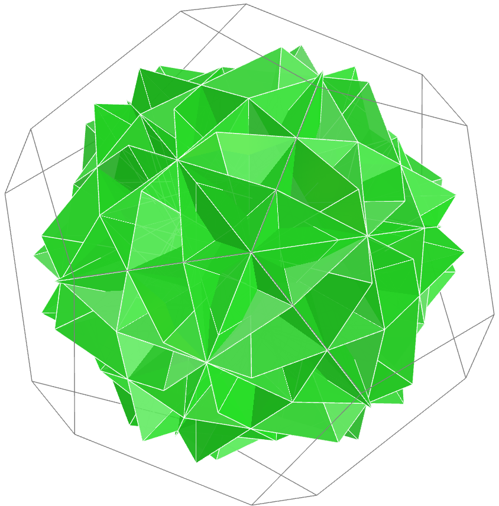</a>
  O quiricosaedro é composto de cinco poliedros e pode ser considerado regular. Neste composto, temos os vértices dos cinco poliedros escolhidos formando um casco convexo com vértices comuns, ou com correspondência com as faces de um dodecaedro regular.
  

<h4>22. Octahemioctacron</h4>
<a href="../vr/Octahemioctacron.htm" target="_blank" title="modelo 3D" class="fotoA">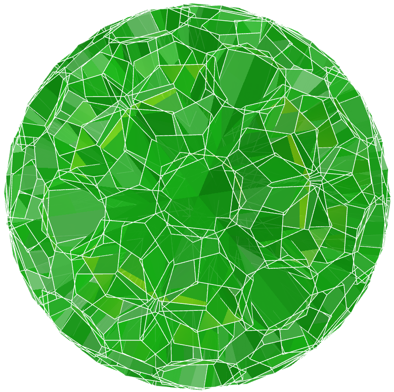</a>
  O resultado do "Composto 4" (Compound 4) de 20 poliedros é um poliedro estrelado, lembrando poliedros de Kepler-Poinsot. 
  

<h4>23. Octahemioctaedro</h4>
<a href="../vr/Octahemioctahedron.htm" target="_blank" title="modelo 3D" class="fotoA">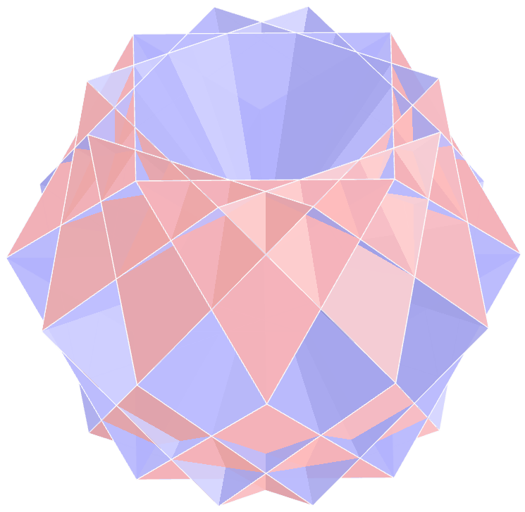</a>
  O resultado do "Composto 2" (Compound 2) de 3 poliedros é um poliedro estrelado, lembrando trapezoedros estrelados.
  

<h4>24. Rombicuboctaedro</h4>
<a href="../vr/Rhombicuboctahedron.htm" target="_blank" title="modelo 3D" class="fotoA">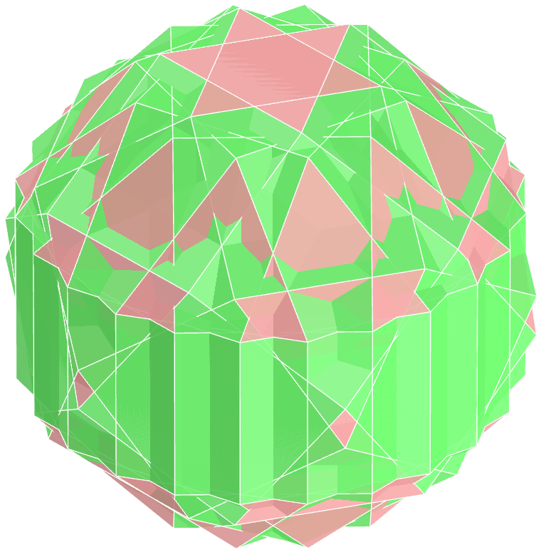</a>
  O resultado do "Composto 3" (Compound 3) de 5 poliedros é um poliedro estrelado, lembrando pirâmides estreladas duplas.
  

<h4>25. Pequeno Cubicuboctaedro</h4>
<a href="../vr/SmallCubicuboctahedron.htm" target="_blank" title="modelo 3D" class="fotoA">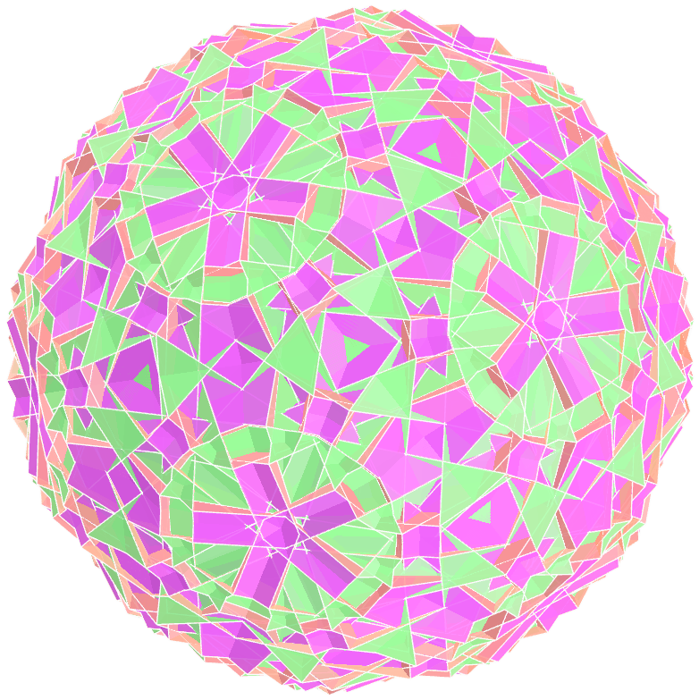</a>
  O resultado do "Composto 4" (Compound 4) de 20 poliedros é um poliedro estrelado, lembrando poliedros de Kepler-Poinsot. 
  

<h4>26. Pequeno Rombihexaedro</h4>
<a href="../vr/SmallRhombihexahedron.htm" target="_blank" title="modelo 3D" class="fotoA">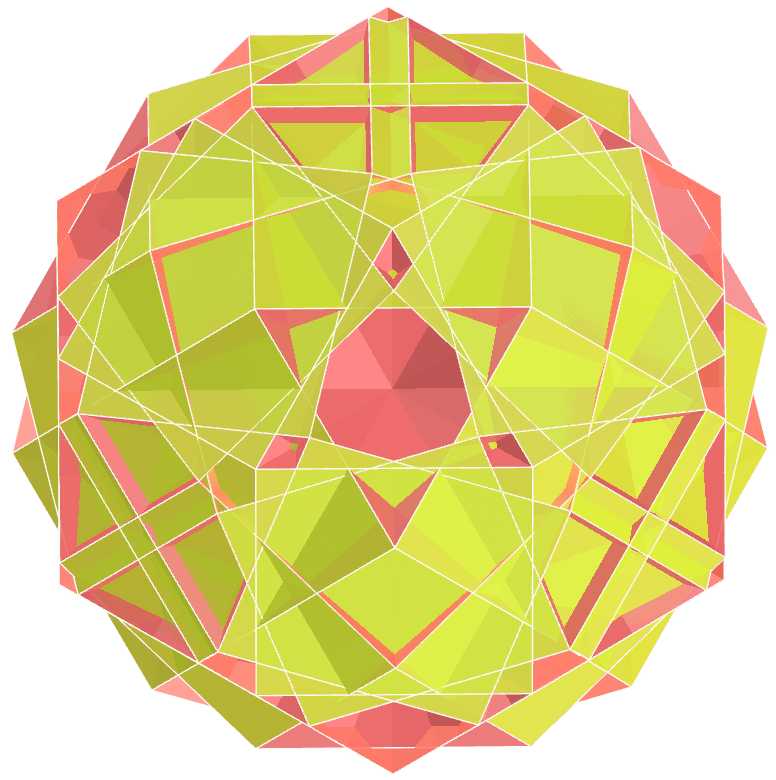</a>
  O composto de Escher pode ser adaptado para a família de cubos utilizando-se 5 poliedros. O resultado desta composição é um sólido que lembra o sólido de Escher. A imagem central da gravura Stars de 1948 popularizou o composto de Escher de octaedros.
  

<h4>27. Cubo Snub</h4>
<a href="../vr/SnubCube.htm" target="_blank" title="modelo 3D" class="fotoA">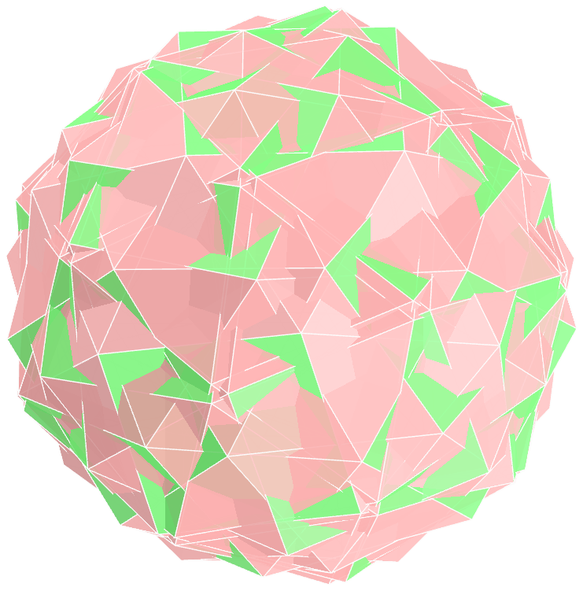</a>
  O disnubaedro é um composto de seis poliedros, com ângulos de rotação de 30&ordm; ou 45&ordm;, formando um poliedro uniforme. 
  

<h4>28. Hexaedro truncado estrelado</h4>
<a href="../vr/StellatedTruncatedHexahedron.htm" target="_blank" title="modelo 3D" class="fotoA">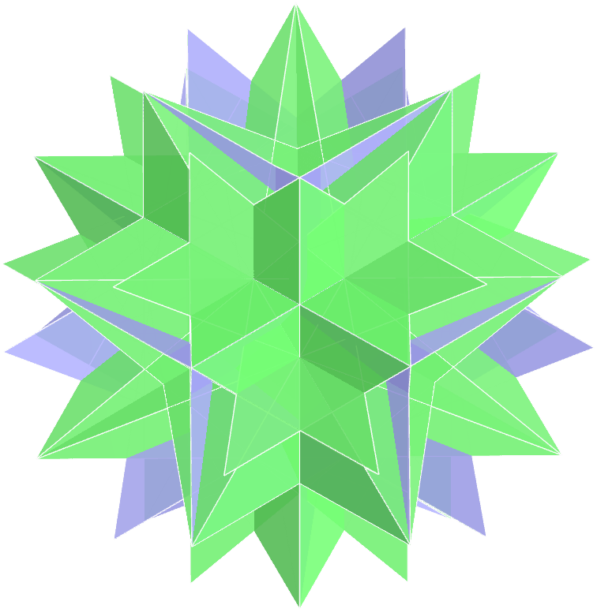</a>
  O snubaedro é um composto de três poliedros, com ângulos de rotação de 45&ordm;, formando um poliedro uniforme.
  

<h4>29. Hexaedro Tetrakis</h4>
<a href="../vr/TetrakisHexahedron.htm" target="_blank" title="modelo 3D" class="fotoA">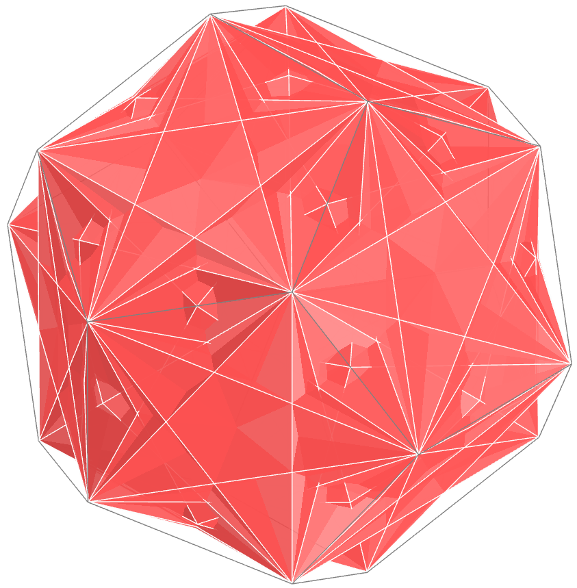</a>
  O quiricosaedro é composto de cinco poliedros e pode ser considerado regular. Neste composto, temos os vértices dos cinco poliedros escolhidos formando um casco convexo com vértices comuns, ou com correspondência com as faces de um dodecaedro regular.
  

<h4>30. Cubo Truncado</h4>
<a href="../vr/TruncatedCube.htm" target="_blank" title="modelo 3D" class="fotoA">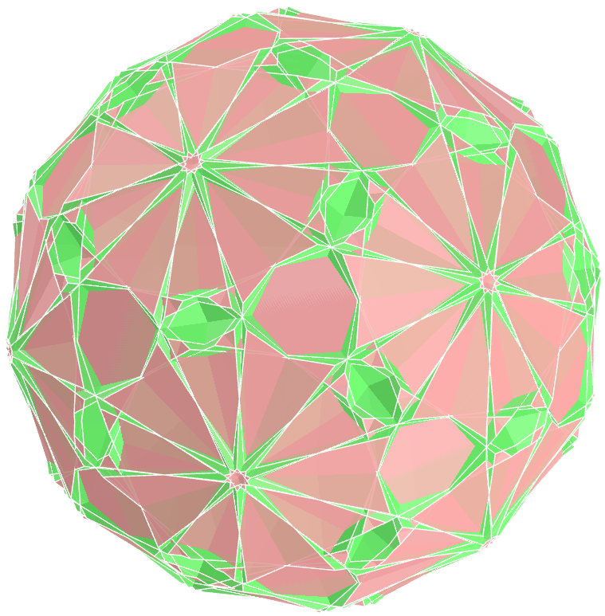</a>
  O resultado do "Composto 4" (Compound 4) de 20 poliedros é um poliedro estrelado, lembrando poliedros de Kepler-Poinsot. 
  

<a href="#p1" class="topo">voltar ao topo</a>

<h4>31. Cuboctaedro Truncado</h4>
<a href="../vr/TruncatedCuboctahedron.htm" target="_blank" title="modelo 3D" class="fotoA">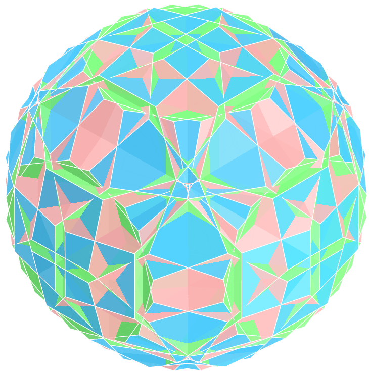</a>
  O disnubaedro é um composto de seis poliedros, com ângulos de rotação de 30&ordm; ou 45&ordm;, formando um poliedro uniforme. 
  

<h4>32. Grande Rombicuboctaedro Uniforme</h4>
<a href="../vr/UniformGreatRhombicuboctahedron.htm" target="_blank" title="modelo 3D" class="fotoA">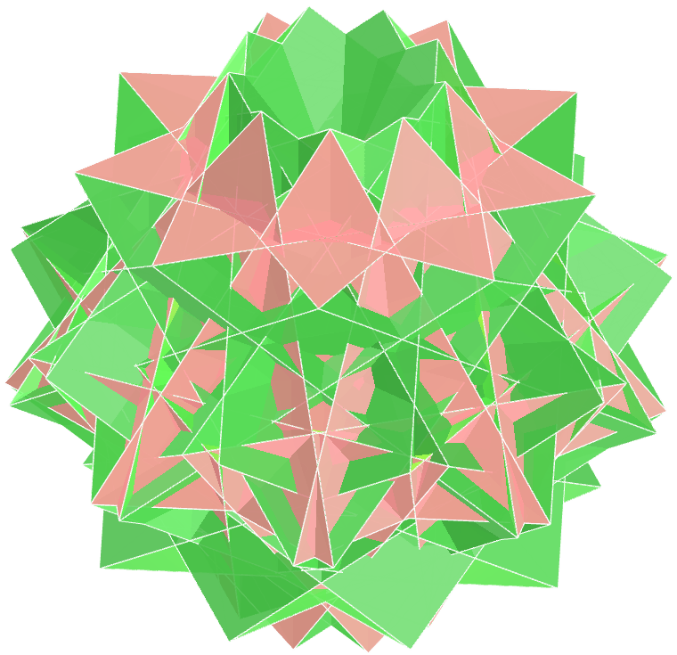</a>
  O resultado do "Composto 1" (Compound 1) de 3 poliedros é um poliedro estrelado, lembrando pirâmides estreladas duplas.
  

<h4>33. Cuboctaedro com pipas</h4>
<a href="../vr/CuboctahedronKites.htm" target="_blank" title="modelo 3D" class="fotoA">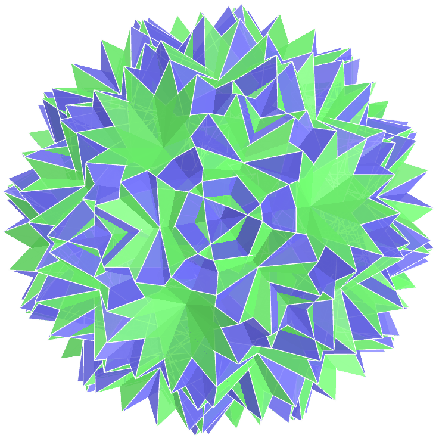</a>
  O resultado do "Composto 4" (Compound 4) de 20 poliedros é um poliedro estrelado, lembrando poliedros de Kepler-Poinsot. 
  

<h4>34. Rombicuboctaedro com pipas</h4>
<a href="../vr/RhombicuboctahedronKites.htm" target="_blank" title="modelo 3D" class="fotoA">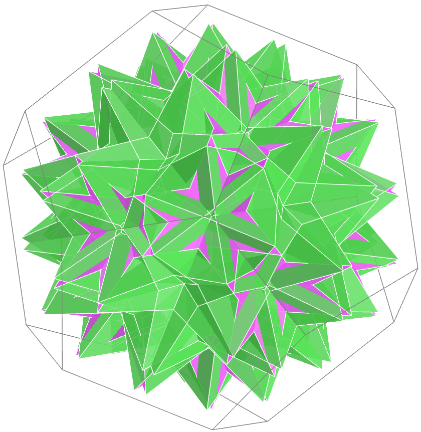</a>
  O quiricosaedro é composto de cinco poliedros e pode ser considerado regular. Neste composto, temos os vértices dos cinco poliedros escolhidos formando um casco convexo com vértices comuns, ou com correspondência com as faces de um dodecaedro regular.
  

<h4>35. Cubo Snub com pipas</h4>
<a href="../vr/SnubCubeKites.htm" target="_blank" title="modelo 3D" class="fotoA">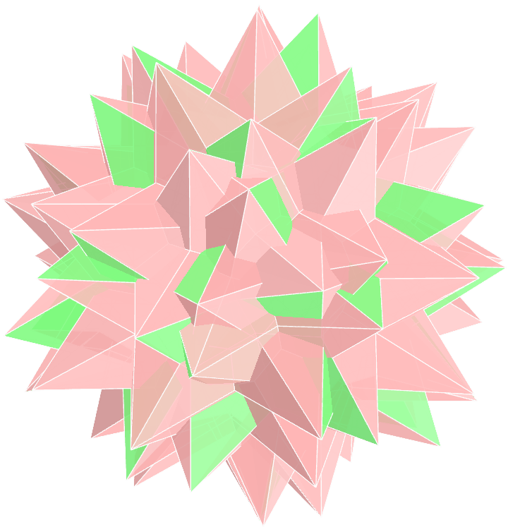</a>
  O snubaedro é um composto de três poliedros, com ângulos de rotação de 45&ordm;, formando um poliedro uniforme.
  

<h4>36. Cubo Truncado com pipas</h4>
<a href="../vr/TruncatedCubeKites.htm" target="_blank" title="modelo 3D" class="fotoA">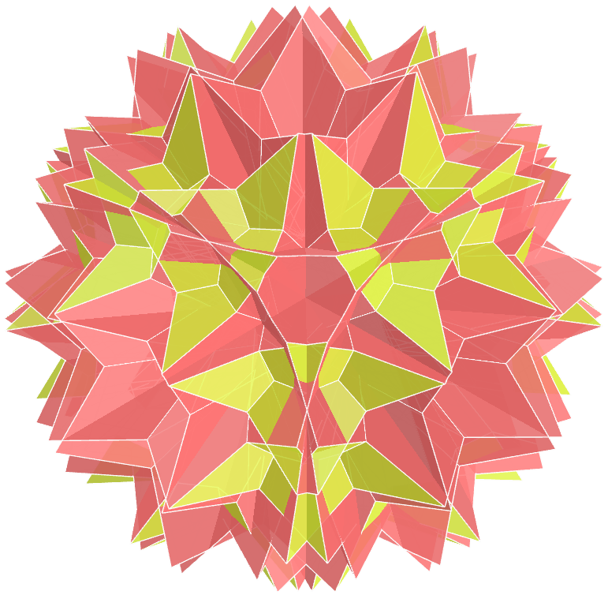</a>
  O disnubaedro é um composto de seis poliedros, com ângulos de rotação de 30&ordm; ou 45&ordm;, formando um poliedro uniforme. 
  

<h4>37. Cuboctaedro Truncado com pipas</h4>
<a href="../vr/TruncatedCuboctahedronKites.htm" target="_blank" title="modelo 3D" class="fotoA">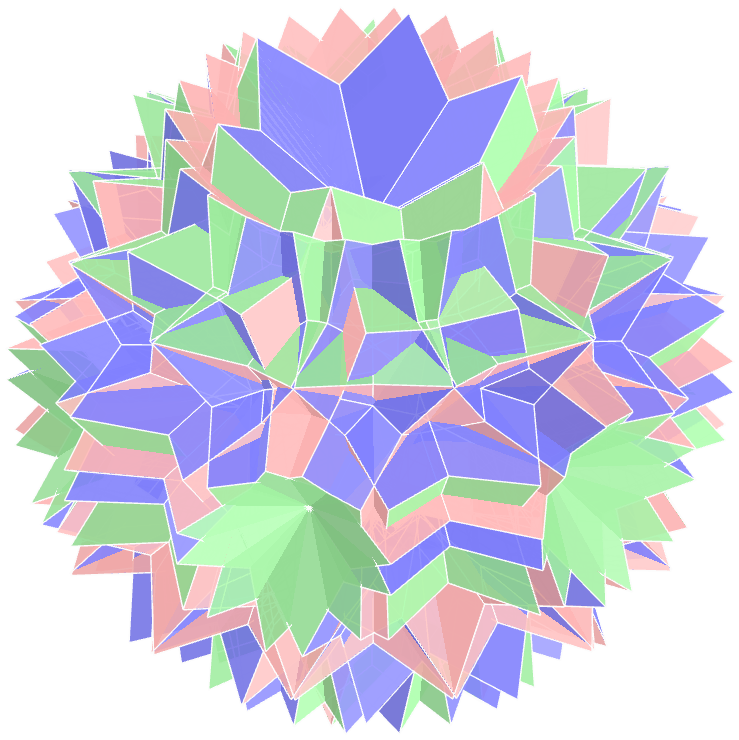</a>
  O resultado do "Composto 3" (Compound 3) de 5 poliedros é um poliedro estrelado, lembrando pirâmides estreladas duplas. 
  

<a href="#p1" class="topo">voltar ao topo</a>

  Polyhedral Compound - Cube family: visualization with Virtual Reality de <a xmlns:cc="http://creativecommons.org/ns#" href="https://paulohscwb.github.io/polycompound/compounds2/pt-br/" property="cc:attributionName" rel="cc:attributionURL">Paulo Henrique Siqueira</a> está licenciado com uma Licença <a rel="license" href="http://creativecommons.org/licenses/by-nc-nd/4.0/">Creative Commons Atribuição-NãoComercial-SemDerivações 4.0 Internacional</a>.

<h4>Como citar este trabalho:</h4> 

Siqueira, P.H., "Polyhedral Compound - Cube family: visualization with Virtual Reality". Disponível em: <https://paulohscwb.github.io/polycompound/compounds2/pt-br/>, Junho de 2025.

<!---->
  <b>Referências:</b>
 Weisstein, Eric W. "Polyhedron Compound" From MathWorld-A Wolfram Web Resource. <a href="https://mathworld.wolfram.com/ArchimedeanDual.html" target="_blank">https://mathworld.wolfram.com/PolyhedronCompound.html</a>
 Weisstein, Eric W. "Uniform Polyhedron." From MathWorld--A Wolfram Web Resource. <a href="https://mathworld.wolfram.com/UniformPolyhedron.html" target="_blank">https://mathworld.wolfram.com/UniformPolyhedron.html</a>
 McCooey, David I. "Visual Polyhedra". <a href="http://dmccooey.com/polyhedra/" target="_blank">http://dmccooey.com/polyhedra/</a>
