<link rel="stylesheet" href="../scripts/style.css">
<meta charset="utf-8">
<link rel="icon" type="image/png" href="vr/salas/imagens/icone.png">
<h2>Visualization of Polyhedra with Virtual Reality (VR) in A-frame</h2>
 <b>author:</b> Paulo Henrique Siqueira - Universidade Federal do Paraná
  <b>contact:</b> <a href="#">paulohscwb@gmail.com</a>
  <a href="https://paulohscwb.github.io/polycompound/compounds3/pt-br/">versão em português</a>
 <form style="margin: 0 auto; float:right; text-align:right; width:100%; margin-bottom:15px;">
	<select id="url" onchange="urlHandler(this.value)" style="color:royalblue;">
		<option disabled selected value>More solids:</option>
		<option value="../compounds1/">Tetrahedra family</option>
		<option value="../compounds2/">Cube family</option>
		<option value="../tetrahedra/">Tetrahedra packings</option>
		<option value="../vesica/">Vesica piscis and Trinexus</option>
		<option disabled value="../compounds3/">Octahedra family</option>
		<!--<option value="../compounds4/">Dodecahedra and icosahedra family 1</option>
		<option value="../compounds5/">Dodecahedra and icosahedra family 2</option>
		<option value="../compounds6/">Compounds of dual polyhedra</option>
		<option value="../compounds7/">Compounds of two polyhedra</option>-->
	</select>
</form>

  <h2 align="center">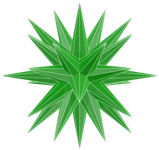 Octahedra family</h2>
A polyhedral compound is an arrangement of several interpenetrating polyhedra, all the same or of distinct types. Polyhedral compounds often have visually interesting symmetrical properties. Compounds of multiple Platonic and Archimedean solids can be especially appealing, as can compounds of these solids and their duals.
 This work shows polyhedral compounds, modeled for viewing in Virtual Reality.

<a href="#m3d">3D Models</a>&nbsp;&nbsp;|&nbsp;&nbsp;<a href="../">Home</a>

 

<h3 id="m3d" align="center">3D models</h3>
<!--<iframe width="560" height="315" style="max-width:100%" src="https://www.youtube.com/embed/videoseries?list=PLy0I_lGW8HxUNlFkcmo7my5krrhVG2_BH" title="YouTube video player" frameborder="0" allow="accelerometer; autoplay; clipboard-write; encrypted-media; gyroscope; picture-in-picture; web-share" allowfullscreen></iframe>-->
<h4>1. Biscribed hexpropellor cube</h4>
<a href="vr/BiscribedHexpropelloCube.htm" target="_blank" title="3D model" class="fotoA">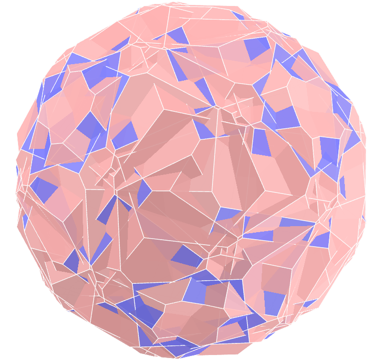</a>
  The chiricosahedron is composed of five polyhedra and can be considered regular. In this compound, we have the vertices of the five chosen polyhedra forming a convex hull with common vertices, or with correspondence with the faces of a regular dodecahedron.
  

<h4>2. Biscribed orthokis propellor cube</h4>
<a href="vr/BiscribedOrthokisPropellorCube.htm" target="_blank" title="3D model" class="fotoA">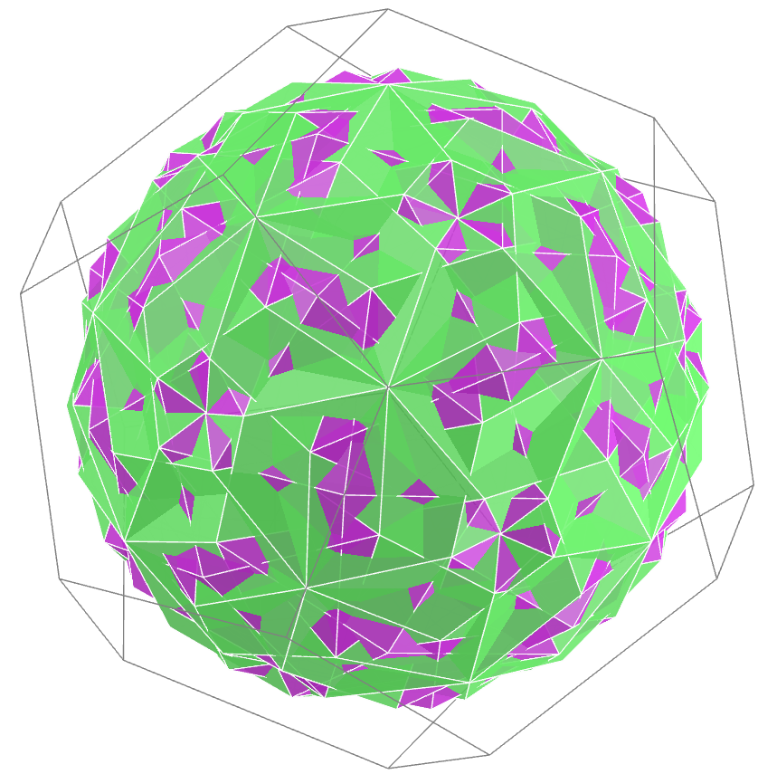</a>
  The result of "Compound 1" of 2 polyhedra is a stellated polyhedron, resembling stellated pyramids.
  

<h4>3. Biscribed orthotruncated propellor octahedron</h4>
<a href="vr/BiscribedOrthotruncatedPropellorOctahedron.htm" target="_blank" title="3D model" class="fotoA">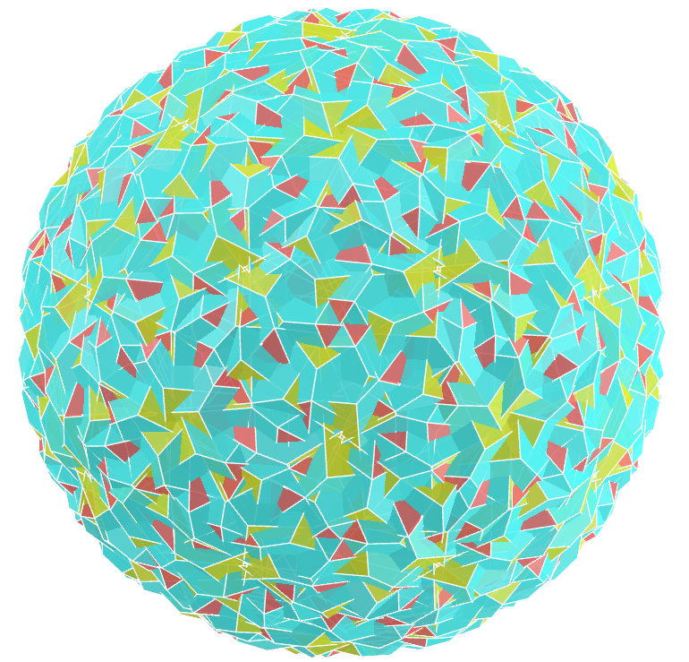</a>
  The result of "Compound 2" of 3 polyhedra is a stellated polyhedron, resembling stellated trapezohedrons.
  

<h4>4. Biscribed propellor cube</h4>
<a href="vr/BiscribedPropelloCube.htm" target="_blank" title="3D model" class="fotoA">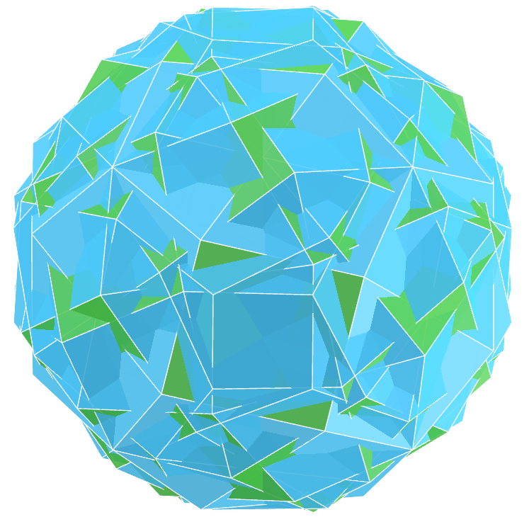</a>
  The result of "Compound 3" of 5 polyhedra is a stellated polyhedron, resembling double stellated pyramids.
  

<h4>5. Biscribed propellor octahedron</h4>
<a href="vr/BiscribedPropellorOctahedron.htm" target="_blank" title="3D model" class="fotoA">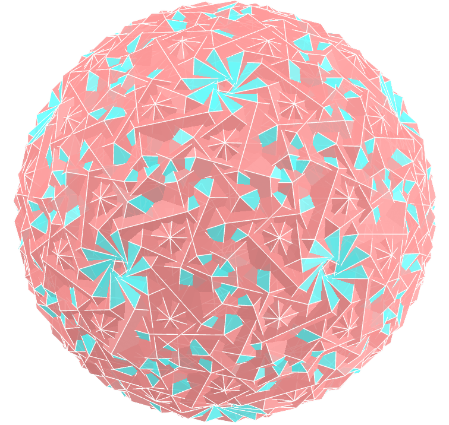</a>
  The result of "Compound 4" of 20 polyhedra is a stellated polyhedron, resembling Kepler-Poinsot polyhedra.
  

<h4>6. Hexaedro tetrakis de hélice biscrito</h4>
<a href="vr/BiscribedPropellorTetrakisHexahedron.htm" target="_blank" title="3D model" class="fotoA">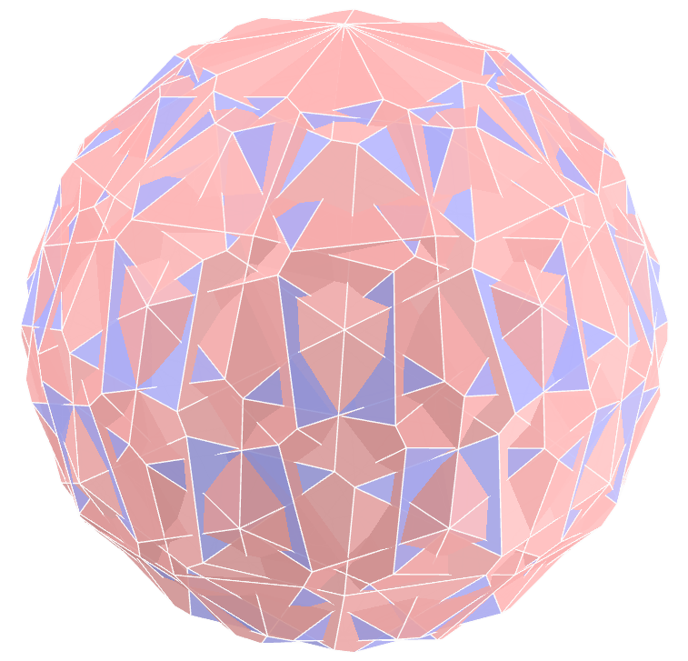</a>
  The Escher compound can be adapted to the cube family using 5 polyhedra. The result of this composition is a solid that resembles the Escher solid. The central image of the 1948 engraving Stars popularized the Escher compound of octahedra.
  

<h4>7. Biscribed propellor truncated cuboctahedron</h4>
<a href="vr/BiscribedPropellorTruncatedCuboctahedron.htm" target="_blank" title="3D model" class="fotoA">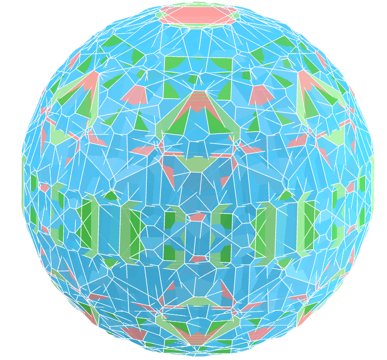</a>
  The disnubahedron is a compound of six polyhedra, with rotation angles of 30&ordm; or 45&ordm;, forming a uniform polyhedron. 
  

<h4>8. Biscribed propellor truncated octahedron</h4>
<a href="vr/BiscribedPropellorTruncatedOctahedron.htm" target="_blank" title="3D model" class="fotoA">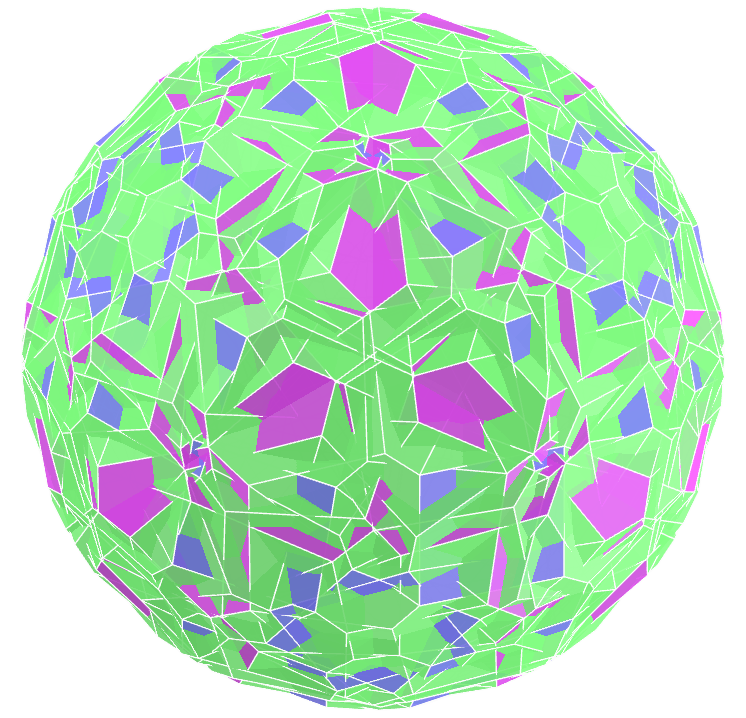</a>
  The snubahedron is a compound of three polyhedra, with rotation angles of 45&ordm;, forming a uniform polyhedron.
  

<h4>9. Biscribed snub cube</h4>
<a href="vr/BiscribedSnubCube.htm" target="_blank" title="3D model" class="fotoA">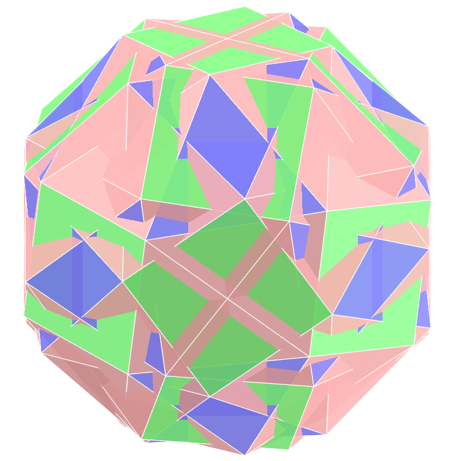</a>
  The chiricosahedron is composed of five polyhedra and can be considered regular. In this compound, we have the vertices of the five chosen polyhedra forming a convex hull with common vertices, or with correspondence with the faces of a regular dodecahedron.
  

<h4>10. Biscribed snub truncated octahedron</h4>
<a href="vr/BiscribedSnubTruncatedOctahedron.htm" target="_blank" title="3D model" class="fotoA">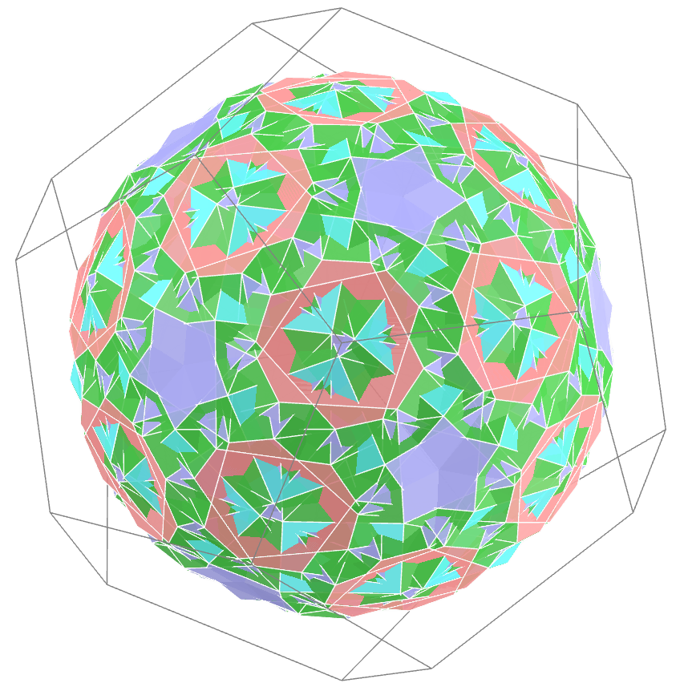</a>
  The result of "Compound 1" of 2 polyhedra is a stellated polyhedron, resembling stellated pyramids.
  

<a href="#p1" class="topo">back to top</a>

<h4>11. Biscribed truncated cuboctahedron</h4>
<a href="vr/BiscribedTruncatedCuboctahedron.htm" target="_blank" title="3D model" class="fotoA">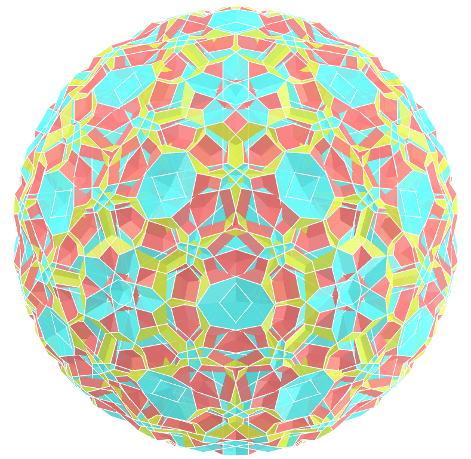</a>
  The result of "Compound 2" of 3 polyhedra is a stellated polyhedron, resembling stellated trapezohedrons.
  

<h4>12. Biscribed truncated octahedron</h4>
<a href="vr/BiscribedTruncatedOctahedron.htm" target="_blank" title="3D model" class="fotoA">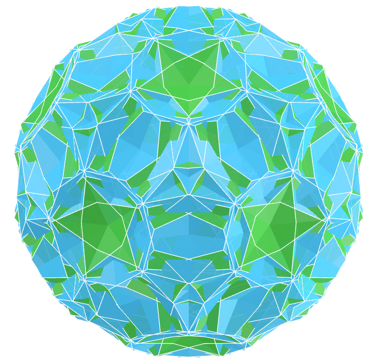</a>
  The chiricosahedron is composed of five polyhedra and can be considered regular. In this compound, we have the vertices of the five chosen polyhedra forming a convex hull with common vertices, or with correspondence with the faces of a regular dodecahedron.
  

<h4>13. Chamfered cube</h4>
<a href="vr/ChamferedCube.htm" target="_blank" title="3D model" class="fotoA">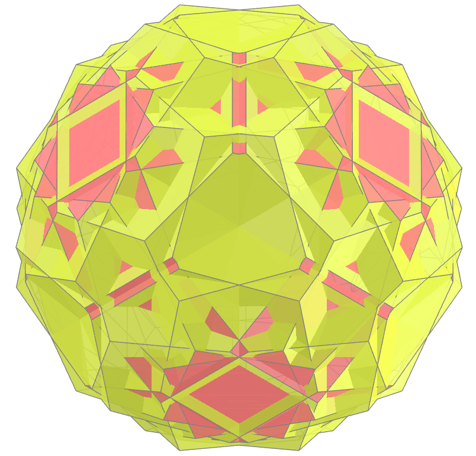</a>
  The Escher compound can be adapted to the cube family using 5 polyhedra. The result of this composition is a solid that resembles the Escher solid. The central image of the 1948 engraving Stars popularized the Escher compound of octahedra.
  

<h4>14. Chamfered octahedron</h4>
<a href="vr/ChamferedOctahedron.htm" target="_blank" title="3D model" class="fotoA">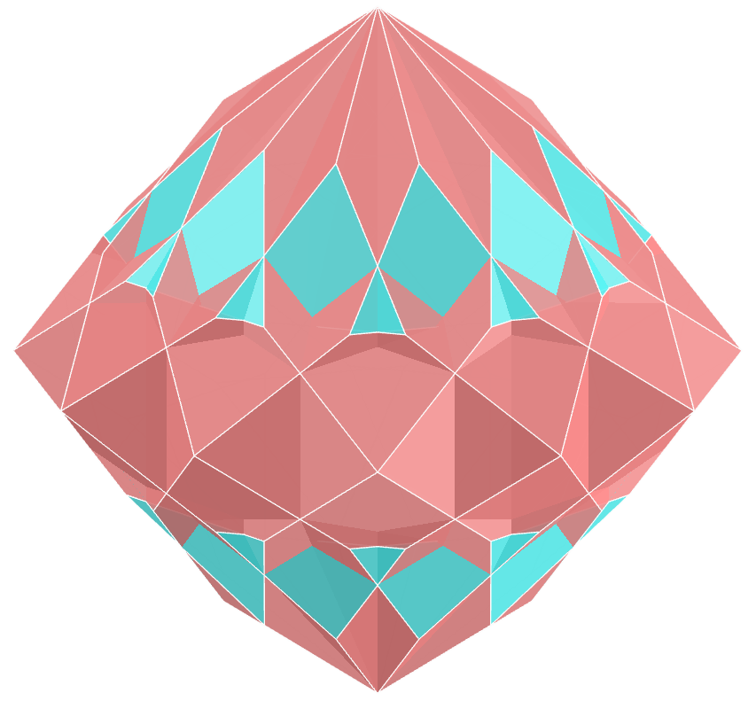</a>
  The result of "Compound 3" of 5 polyhedra is a stellated polyhedron, resembling double stellated pyramids.
  

<h4>15. Deltoidal icositetrahedron</h4>
<a href="vr/DeltoidalIcositetrahedron.htm" target="_blank" title="3D model" class="fotoA">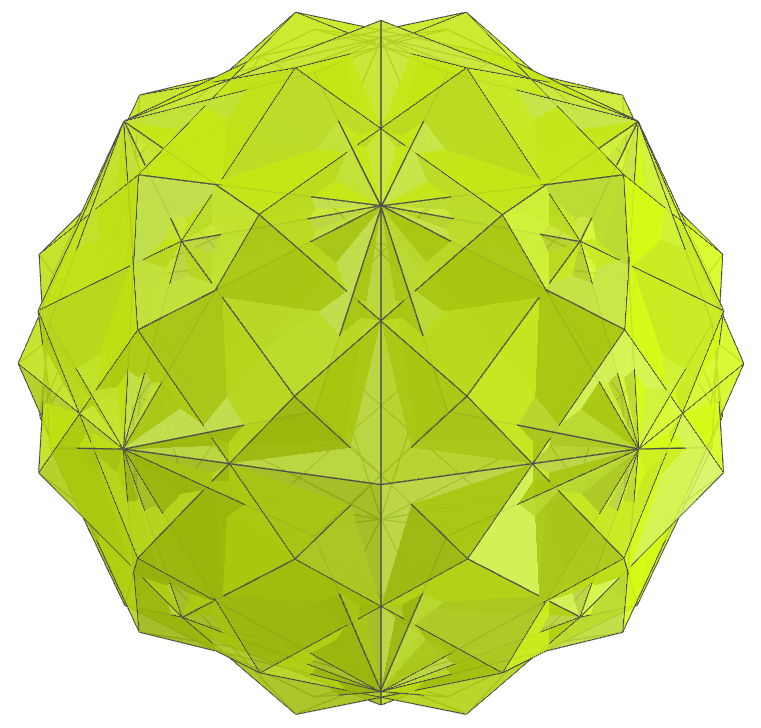</a>
  The result of "Compound 4" of 20 polyhedra is a stellated polyhedron, resembling Kepler-Poinsot polyhedra.
  

 <h4>16. Disdyakis dodecahedron</h4>
<a href="vr/DisdyakisDodecahedron.htm" target="_blank" title="3D model" class="fotoA">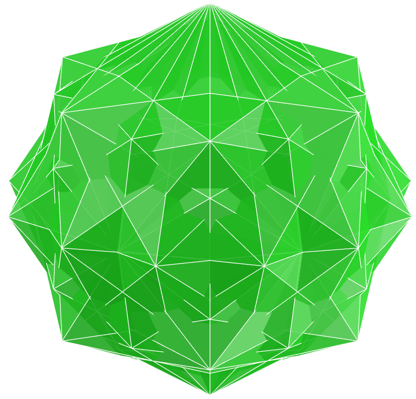</a>
  The snubahedron is a compound of three polyhedra, with rotation angles of 45&ordm;, forming a uniform polyhedron.
  

<h4>17. Dyakis dodecahedron</h4>
<a href="vr/DyakisDodecahedron.htm" target="_blank" title="3D model" class="fotoA">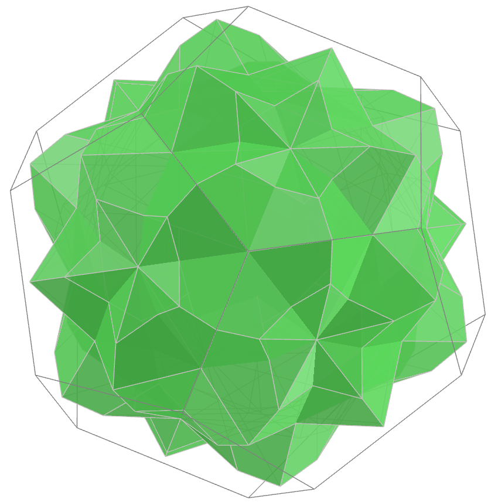</a>
  The result of "Compound 1" of 2 polyhedra is a stellated polyhedron, resembling stellated pyramids.
  

<h4>18. Great hexacronic icositetrahedron</h4>
<a href="vr/GreatHexacronicIcositetrahedron.htm" target="_blank" title="3D model" class="fotoA">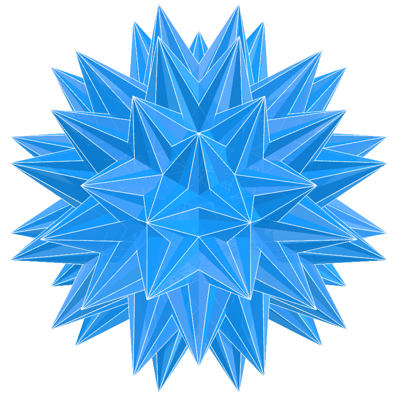</a>
  The result of "Compound 4" of 20 polyhedra is a stellated polyhedron, resembling Kepler-Poinsot polyhedra.
  

<h4>19. Jessens orthogonal icosahedron</h4>
<a href="vr/JessensOrthogonalIcosahedron.htm" target="_blank" title="3D model" class="fotoA">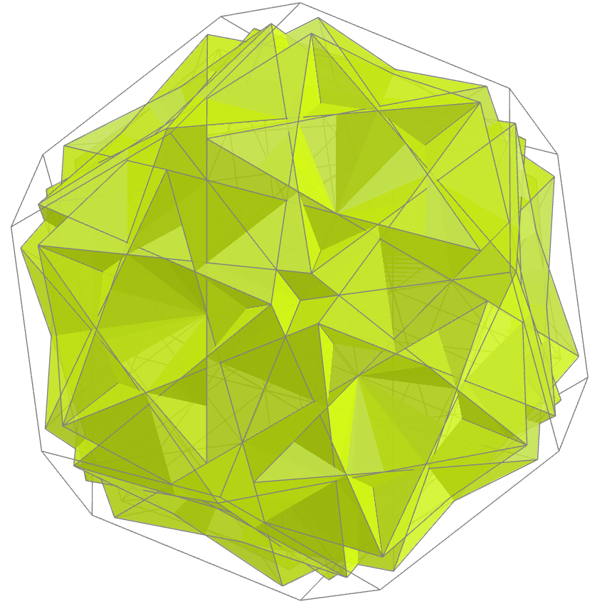</a>
  The chiricosahedron is composed of five polyhedra and can be considered regular. In this compound, we have the vertices of the five chosen polyhedra forming a convex hull with common vertices, or with correspondence with the faces of a regular dodecahedron.
  

<h4>20. Joined truncated cube</h4>
<a href="vr/JoinedTruncatedCube.htm" target="_blank" title="3D model" class="fotoA">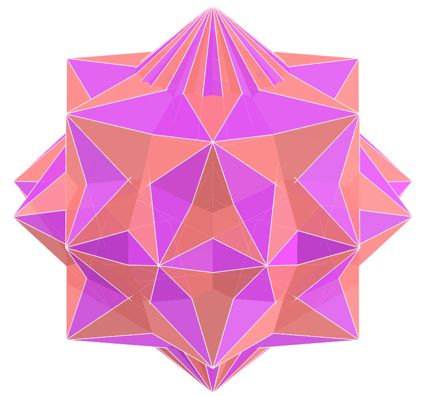</a>
  The Escher compound can be adapted to the cube family using 5 polyhedra. The result of this composition is a solid that resembles the Escher solid. The central image of the 1948 engraving Stars popularized the Escher compound of octahedra.
  
 

<a href="#p1" class="topo">back to top</a>

<h4>21. Joined truncated cuboctahedron</h4>
<a href="vr/JoinedTruncatedCuboctahedron.htm" target="_blank" title="3D model" class="fotoA">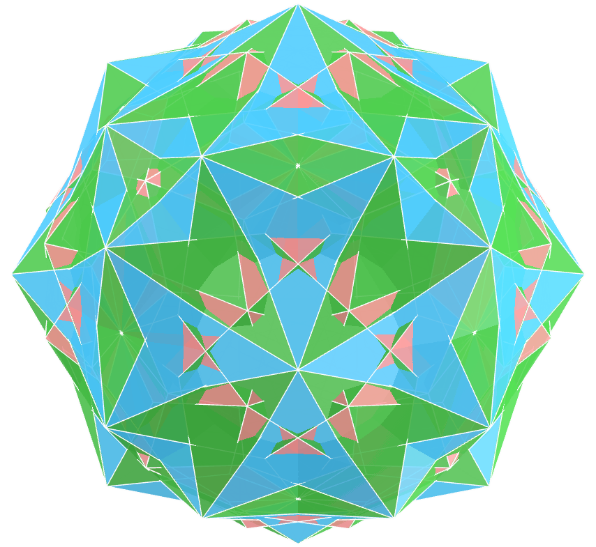</a>
  The chiricosahedron is composed of five polyhedra and can be considered regular. In this compound, we have the vertices of the five chosen polyhedra forming a convex hull with common vertices, or with correspondence with the faces of a regular dodecahedron.
  

<h4>22. Möbius hexakis octahedron</h4>

  The result of "Compound 4" of 20 polyhedra is a stellated polyhedron, resembling Kepler-Poinsot polyhedra.
  

<h4>23. Möbius octakis hexahedron dual</h4>
<a href="vr/MobiusOctakisHexahedronDual.htm" target="_blank" title="3D model" class="fotoA">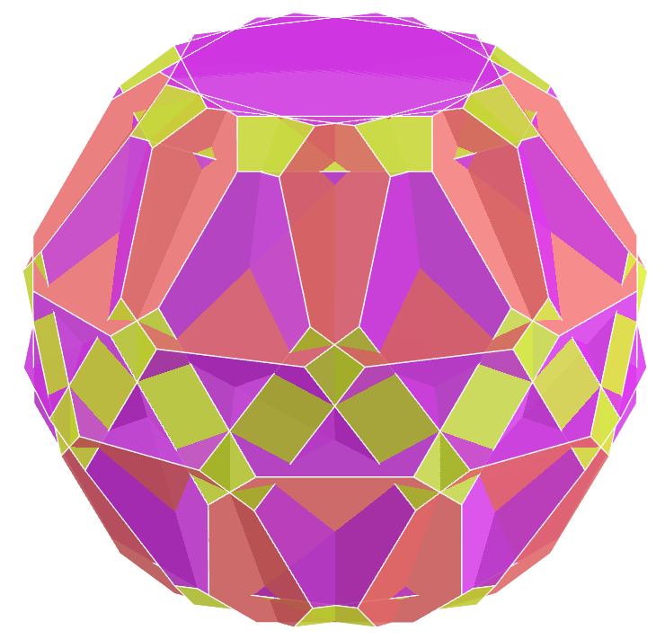</a>
  The result of "Compound 2" of 3 polyhedra is a stellated polyhedron, resembling stellated trapezohedrons.
  

<h4>24. Octahedron</h4>
<a href="vr/Octahedron.htm" target="_blank" title="3D model" class="fotoA">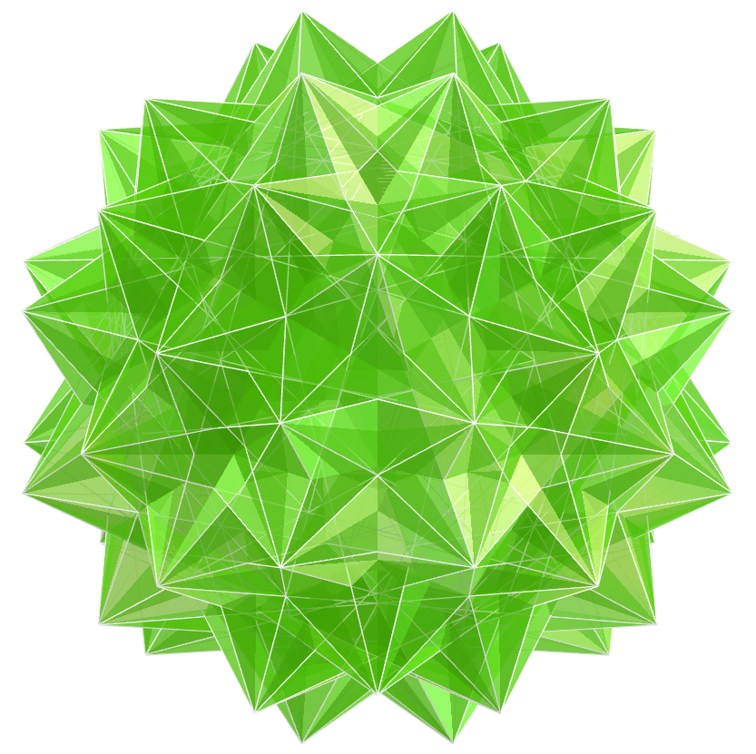</a>
  The result of "Compound 3" of 5 polyhedra is a stellated polyhedron, resembling double stellated pyramids.
  

<h4>25. Octahedron kites</h4>
<a href="vr/OctahedronKites.htm" target="_blank" title="3D model" class="fotoA">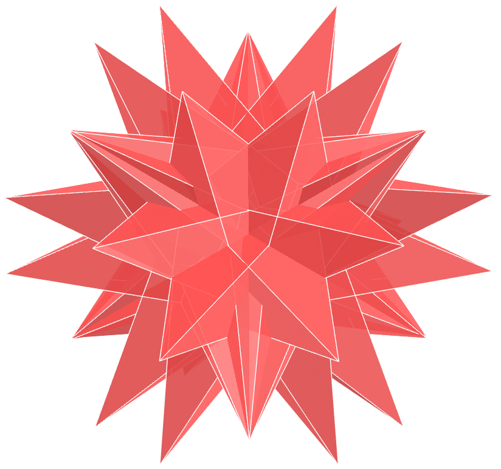</a>
  The result of "Compound 4" of 20 polyhedra is a stellated polyhedron, resembling Kepler-Poinsot polyhedra.
  

<h4>26. Pentagonal icositetrahedron</h4>
<a href="vr/PentagonalIcositetrahedron.htm" target="_blank" title="3D model" class="fotoA">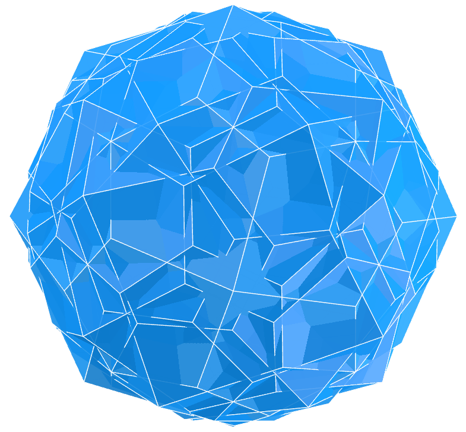</a>
  The Escher compound can be adapted to the cube family using 5 polyhedra. The result of this composition is a solid that resembles the Escher solid. The central image of the 1948 engraving Stars popularized the Escher compound of octahedra.
  

<h4>27. Propellor cube</h4>
<a href="vr/PropellorCube.htm" target="_blank" title="3D model" class="fotoA">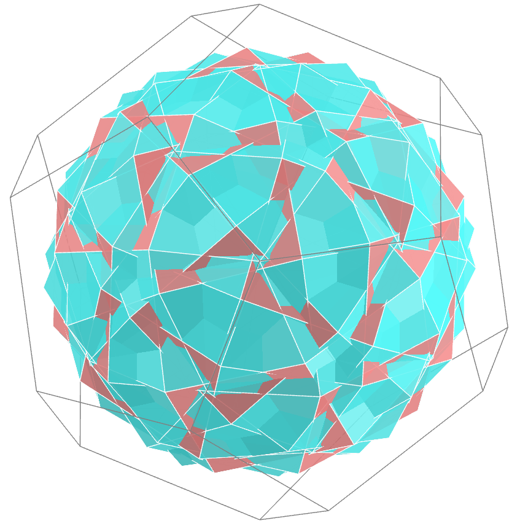</a>
  The disnubahedron is a compound of six polyhedra, with rotation angles of 30&ordm; or 45&ordm;, forming a uniform polyhedron. 
  

<h4>28. Propellor octahedron</h4>
<a href="vr/PropellorOctahedron.htm" target="_blank" title="3D model" class="fotoA">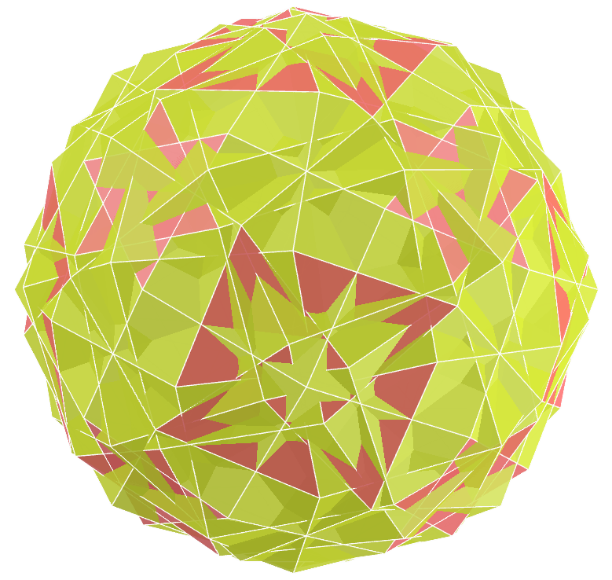</a>
  The snubahedron is a compound of three polyhedra, with rotation angles of 45&ordm;, forming a uniform polyhedron.
  

<h4>29. Propellor snub cube</h4>
<a href="vr/PropellorSnubCube.htm" target="_blank" title="3D model" class="fotoA">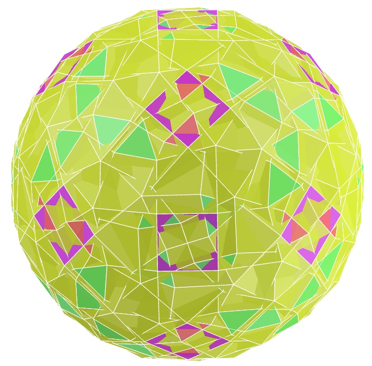</a>
  The chiricosahedron is composed of five polyhedra and can be considered regular. In this compound, we have the vertices of the five chosen polyhedra forming a convex hull with common vertices, or with correspondence with the faces of a regular dodecahedron.
  

<h4>30. Propellor tetrakis hexahedron</h4>
<a href="vr/PropellorTetrakisHexahedron.htm" target="_blank" title="3D model" class="fotoA">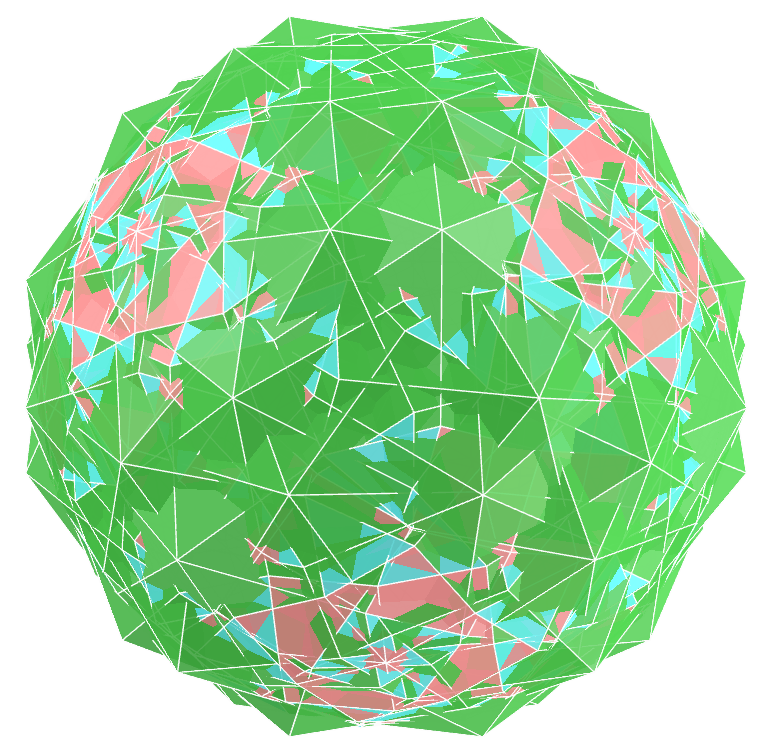</a>
  The result of "Compound 4" of 20 polyhedra is a stellated polyhedron, resembling Kepler-Poinsot polyhedra.
  

<a href="#p1" class="topo">back to top</a>

<h4>31. Propellor truncated cuboctahedron</h4>
<a href="vr/PropellorTruncatedCuboctahedron.htm" target="_blank" title="3D model" class="fotoA">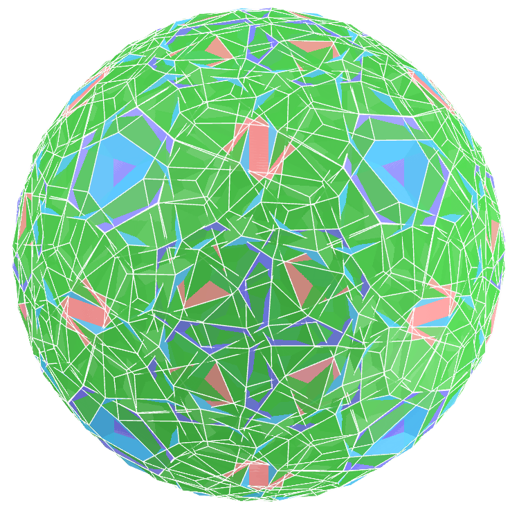</a>
  The disnubahedron is a compound of six polyhedra, with rotation angles of 30&ordm; or 45&ordm;, forming a uniform polyhedron. 
  

<h4>32. Propellor truncated octahedron</h4>
<a href="vr/PropellorTruncatedOctahedron.htm" target="_blank" title="3D model" class="fotoA">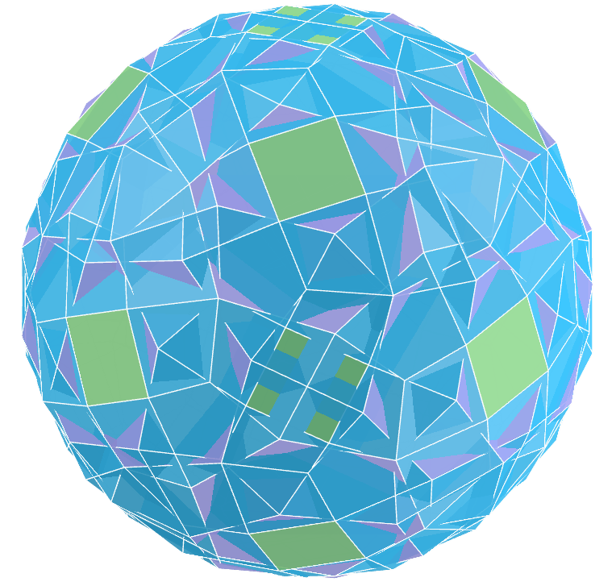</a>
  The result of "Compound 1" of 2 polyhedra is a stellated polyhedron, resembling stellated pyramids.
  

<h4>33. Rhombic dodecahedron</h4>
<a href="vr/RhombicDodecahedron.htm" target="_blank" title="3D model" class="fotoA">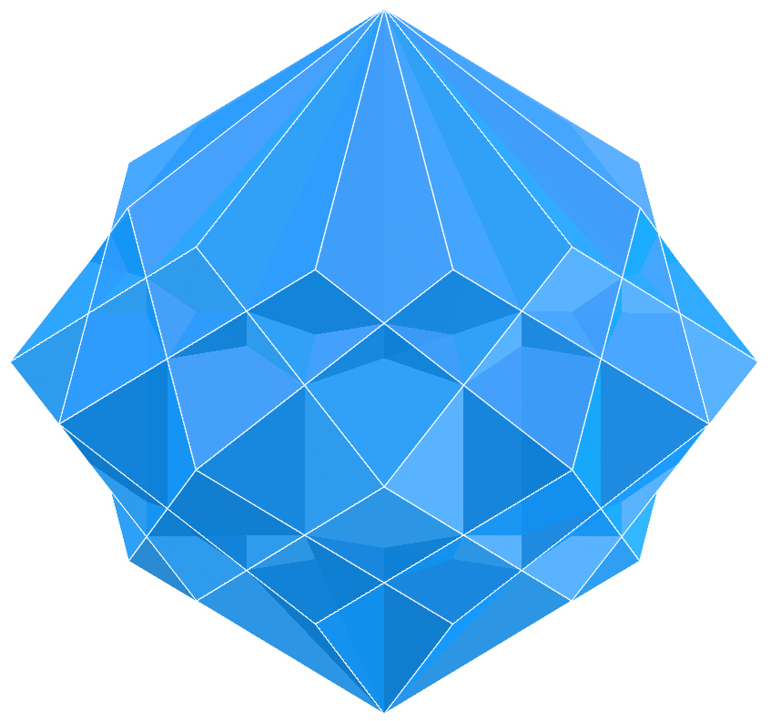</a>
  The result of "Compound 4" of 20 polyhedra is a stellated polyhedron, resembling Kepler-Poinsot polyhedra.
  

<h4>34. Small hexacronic icositetrahedron</h4>
<a href="vr/SmallHexacronicIcositetrahedron.htm" target="_blank" title="3D model" class="fotoA">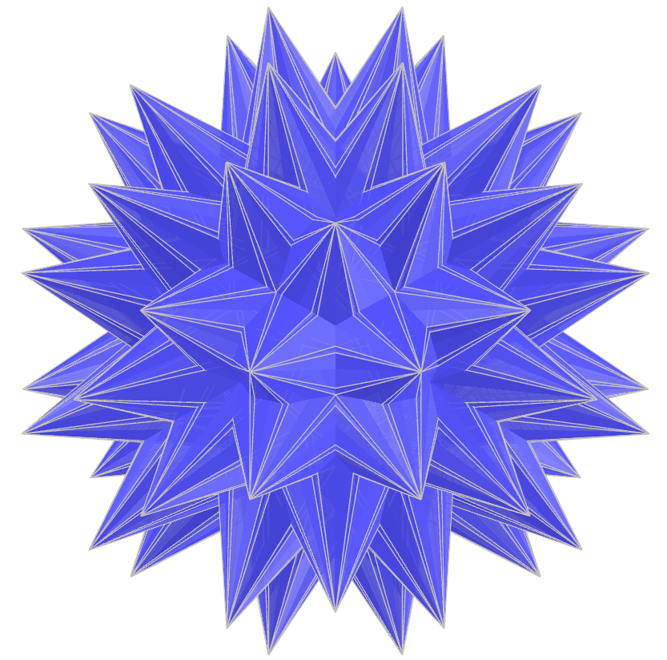</a>
  The chiricosahedron is composed of five polyhedra and can be considered regular. In this compound, we have the vertices of the five chosen polyhedra forming a convex hull with common vertices, or with correspondence with the faces of a regular dodecahedron.
  

<h4>35. Tetradyakis hexahedron</h4>
<a href="vr/TetradyakisHexahedron.htm" target="_blank" title="3D model" class="fotoA">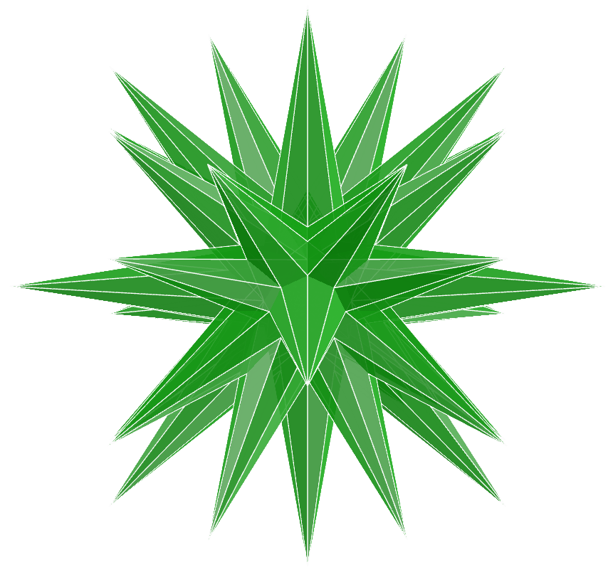</a>
  The snubahedron is a compound of three polyhedra, with rotation angles of 45&ordm;, forming a uniform polyhedron.
  

<h4>36. Tetrahemihexacron</h4>
<a href="vr/Tetrahemihexacron.htm" target="_blank" title="3D model" class="fotoA">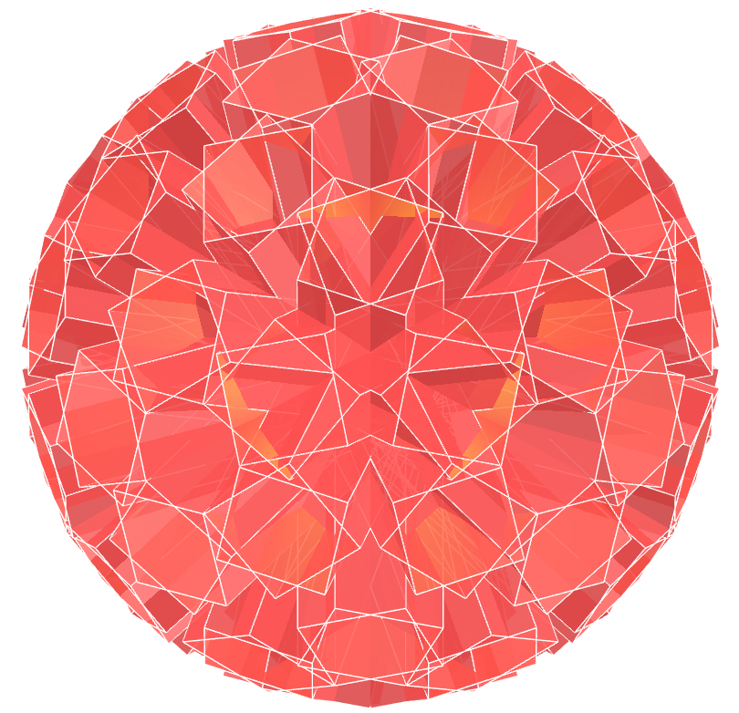</a>
  The disnubahedron is a compound of six polyhedra, with rotation angles of 30&ordm; or 45&ordm;, forming a uniform polyhedron. 
  

<h4>37. Tetrahemihexahedron</h4>

  The result of "Compound 3" of 5 polyhedra is a stellated polyhedron, resembling double stellated pyramids. 
  

<h4>38. Triakis octahedron</h4>
<a href="vr/TriakisOctahedron.htm" target="_blank" title="3D model" class="fotoA">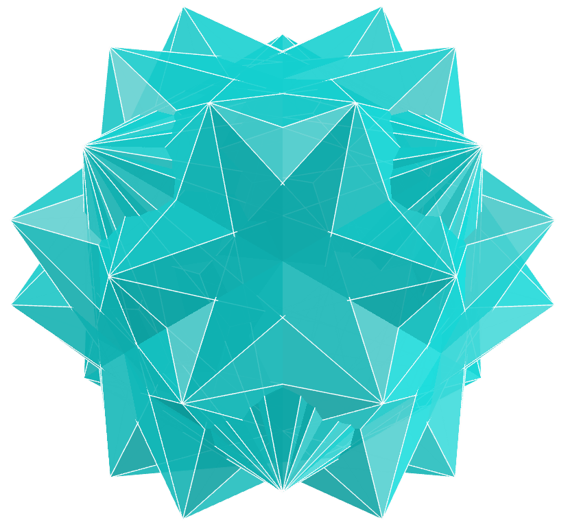</a>
  The result of "Compound 3" of 5 polyhedra is a stellated polyhedron, resembling double stellated pyramids. 
  

<h4>39. Truncated octahedron</h4>
<a href="vr/TruncatedOctahedron.htm" target="_blank" title="3D model" class="fotoA">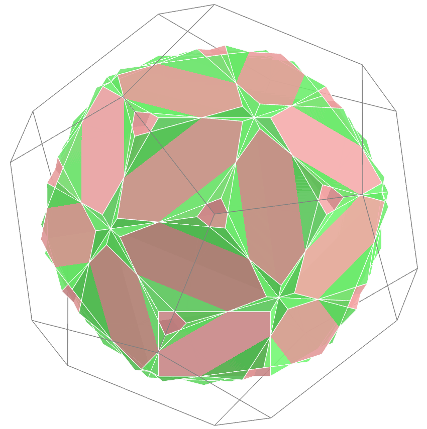</a>
  The result of "Compound 3" of 5 polyhedra is a stellated polyhedron, resembling double stellated pyramids. 
  

<h4>40. Truncated octahedron kites</h4>
<a href="vr/TruncatedOctahedronKites.htm" target="_blank" title="3D model" class="fotoA">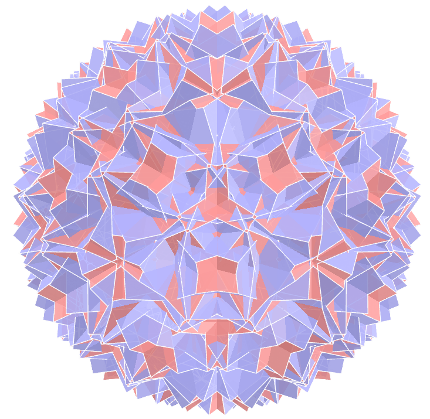</a>
  The result of "Compound 3" of 5 polyhedra is a stellated polyhedron, resembling double stellated pyramids. 
  

<a href="#p1" class="topo">back to top</a>

  Polyhedral Compound - Octahedra family: visualization with Virtual Reality by <a xmlns:cc="http://creativecommons.org/ns#" href="https://paulohscwb.github.io/polycompound/compounds3/" property="cc:attributionName" rel="cc:attributionURL">Paulo Henrique Siqueira</a> is licensed with a license <a rel="license" href="http://creativecommons.org/licenses/by-nc-nd/4.0/">Creative Commons Attribution-NonCommercial-NoDerivatives 4.0 International</a>.

<h4>How to cite this work:</h4> 

Siqueira, P.H., "Polyhedral Compound - Octahedra family: visualization with Virtual Reality". Available in: <https://paulohscwb.github.io/polycompound/compounds3/>, February 2026.

<!---->
  <b>References:</b>
 Weisstein, Eric W. "Polyhedron Compound" From MathWorld-A Wolfram Web Resource. <a href="https://mathworld.wolfram.com/ArchimedeanDual.html" target="_blank">https://mathworld.wolfram.com/PolyhedronCompound.html</a>
 Weisstein, Eric W. "Uniform Polyhedron." From MathWorld--A Wolfram Web Resource. <a href="https://mathworld.wolfram.com/UniformPolyhedron.html" target="_blank">https://mathworld.wolfram.com/UniformPolyhedron.html</a>
 McCooey, David I. "Visual Polyhedra". <a href="http://dmccooey.com/polyhedra/" target="_blank">http://dmccooey.com/polyhedra/</a>
