<link rel="stylesheet" href="../scripts/style.css">
<meta charset="utf-8">
<link rel="icon" type="image/png" href="vr/salas/imagens/icone.png">
<h2>Visualization of Polyhedra with Virtual Reality (VR) in A-frame</h2>
 <b>author:</b> Paulo Henrique Siqueira - Universidade Federal do Paraná
  <b>contact:</b> <a href="#">paulohscwb@gmail.com</a>
  <a href="https://paulohscwb.github.io/polycompound/escher1/pt-br/">versão em português</a>
 <form style="margin: 0 auto; float:right; text-align:right; width:100%; margin-bottom:15px;">
	<select id="url" onchange="urlHandler(this.value)" style="color:royalblue;">
		<option disabled selected value>More solids:</option>
		<option value="../compounds1/">Tetrahedra family</option>
		<option value="../compounds2/">Cube family</option>
		<option value="../tetrahedra/">Tetrahedra packings</option>
		<option value="../vesica/">Vesica piscis and Trinexus</option>
		<option value="../compounds3/">Octahedra family</option>
		<option disabled value="../escher1/">Escher's transformations</option>
		<!--<option value="../compounds4/">Dodecahedra and icosahedra family 1</option>
		<option value="../compounds5/">Dodecahedra and icosahedra family 2</option>
		<option value="../compounds6/">Compounds of dual polyhedra</option>
		<option value="../compounds7/">Compounds of two polyhedra</option>-->
	</select>
</form>

  <h2 align="center">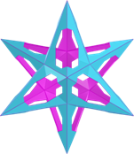 Escher's transformations in polyhedra</h2>
The technical work Gravitation was completed in 1952 by the Dutch artist Maurits Cornelis Escher. This work shows the non-convex small stellated dodecahedron of Kepler-Poinsot with geometric transformations on each face. Using the midpoints of parts of the faces, trapezoidal indentations are used by Escher to insert the heads and legs of shell-less turtles.
 This work shows the transformations and some compositions made with polyhedra, based on geometric transformations with trapezoidal cutouts on the faces or parts of the faces of these solids, modeled for viewing in Virtual Reality.

<a href="#m3d">3D Models</a>&nbsp;&nbsp;|&nbsp;&nbsp;<a href="../">Home</a>

 

<h3 id="m3d" align="center">3D models</h3>
<!--<iframe width="560" height="315" style="max-width:100%" src="https://www.youtube.com/embed/videoseries?si=QsXp7E47R3uro-mF&amp;list=PLIPWSqmB3er0" title="YouTube video player" frameborder="0" allow="accelerometer; autoplay; clipboard-write; encrypted-media; gyroscope; picture-in-picture; web-share" allowfullscreen></iframe>-->
<h4>1. Concave dodecahedron</h4>
<a href="vr/ConcaveDodecahedron.html" target="_blank" title="3D model" class="fotoA">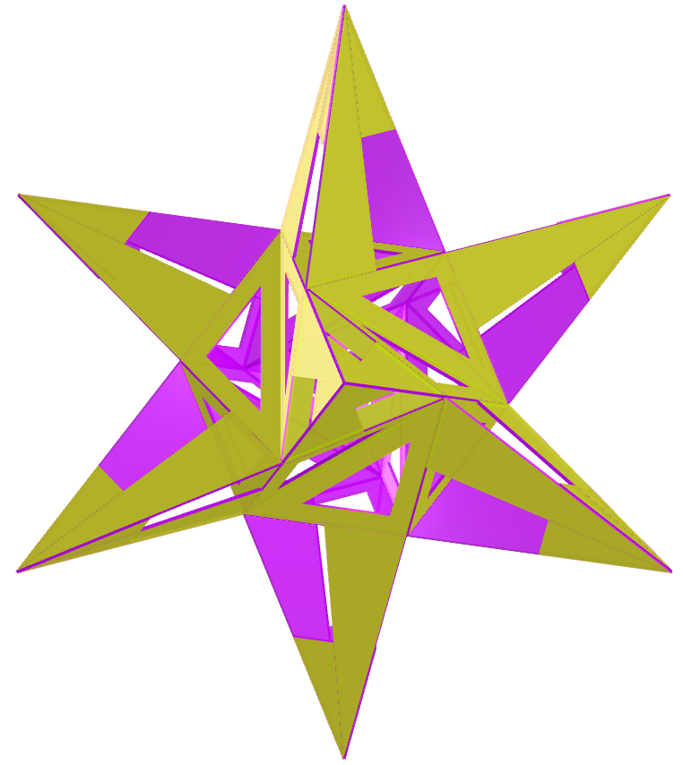</a>
  Parts of the faces of this polyhedron were transformed by removing trapezoids and triangles.
  

<h4>2. Cube and octahedron compound</h4>
<a href="vr/CubeOctahedron.html" target="_blank" title="3D model" class="fotoA">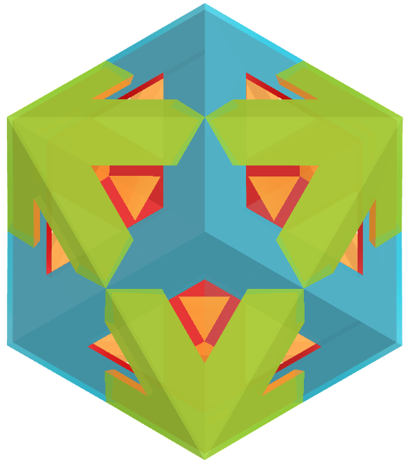</a>
  Composition of a cube with the dual octahedron, with the faces of these polyhedra transformed by removing squares and triangles.
  

<h4>3. Disdyakis dodecahedron</h4>
<a href="vr/DisdyakisDodecahedron.html" target="_blank" title="3D model" class="fotoA">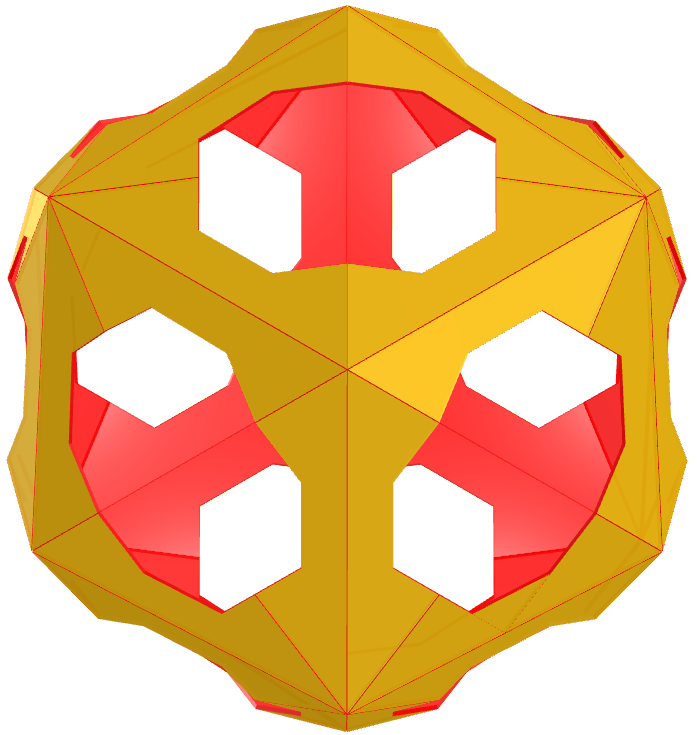</a>
  The faces of this polyhedron were transformed by removing trapezoids.
  

<h4>4. Disdyakis triacontahedron</h4>
<a href="vr/DisdyakisTriacontahedron.html" target="_blank" title="3D model" class="fotoA">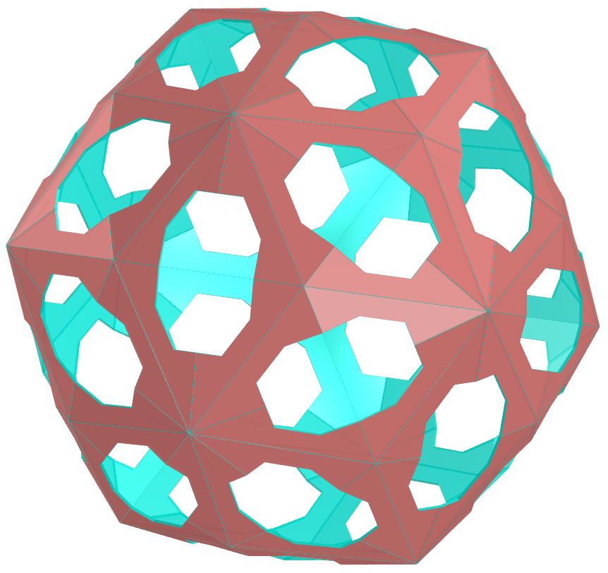</a>
  The faces of this polyhedron were transformed by removing trapezoids.
  

<h4>5. Dodecahedron and icosahedron compound</h4>
<a href="vr/DodecahedronIcosahedron.html" target="_blank" title="3D model" class="fotoA">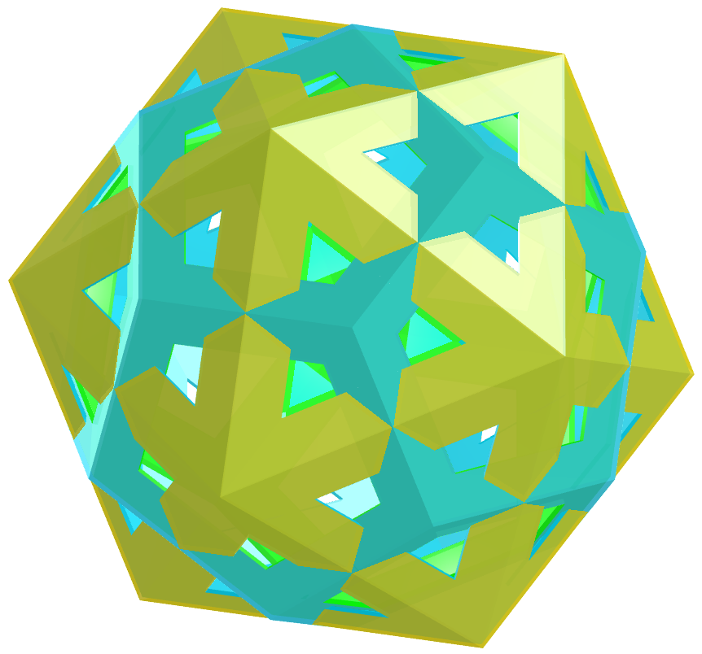</a>
  A composition of a dodecahedron with its dual icosahedron, with the faces of these polyhedra transformed by removing pentagons and triangles.
  

<h4>6. Escher solid</h4>
<a href="vr/Escher.htm" target="_blank" title="3D model" class="fotoA">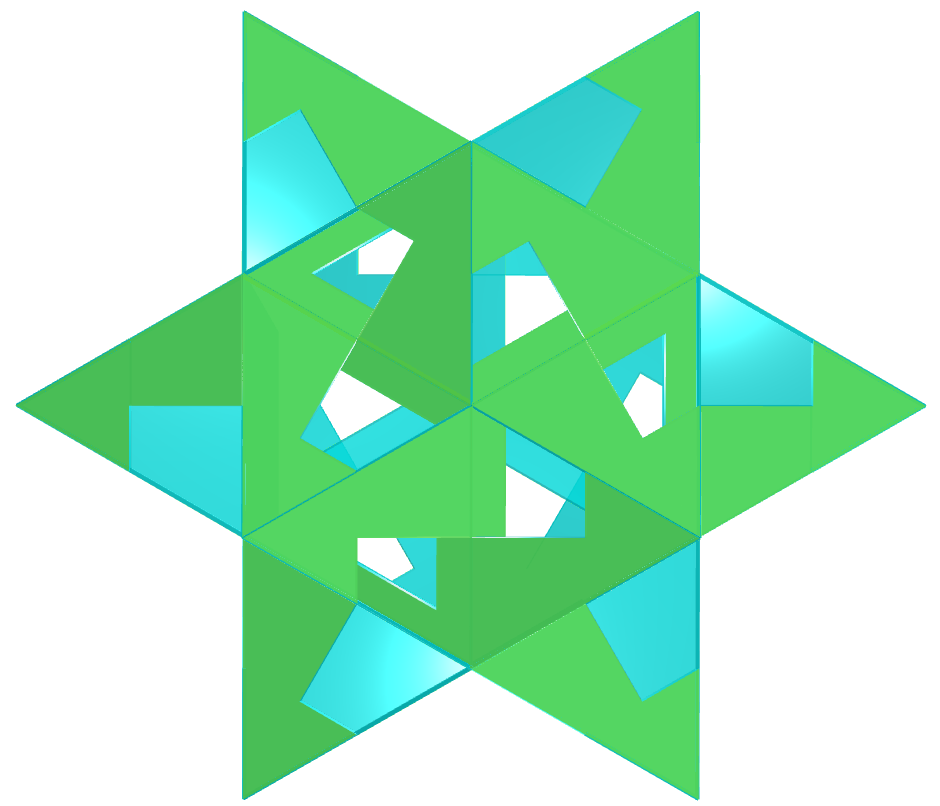</a>
  The faces of this polyhedron were transformed by removing trapezoids.
  

<h4>7. Escher solid v2</h4>
<a href="vr/Escher1.html" target="_blank" title="3D model" class="fotoA">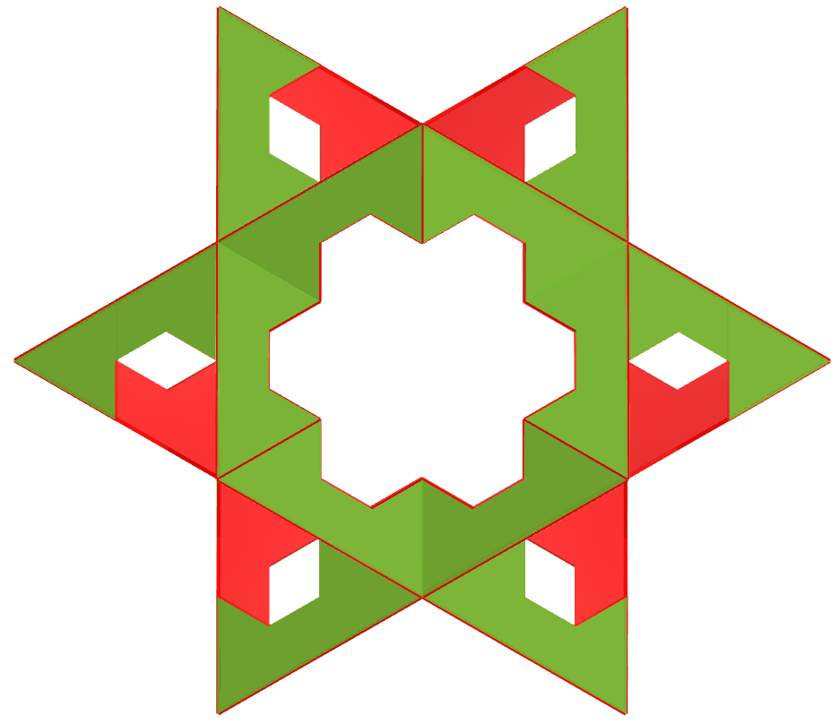</a>
  The faces of this polyhedron were transformed by removing trapezoids.
  

<h4>8. Great disdyakis dodecahedron</h4>
<a href="vr/GreatDisdyakisDodecahedron.html" target="_blank" title="3D model" class="fotoA">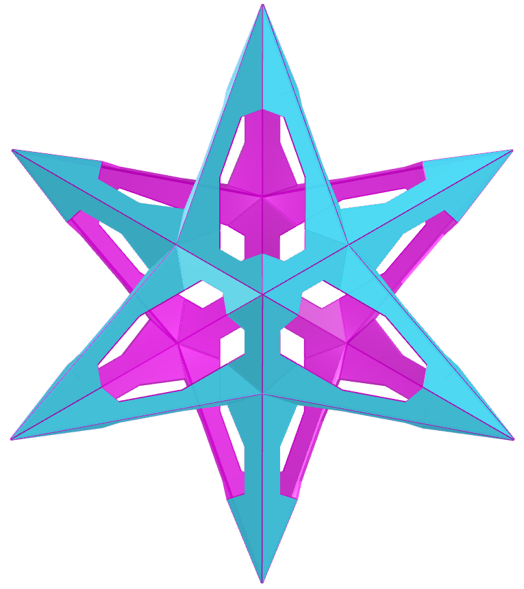</a>
  The faces of this polyhedron were transformed by removing trapezoids.
  

<h4>9. Great dodecahedron</h4>
<a href="vr/GreatDodecahedron.html" target="_blank" title="3D model" class="fotoA">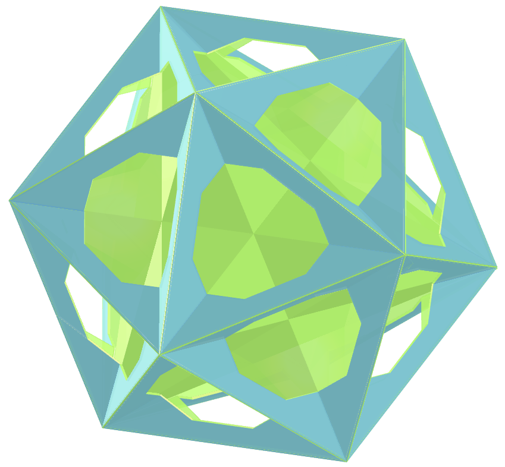</a>
  A composition of a great dodecahedron with its dual small stellated dodecahedron, with parts of the faces of great dodecahedron transformed by removing trapezoids.
  

<h4>10. Great dodecahedron v2</h4>
<a href="vr/GreatDodecahedron1.html" target="_blank" title="3D model" class="fotoA">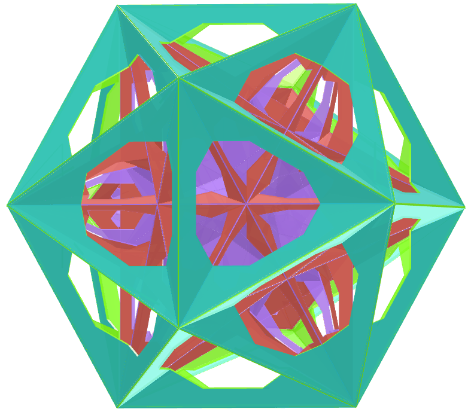</a>
  A composition of a great dodecahedron with the great icosahedron, with parts of the faces of these polyhedra transformed by removing trapezoids.
  

<a href="#p1" class="topo">back to top</a>

<h4>11. Great dodecahedron v3</h4>
<a href="vr/GreatDodecahedron2.html" target="_blank" title="3D model" class="fotoA">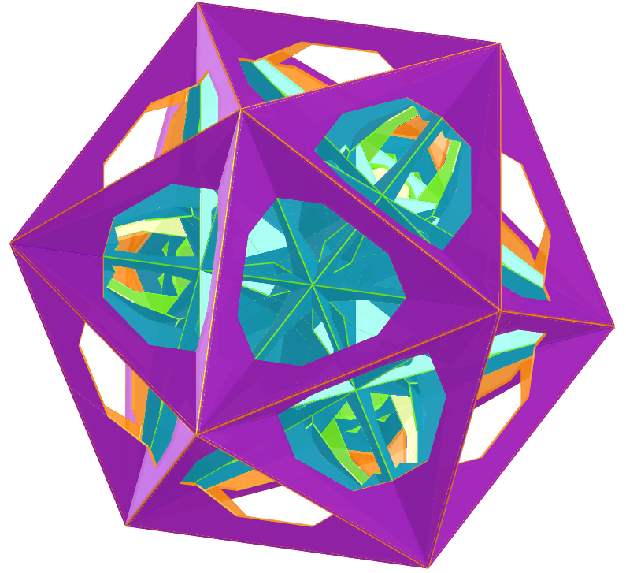</a>
  A composition of a great dodecahedron with the great icosahedron, with parts of the faces of these polyhedra transformed by removing trapezoids.
  

<h4>12. Great dodecahedron v4</h4>
<a href="vr/GreatDodecahedron3.html" target="_blank" title="3D model" class="fotoA">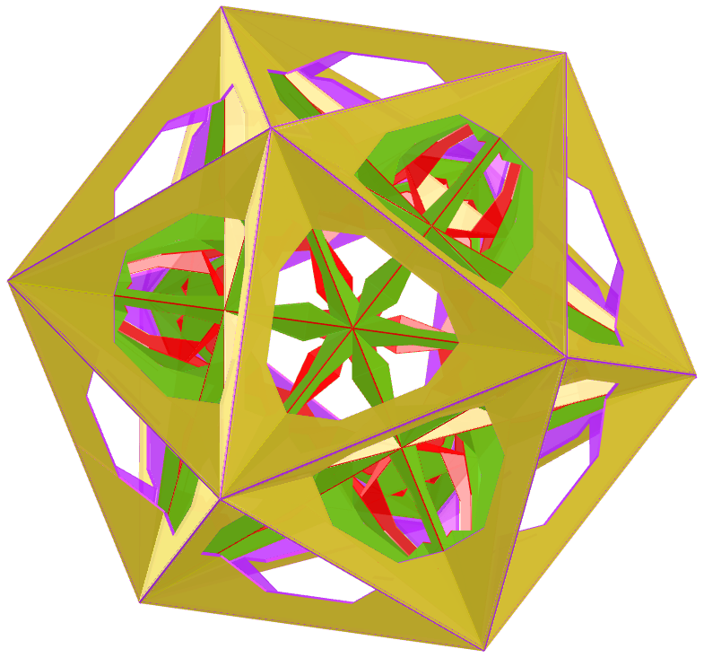</a>
  A composition of a great dodecahedron with the great icosahedron, with parts of the faces of these polyhedra transformed by removing trapezoids.
  

<h4>13. Great dodecicosacron</h4>
<a href="vr/GreatDodecicosacron.html" target="_blank" title="3D model" class="fotoA">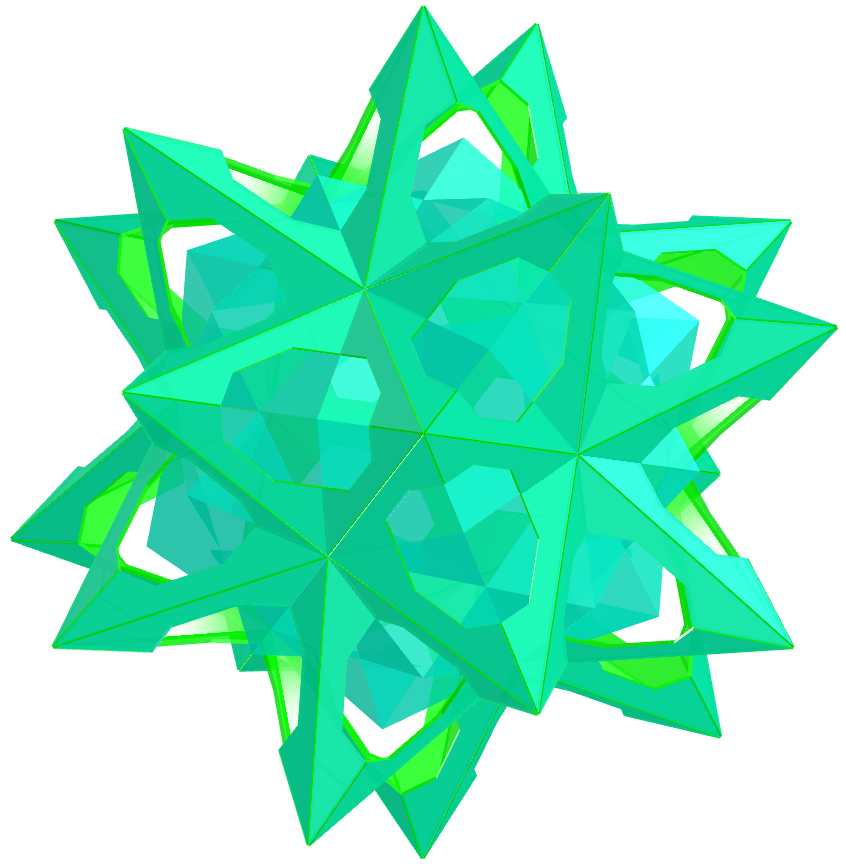</a>
  Parts of the faces of this polyhedron were transformed by removing trapezoids and triangles.
  

<h4>14. Great dodecicosacron v2</h4>
<a href="vr/GreatDodecicosacron1.html" target="_blank" title="3D model" class="fotoA">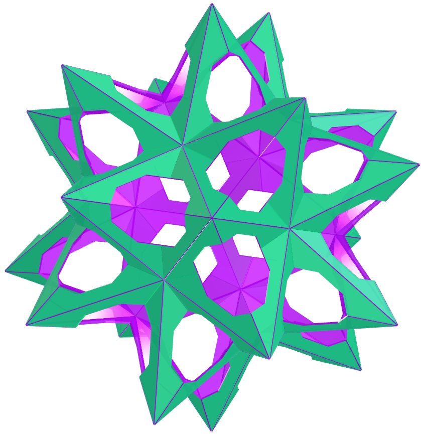</a>
  Parts of the faces of this polyhedron were transformed by removing trapezoids and triangles.
  

<h4>15. Great icosahedron</h4>
<a href="vr/GreatIcosahedron.html" target="_blank" title="3D model" class="fotoA">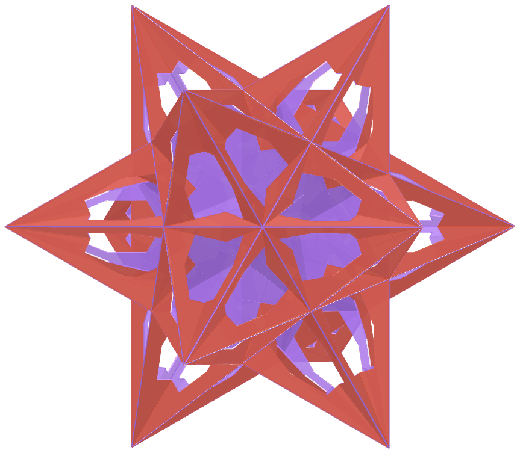</a>
  Parts of the faces of this polyhedron were transformed by removing trapezoids and triangles.
  

 <h4>16. Great icosahedron v2</h4>
<a href="vr/GreatIcosahedron1.html" target="_blank" title="3D model" class="fotoA">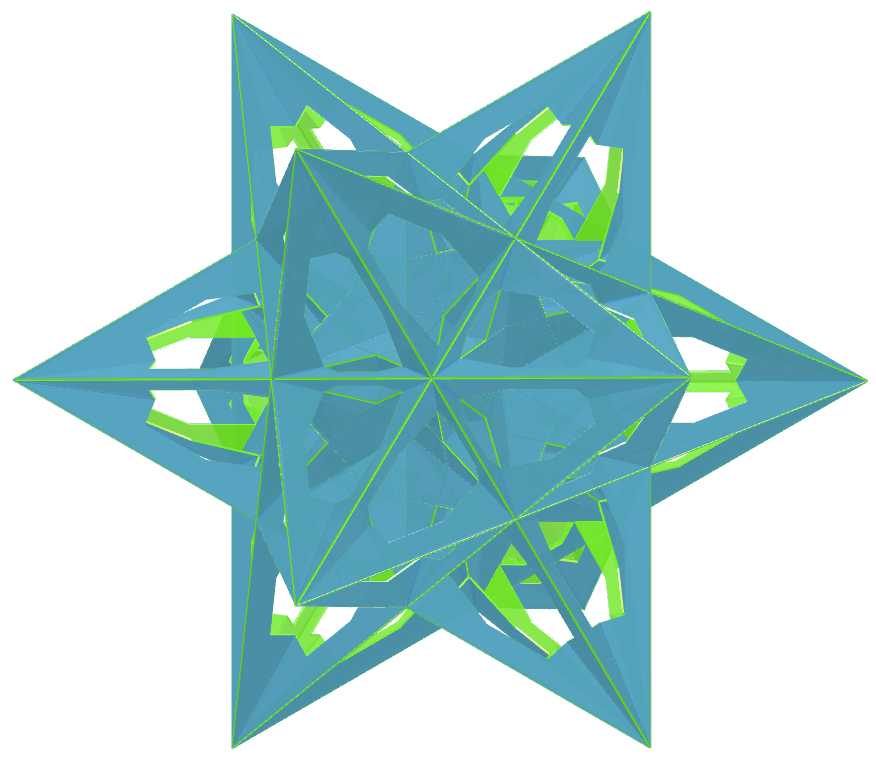</a>
  Parts of the faces of this polyhedron were transformed by removing trapezoids and triangles.

<h4>17. Great icosahedron v3</h4>
<a href="vr/GreatIcosahedron2.html" target="_blank" title="3D model" class="fotoA">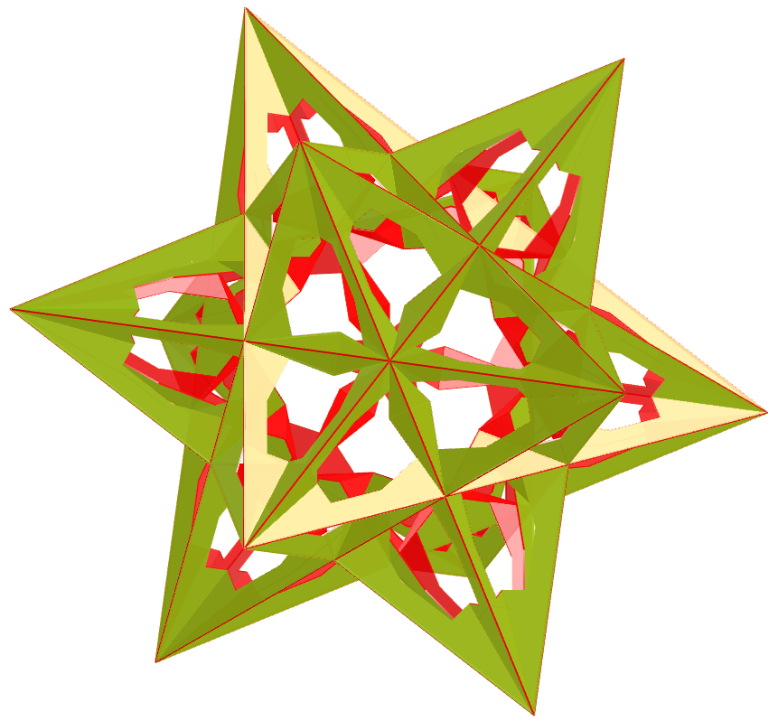</a>
  Parts of the faces of this polyhedron were transformed by removing trapezoids and triangles.
  

<h4>18. Great icosahedron v4</h4>
<a href="vr/GreatIcosahedron3.html" target="_blank" title="3D model" class="fotoA">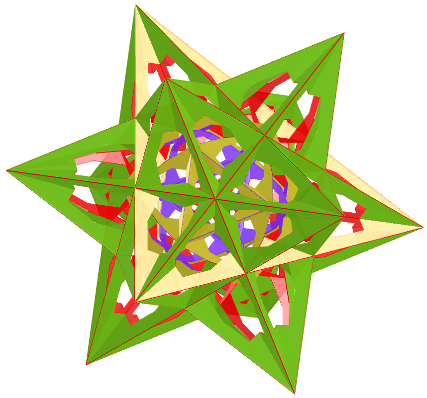</a>
  A composition of a great icosahedron with a great dodecahedron, with parts of the faces of these polyhedra transformed by removing trapezoids.
  

<h4>19. Great icosahedron v5</h4>
<a href="vr/GreatIcosahedron4.html" target="_blank" title="3D model" class="fotoA">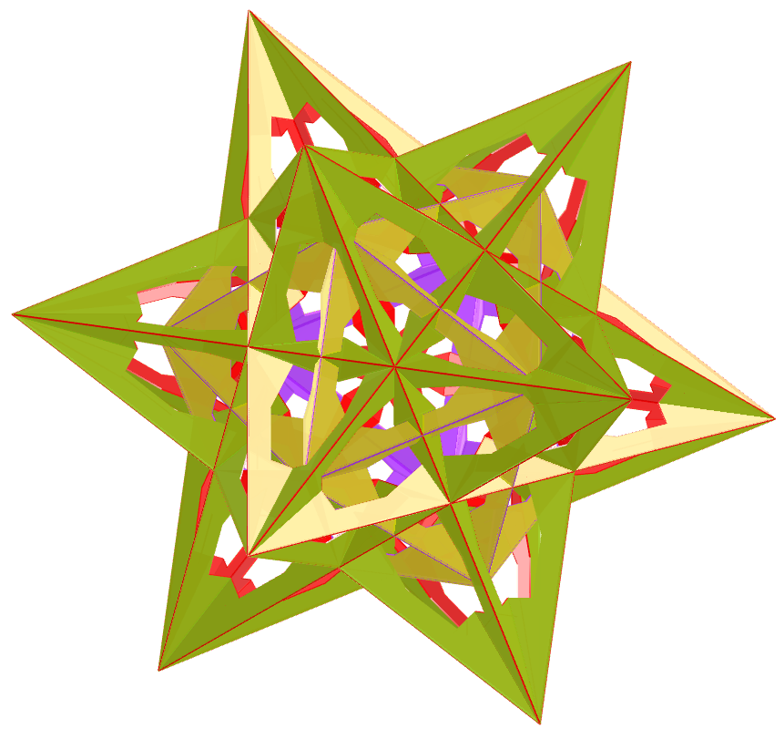</a>
  A composition of a great icosahedron with a great dodecahedron, with parts of the faces of these polyhedra transformed by removing trapezoids.
  

<h4>20. Great rhombihexacron</h4>
<a href="vr/GreatRhombihexacron.html" target="_blank" title="3D model" class="fotoA">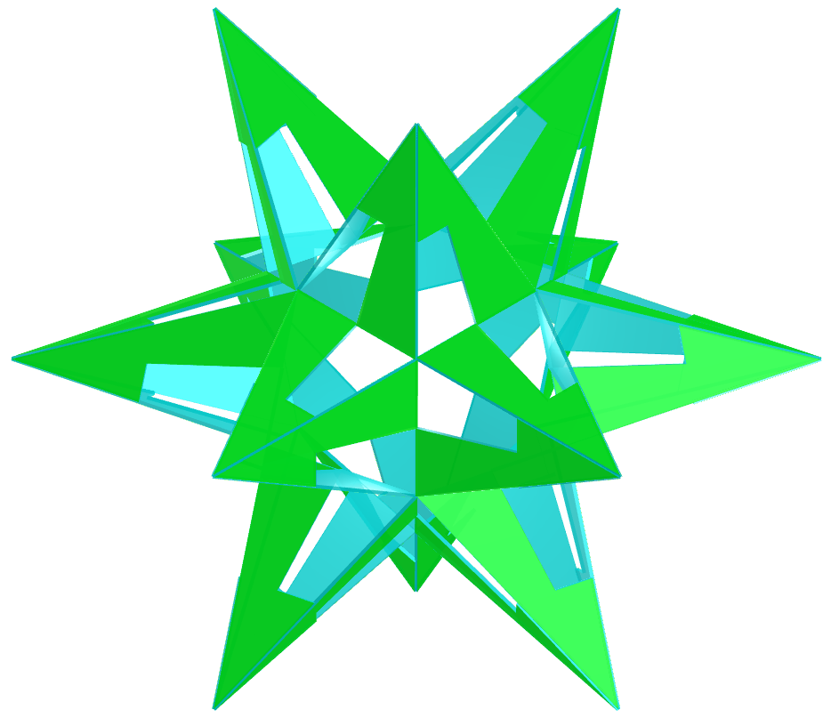</a>
  The faces of this polyhedron were transformed by removing trapezoids.
  
 

<a href="#p1" class="topo">back to top</a>

<h4>21. Great stellated dodecahedron</h4>
<a href="vr/GreatStellatedDodecahedron.html" target="_blank" title="3D model" class="fotoA">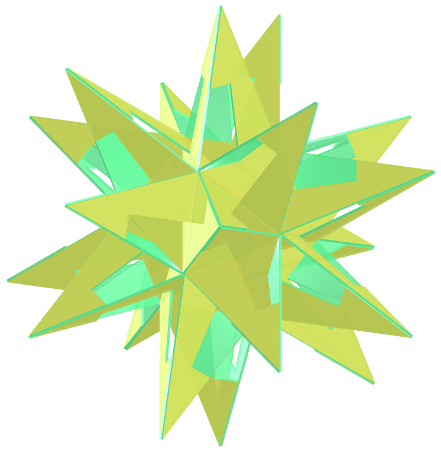</a>
  Parts of the faces of this polyhedron were transformed by removing trapezoids and triangles.
  

<h4>22. Great triambic icosahedron</h4>
<a href="vr/GreatTriambicIcosahedron.html" target="_blank" title="3D model" class="fotoA">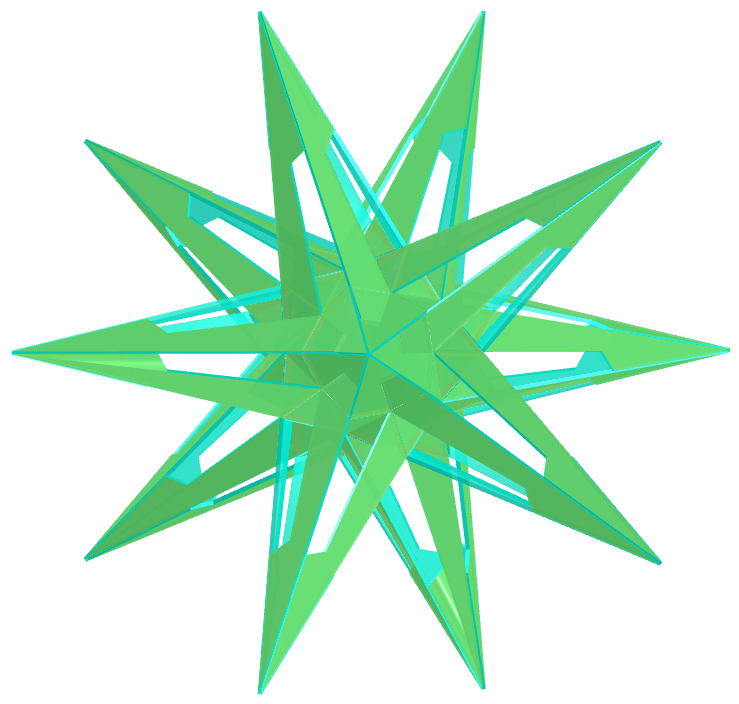</a>
  Parts of the faces of this polyhedron were transformed by removing trapezoids and triangles.
  

<h4>23. Heptagrammic dipyramid</h4>
<a href="vr/HeptagrammicDipyramid.html" target="_blank" title="3D model" class="fotoA">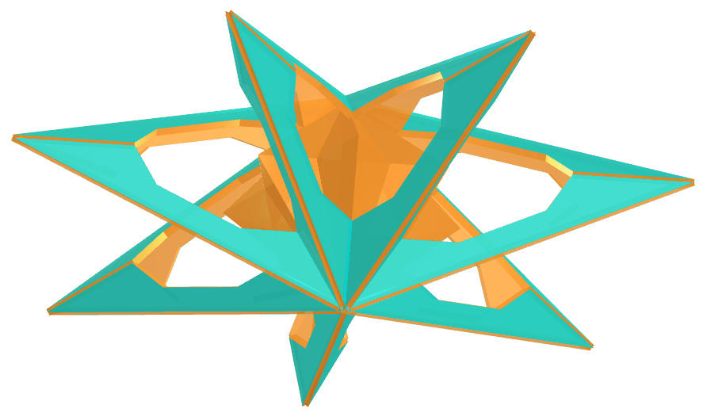</a>
  Parts of the faces of this polyhedron were transformed by removing trapezoids and triangles.
  

<h4>24. Hexakis tetrahedron</h4>
<a href="vr/HexakisTetrahedron.html" target="_blank" title="3D model" class="fotoA">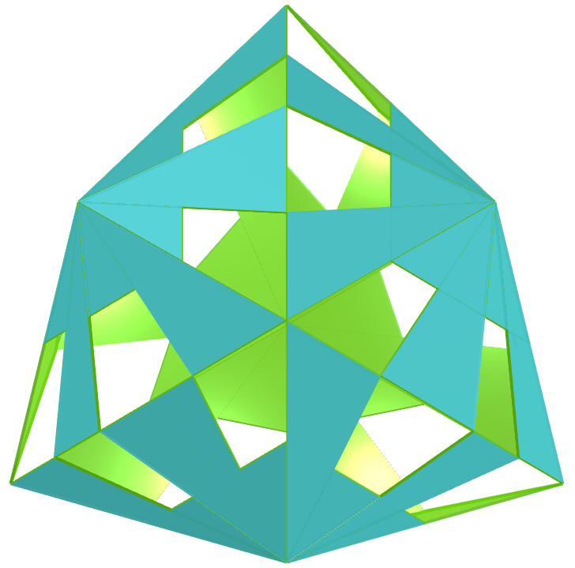</a>
  The faces of this polyhedron were transformed by removing trapezoids.
  

<h4>25. Medial deltoidal hexecontahedron</h4>
<a href="vr/MedialDeltoidalHexecontahedron.html" target="_blank" title="3D model" class="fotoA">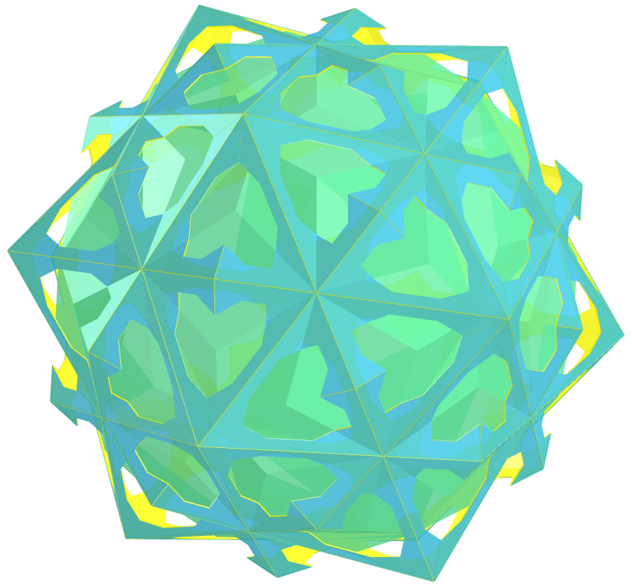</a>
  Parts of the faces of this polyhedron were transformed by removing trapezoids and triangles.
  

<h4>26. Medial deltoidal hexecontahedron v2</h4>
<a href="vr/MedialDeltoidalHexecontahedron1.html" target="_blank" title="3D model" class="fotoA">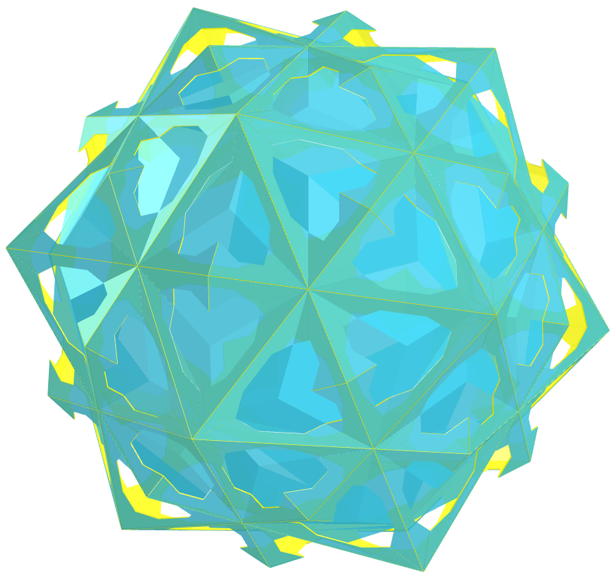</a>
  Parts of the faces of this polyhedron were transformed by removing trapezoids and triangles.
  

<h4>27. Medial deltoidal hexecontahedron v3</h4>
<a href="vr/MedialDeltoidalHexecontahedron2.html" target="_blank" title="3D model" class="fotoA">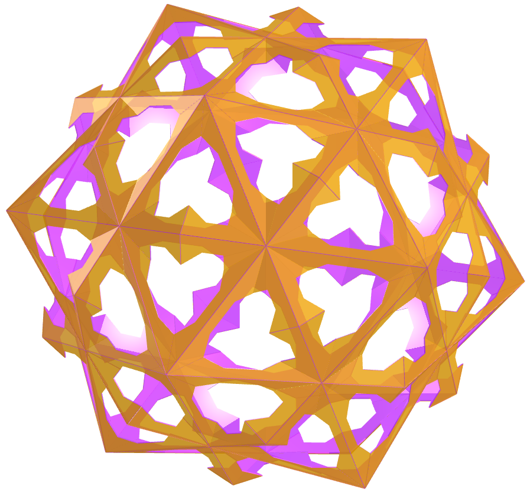</a>
  Parts of the faces of this polyhedron were transformed by removing trapezoids and triangles.
  

<h4>28. Medial icosacronic hexecontahedron</h4>
<a href="vr/MedialIcosacronicHexecontahedron.html" target="_blank" title="3D model" class="fotoA">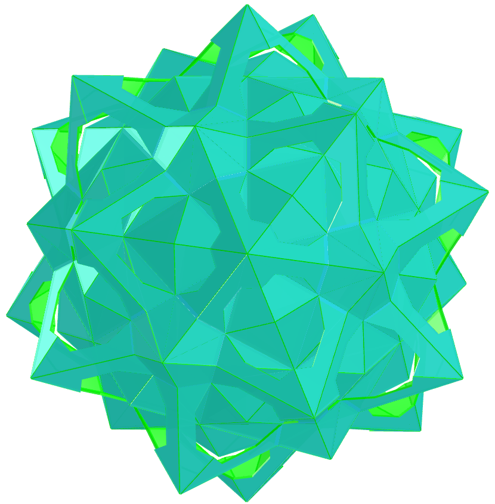</a>
  Parts of the faces of this polyhedron were transformed by removing trapezoids and triangles.
  

<h4>29. Medial icosacronic hexecontahedron v2</h4>
<a href="vr/MedialIcosacronicHexecontahedron1.html" target="_blank" title="3D model" class="fotoA">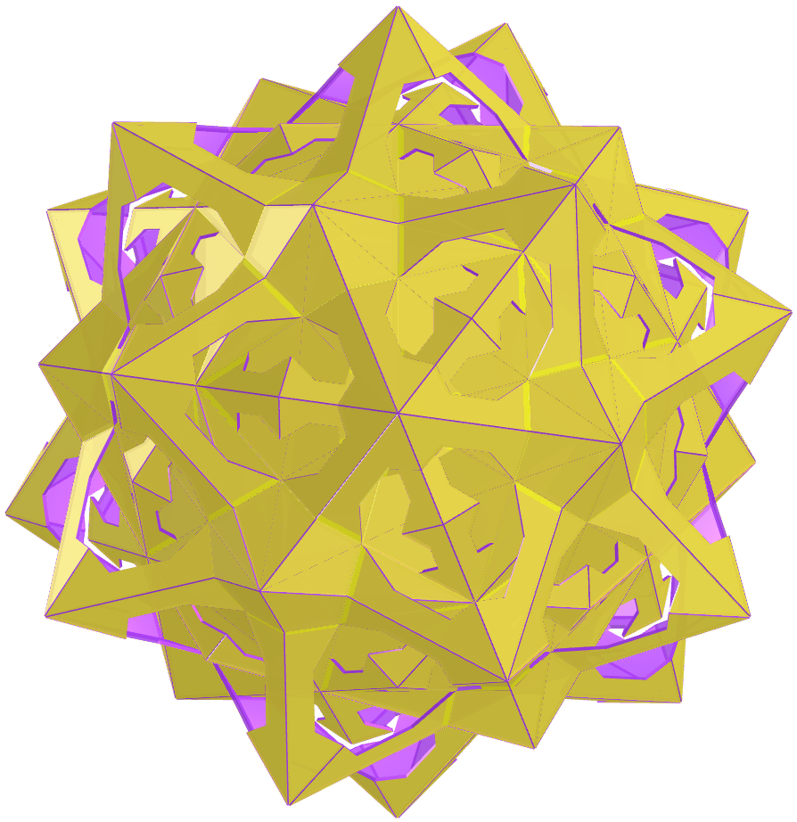</a>
  Parts of the faces of this polyhedron were transformed by removing trapezoids and triangles.
  

<h4>30. Medial rhombic triacontahedron</h4>
<a href="vr/MedialRhombicTriacontahedron.html" target="_blank" title="3D model" class="fotoA">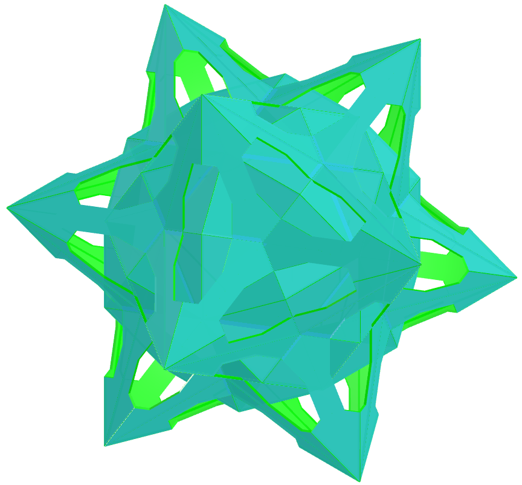</a>
  Parts of the faces of this polyhedron were transformed by removing trapezoids and triangles.
  

<a href="#p1" class="topo">back to top</a>

<h4>31. Medial rhombic triacontahedron v2</h4>
<a href="vr/MedialRhombicTriacontahedron1.html" target="_blank" title="3D model" class="fotoA">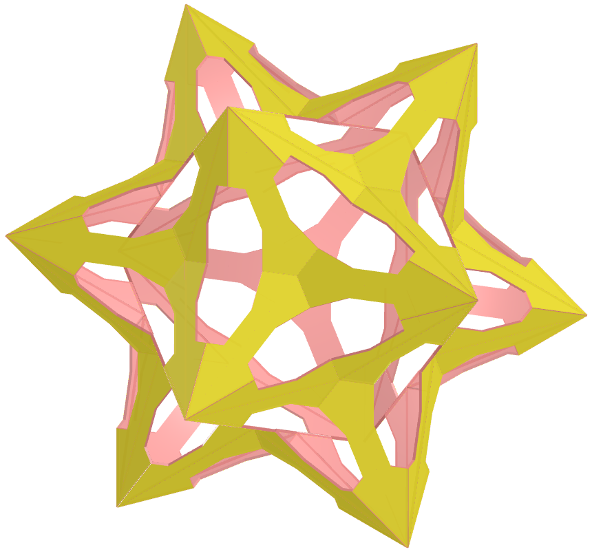</a>
  Parts of the faces of this polyhedron were transformed by removing trapezoids and triangles.
  

<h4>32. Medial triambic icosahedron</h4>
<a href="vr/MedialTriambicIcosahedron.html" target="_blank" title="3D model" class="fotoA">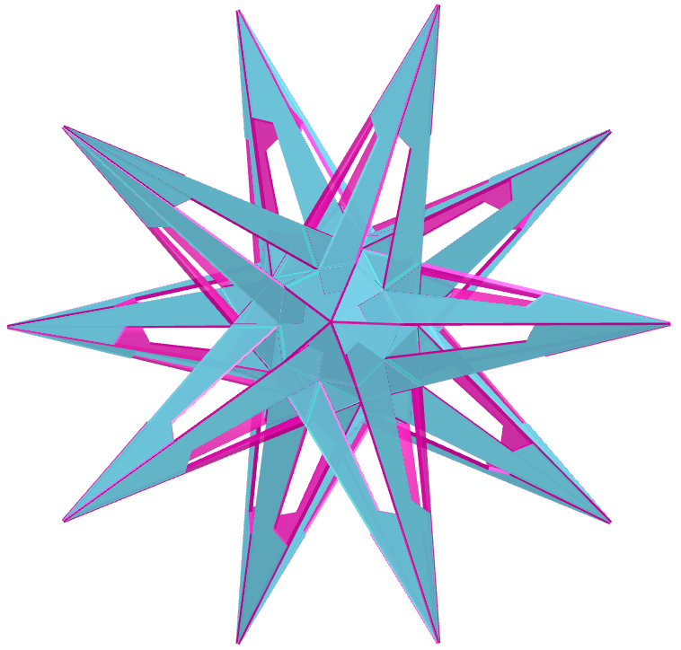</a>
  Parts of the faces of this polyhedron were transformed by removing trapezoids and triangles.
  

<h4>33. Merkaba</h4>

  A composition of two tetrahedra, with the faces of these polyhedra transformed by removing triangles.
  

<h4>34. Möbius deltahedron</h4>

  The faces of this polyhedron were transformed by removing trapezoids.
  

<h4>35. Möbius octakis hexahedron</h4>
<a href="vr/Mobius48a.html" target="_blank" title="3D model" class="fotoA">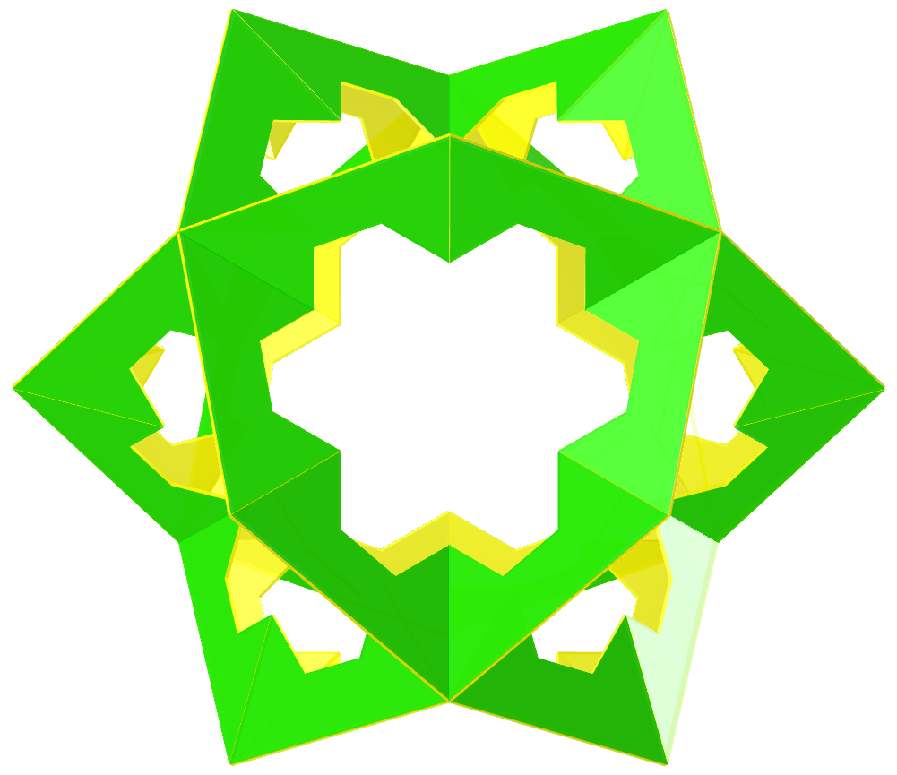</a>
  The faces of this polyhedron were transformed by removing trapezoids.
  

<h4>36. Möbius hexakis octahedron</h4>

  The faces of this polyhedron were transformed by removing trapezoids. 
  

<h4>37. Möbius hexakis icosahedron</h4>
<a href="vr/Mobius120a.htm" target="_blank" title="3D model" class="fotoA">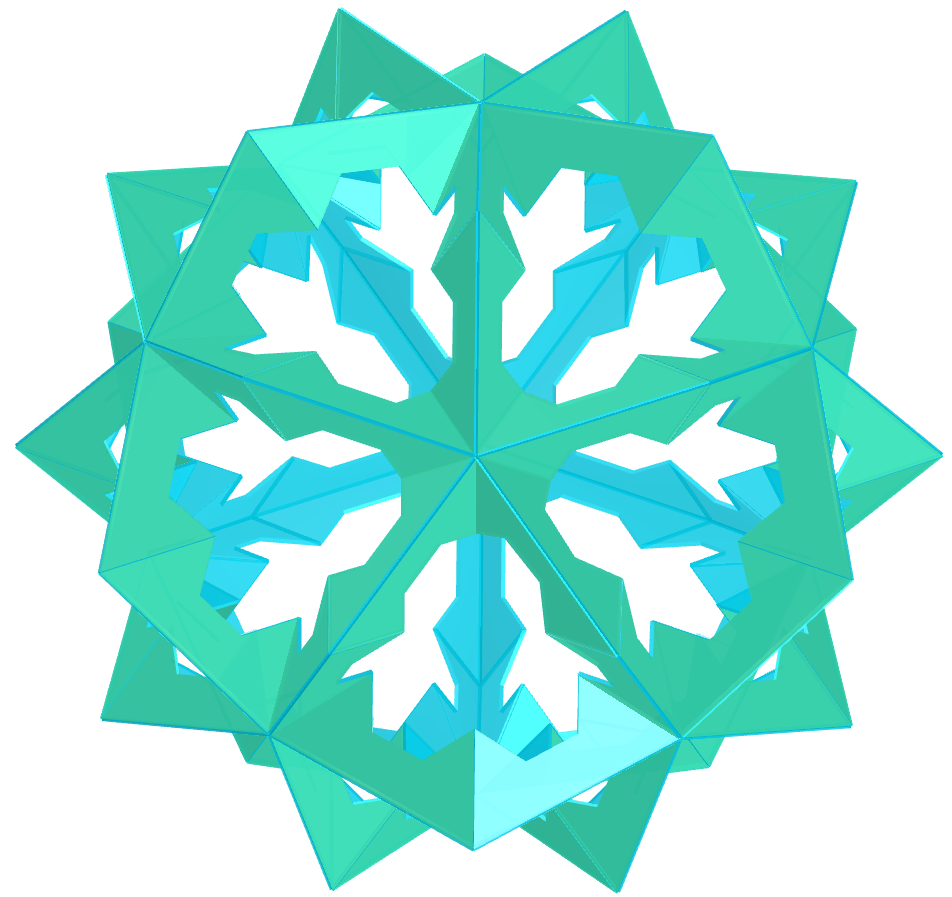</a>
  The faces of this polyhedron were transformed by removing trapezoids.
  

<h4>38. Möbius 10-akis dodecahedron</h4>
<a href="vr/Mobius120b.htm" target="_blank" title="3D model" class="fotoA">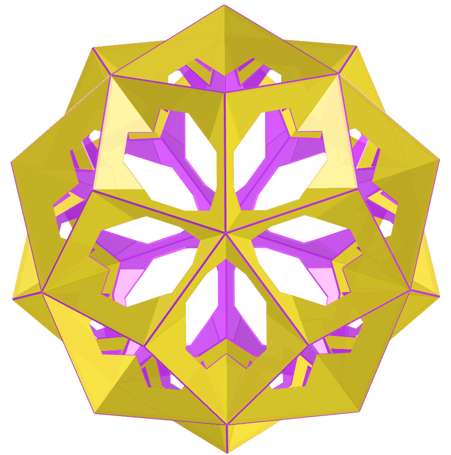</a>
  The faces of this polyhedron were transformed by removing trapezoids.
  

<a href="#p1" class="topo">back to top</a>

  Escher's transformations in polyhedra: visualization with Virtual Reality by <a xmlns:cc="http://creativecommons.org/ns#" href="https://paulohscwb.github.io/polycompound/escher1/" property="cc:attributionName" rel="cc:attributionURL">Paulo Henrique Siqueira</a> is licensed with a license <a rel="license" href="http://creativecommons.org/licenses/by-nc-nd/4.0/">Creative Commons Attribution-NonCommercial-NoDerivatives 4.0 International</a>.

<h4>How to cite this work:</h4> 

Siqueira, P.H., "Escher's transformations in polyhedra: visualization with Virtual Reality". Available in: <https://paulohscwb.github.io/polycompound/escher1/>, June 2026.

<!---->
  <b>References:</b>
 Weisstein, Eric W. "Polyhedron Compound" From MathWorld-A Wolfram Web Resource. <a href="https://mathworld.wolfram.com/ArchimedeanDual.html" target="_blank">https://mathworld.wolfram.com/PolyhedronCompound.html</a>
 Weisstein, Eric W. "Uniform Polyhedron." From MathWorld--A Wolfram Web Resource. <a href="https://mathworld.wolfram.com/UniformPolyhedron.html" target="_blank">https://mathworld.wolfram.com/UniformPolyhedron.html</a>
 McCooey, David I. "Visual Polyhedra". <a href="http://dmccooey.com/polyhedra/" target="_blank">http://dmccooey.com/polyhedra/</a>
