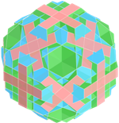
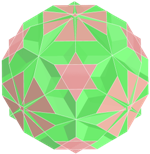
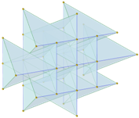
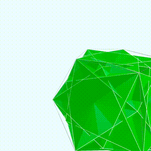

<link rel="stylesheet" href="../scripts/style.css">
<meta charset="utf-8">
<link rel="icon" type="image/png" href="../compounds1/vr/salas/imagens/icone.png">
<h2>Visualização de Poliedros com Realidade Virtual (RV) em A-frame</h2>
<b>autor:</b> Paulo Henrique Siqueira - Universidade Federal do Paraná
 <b>contato:</b> <a href="#"> paulohscwb@gmail.com </a>
 <a href="https://paulohscwb.github.io/polycompound/">english version</a>
  Um composto poliédrico é formado de vários poliedros que compartilham o mesmo centro. Eles são os análogos tridimensionais de compostos poligonais, como os hexagramas. Os vértices externos de um composto podem ser conectados para formar um poliedro convexo chamado de casco convexo. Um composto é chamado de facetado de seu casco convexo.
 Neste trabalho são mostrados os compostos poliédricos mais conhecidos, todos com modelos para visualização em Realidade Virtual:  quiricosaedro, composto de Escher, disnubaedro, snubaedro, icosicosaedro e o pequeno snubaedro.

<h3 style="margin-top:3px"><a target="_blank" href="../compounds1/pt-br/"> Família dos tetraedros</a></h3>
<h3 style="margin-top:3px"><a target="_blank" href="../compounds2/pt-br/"> Família dos cubos</a></h3>
<h3 style="margin-top:3px"><a target="_blank" href="../tetrahedra/pt-br/"> Embalagens tetraédricas</a></h3>
<!--<h3 style="margin-top:3px"><a target="_blank" href="../compounds3/pt-br/"> Família dos octaedros</a></h3>
<h3 style="margin-top:3px"><a target="_blank" href="../compounds4/pt-br/"> Família dos dodecaedros e icosaedros 1</a></h3>
<h3 style="margin-top:3px"><a target="_blank" href="../compounds5/pt-br/"> Família dos dodecaedros e icosaedros 2</a></h3>
<h3 style="margin-top:3px"><a target="_blank" href="../compounds6/pt-br/"> Compostos de poliedros duais</a></h3>
<h3 style="margin-top:3px"><a target="_blank" href="../compounds7/pt-br/"> Compostos de dois poliedros</a></h3>-->

<!--<h3 style="margin-top:5px; text-align:center;"><a target="_blank" href="../todos/">&#x1f4c4; Lista completa dos poliedros</a></h3>

-->
<h3 align="center">Realidade Virtual</h3>

<h3 align="center">Modelos 3D</h3>

 Os scripts de órbita desenvolvidos por <b>Kevin Ngo</b> foram usados nas páginas de Realidade Virtual dos modelos 3D: <a href="https://github.com/supermedium/superframe/tree/master/components/orbit-controls/" target="_blank"> Orbit controls for A-Frame</a>.
 Os scripts de teleporte desenvolvidos por <b>Fernando Serrano</b> foram usados nas páginas de Realidade Virtual dos modelos 3D: <a  href="https://aframe.io/blog/teleport-component/" target="_blank"> Developing an A-Frame Teleport Component</a>
 

  Polyhedral Compound: visualization with Virtual Reality de <a xmlns:cc="http://creativecommons.org/ns#" href="https://paulohscwb.github.io/polycompound/" property="cc:attributionName" rel="cc:attributionURL">Paulo Henrique Siqueira</a> está licenciado com uma Licença <a rel="license" href="http://creativecommons.org/licenses/by-nc-nd/4.0/">Creative Commons Atribuição-NãoComercial-SemDerivações 4.0 Internacional</a>.

<h4>Como citar este trabalho:</h4> 

Siqueira, P.H., "Polyhedral Compound: Visualization of polyhedra with Virtual Reality". Disponível em: <https://paulohscwb.github.io/polycompound/>, Março de 2025.

<!---->
 <b>Referências:</b>
 Weisstein, Eric W. "Polyhedron Compound" From MathWorld-A Wolfram Web Resource. <a href="https://mathworld.wolfram.com/ArchimedeanDual.html" target="_blank">https://mathworld.wolfram.com/PolyhedronCompound.html</a>
 Weisstein, Eric W. "Uniform Polyhedron." From MathWorld--A Wolfram Web Resource. <a href="https://mathworld.wolfram.com/UniformPolyhedron.html" target="_blank">https://mathworld.wolfram.com/UniformPolyhedron.html</a>
 McCooey, David I. "Visual Polyhedra". <a href="http://dmccooey.com/polyhedra/" target="_blank">http://dmccooey.com/polyhedra/</a>
