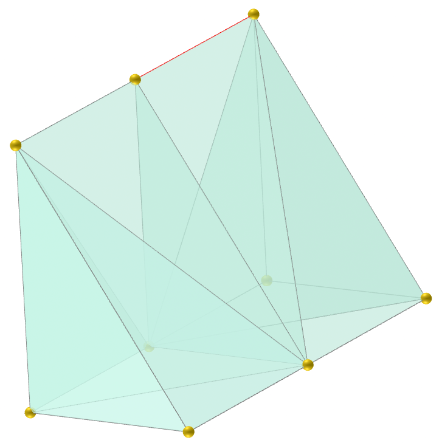
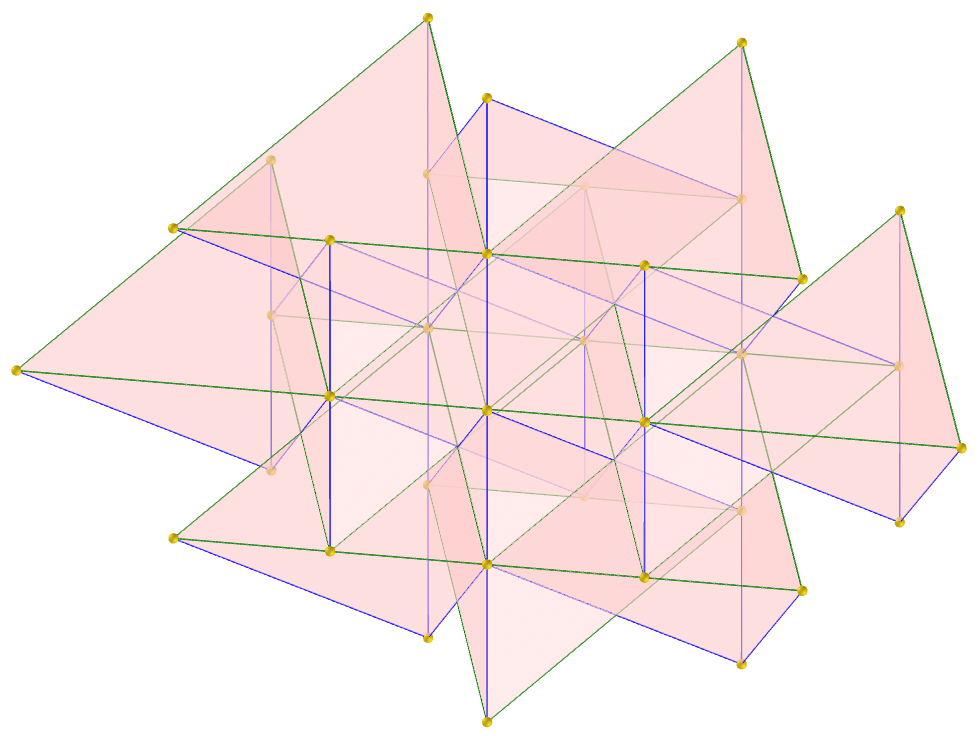
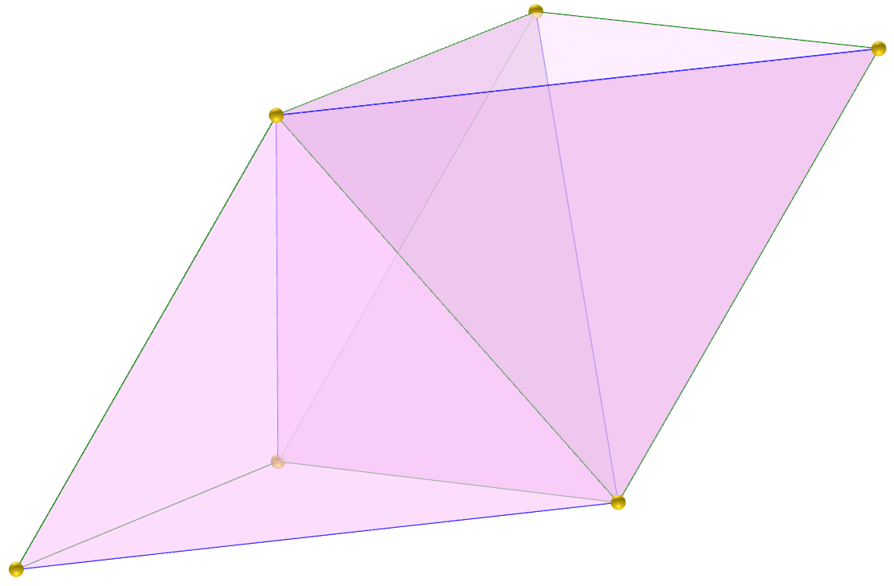
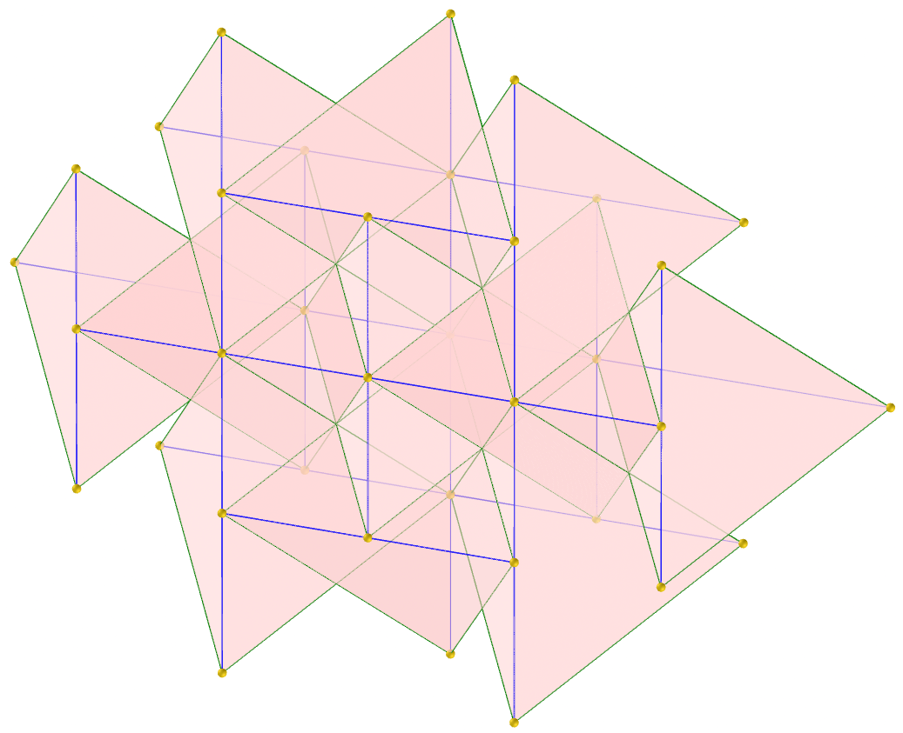
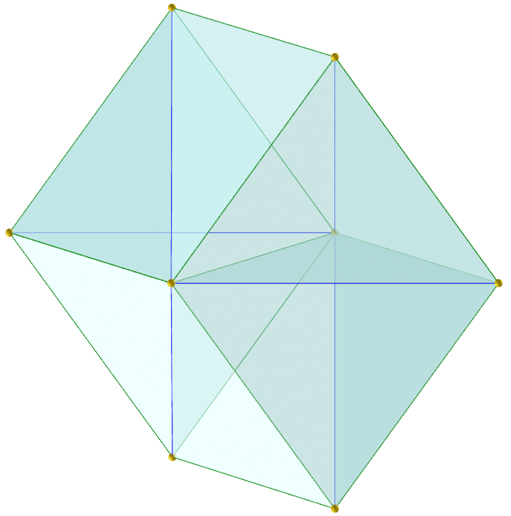
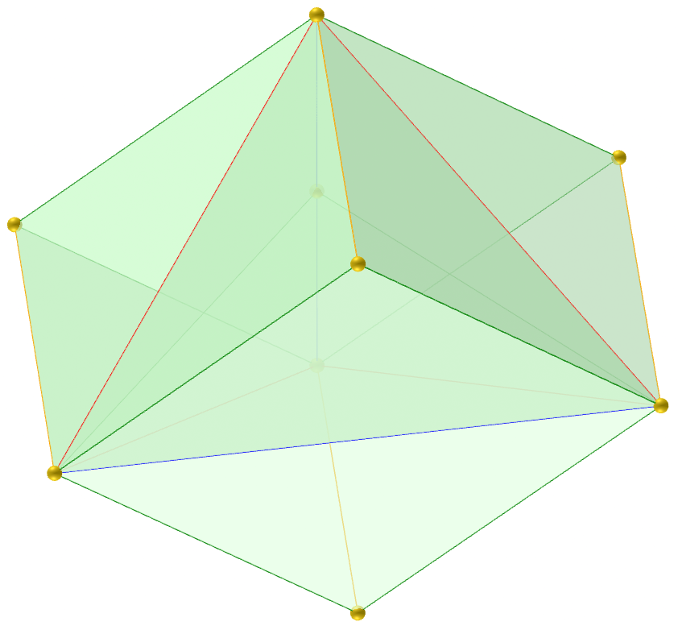
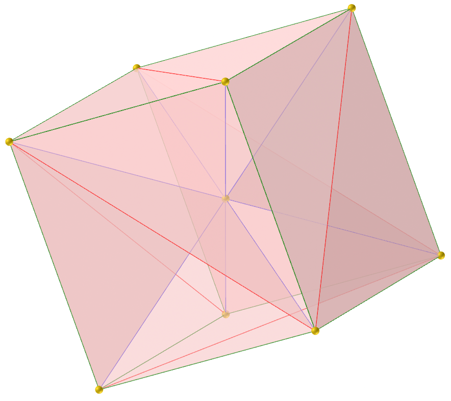
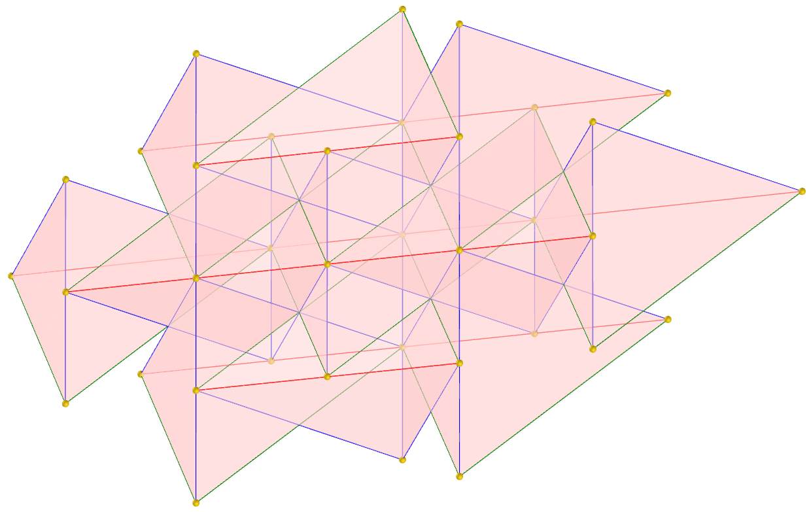
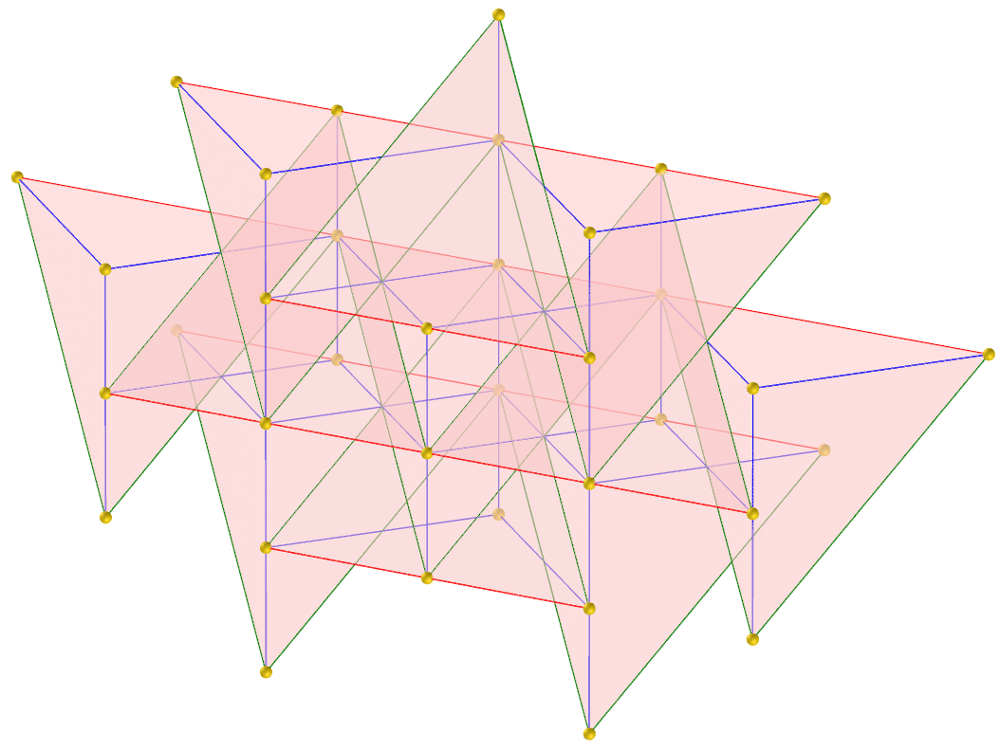
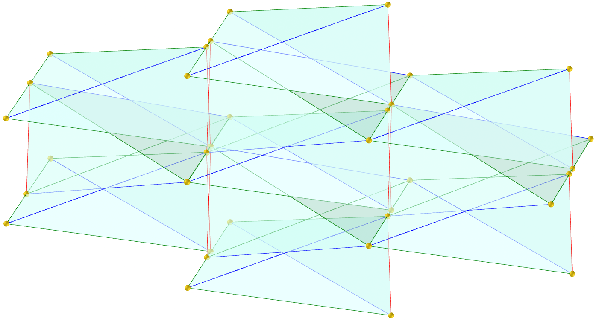

<link rel="stylesheet" href="../scripts/style.css">
<meta charset="utf-8">

<link rel="icon" type="image/png" href="vr/salas/imagens/icone.png">
<h2>Visualization of Polyhedra with Virtual Reality (VR) in A-frame</h2>
 <b>author:</b> Paulo Henrique Siqueira - Universidade Federal do Paraná
  <b>contact:</b> <a href="#">paulohscwb@gmail.com</a>
  <a href="https://paulohscwb.github.io/polycompound/tetrahedra/pt-br/">versão em português</a>
 <form style="margin: 0 auto; float:right; text-align:right; width:100%; margin-bottom:15px;">
	<select id="url" onchange="urlHandler(this.value)" style="color:royalblue;">
		<option disabled selected value>More solids:</option>
		<option value="../compounds1/">Tetrahedra family</option>
		<option value="../compounds2/">Cube family</option>
		<option disabled value="../tetrahedra/">Tetrahedra packings</option>
		<!--<option value="../compounds3/">Octahedra family</option>
		<option value="../compounds4/">Dodecahedra and icosahedra family 1</option>
		<option value="../compounds5/">Dodecahedra and icosahedra family 2</option>
		<option value="../compounds6/">Compounds of dual polyhedra</option>
		<option value="../compounds7/">Compounds of two polyhedra</option>-->
	</select>
</form>

  <h2 align="center"> Tetrahedra packings</h2>
Tetrahedral packing is a problem of arranging identical tetrahedra in three-dimensional space, aiming to fill as much of the space as possible. These packing arrangements include spherical, flat, prismatic, antiprismatic and cubic shapes.
 The densest known packing structure of regular tetrahedra is formed by a set of triangular bipyramids, which fills 85.63% of the space in a spherical shape.
 This work shows tetrahedral compounds, modeled for viewing in Virtual Reality.

<a href="#m3d">3D Models</a>&nbsp;&nbsp;|&nbsp;&nbsp;<a href="../">Home</a>

 

<h3 id="m3d" align="center">3D models</h3>
<iframe width="560" height="315" style="max-width:100%" src="https://www.youtube.com/embed/videoseries?list=PLy0I_lGW8HxUBFOD4zwVl2mMkGU-phDxF" title="YouTube video player" frameborder="0" allow="accelerometer; autoplay; clipboard-write; encrypted-media; gyroscope; picture-in-picture; web-share" allowfullscreen></iframe>
<h4>1. Baumgartner's tetrahedron</h4>

  Baumgartner's tetrahedron (discovered in 1968) can be used for prismatic packaging composition.
  <b>edge sizes</b>: $\mathsf{ \sqrt{11} \over{2} }$, $\mathsf{ \sqrt{3} }$, $\mathsf{ \sqrt{3} \over{2} }$, and $\mathsf{ 2 }$.
  <b>dihedral angles</b>: 106.74°, 30°, 60°, 73.26°, 90°.
  

<h4>2. Irish high tetrahedron</h4>

  Irish high tetrahedron (discovered in 1994 by Denis Weaire and Robert Phelan) can be used for flat packaging composition.
  <b>edge sizes</b>: $\mathsf{ {1} \over{2} }$, $\mathsf{ \sqrt{6} \over{4} }$.
  <b>dihedral angles</b>: 53.13°, 78.46°.
  

<h4>3. Irish medial tetrahedron</h4>

  Irish medial tetrahedron (discovered in 1994 by Denis Weaire and Robert Phelan) can be used for flat packaging composition.
  <b>edge sizes</b>: $\mathsf{ \sqrt{5} \over{4} }$, $\mathsf{ \sqrt{6} \over{4} }$.
  <b>dihedral angles</b>: 73.4°, 67.79°.
  

<h4>4. Irish low tetrahedron</h4>

  Irish low tetrahedron (discovered in 1994 by Denis Weaire and Robert Phelan) can be used for flat packaging composition.
  <b>edge sizes</b>: $\mathsf{ \sqrt{5} \over{4} }$, $\mathsf{ {1} \over{2} }$, $\mathsf{ \sqrt{6} \over{4} }$.
  <b>dihedral angles</b>: 77.4°, 58.41°, 63.43°, 73°.
  

<h4>5. Scottish tetrahedron</h4>

  Scottish tetrahedron (discovered in 1887 by Lord Kelvin) can be used for antiprismatic packaging composition.
  <b>edge sizes</b>: $\mathsf{ \sqrt{3} \over{2} }$, $\mathsf{ {1} }$.
  <b>dihedral angles</b>: 60°, 90°.
  

<h4>6. Scottish tetrahedron v2</h4>

  Scottish tetrahedron (discovered in 1887 by Lord Kelvin) can be used for flat packaging composition.
  <b>edge sizes</b>: $\mathsf{ \sqrt{3} \over{2} }$, $\mathsf{ {1} }$.
  <b>dihedral angles</b>: 60°, 90°.
  

<h4>7. Sommerville tetrahedron 1</h4>

  Sommerville tetrahedron (discovered in 1923 by Duncan Sommerville) can be used for prismatic packaging composition.
  <b>edge sizes</b>: $\mathsf{ {2} }$, $\mathsf{ \sqrt{3} }$.
  <b>dihedral angles</b>: 90°, 60°.
  

<h4>8. Sommerville tetrahedron 1 v2</h4>

  Sommerville tetrahedron (discovered in 1923 by Duncan Sommerville) can be used for flat packaging composition.
  <b>edge sizes</b>: $\mathsf{ {2} }$, $\mathsf{ \sqrt{3} }$.
  <b>dihedral angles</b>: 90°, 60°.
  

<h4>9. Sommerville tetrahedron 1 v3</h4>

  Sommerville tetrahedron (discovered in 1923 by Duncan Sommerville) can be used for prismatic packaging composition.
  <b>edge sizes</b>: $\mathsf{ {2} }$, $\mathsf{ \sqrt{3} }$.
  <b>dihedral angles</b>: 90°, 60°.
  

<h4>10. Sommerville tetrahedron 2</h4>

  Sommerville tetrahedron (discovered in 1923 by Duncan Sommerville) can be used for prismatic packaging composition.
  <b>edge sizes</b>: $\mathsf{ {2} }$, $\mathsf{ \sqrt{2} }$, $\mathsf{ \sqrt{3} }$, $\mathsf{ 1 }$.
  <b>dihedral angles</b>: 45°, 90°, 60°.
  

<a href="#p1" class="topo">back to top</a>

<h4>11. Sommerville tetrahedron 3</h4>

  Sommerville tetrahedron (discovered in 1923 by Duncan Sommerville) can be used for cubic packaging composition.
  <b>edge sizes</b>: $\mathsf{ \sqrt{3} }$, $\mathsf{ {2} }$, $\mathsf{ 2 \sqrt{2} }$.
  <b>dihedral angles</b>: 120°, 60°, 45°, 90°.
  

<h4>12. Sommerville tetrahedron 3 v2</h4>

  Sommerville tetrahedron (discovered in 1923 by Duncan Sommerville) can be used for flat packaging composition.
  <b>edge sizes</b>: $\mathsf{ \sqrt{3} }$, $\mathsf{ {2} }$, $\mathsf{ 2 \sqrt{2} }$.
  <b>dihedral angles</b>: 120°, 60°, 45°, 90°.
  

<h4>13. Sommerville tetrahedron 4</h4>

  Sommerville tetrahedron (discovered in 1923 by Duncan Sommerville) can be used for prismatic packaging composition.
  <b>edge sizes</b>: $\mathsf{ \sqrt{5} \over{2} }$, $\mathsf{ \sqrt{3} }$, $\mathsf{ {2} }$.
  <b>dihedral angles</b>: 131.8°, 114.1°, 30°, 45°.
  

<h4>14. Sommerville tetrahedron 4 v2</h4>

  Sommerville tetrahedron (discovered in 1923 by Duncan Sommerville) can be used for flat packaging composition.
  <b>edge sizes</b>: $\mathsf{ \sqrt{5} \over{2} }$, $\mathsf{ \sqrt{3} }$, $\mathsf{ {2} }$.
  <b>dihedral angles</b>: 131.8°, 114.1°, 30°, 45°.
  

<h4>15. Welsh high tetrahedron</h4>

  The welsh high tetrahedron has a combination of properties of the Irish and Scottish tetrahedrons and can be used for flat packaging composition. This is Plato's regular tetrahedron.
  <b>edge sizes</b>: $\mathsf{ \sqrt{2} \over{2} }$.
  <b>dihedral angles</b>: 70.53°.
  

 <h4>16. Welsh medial tetrahedron</h4>

  The welsh medial tetrahedron has a combination of properties of the Irish and Scottish tetrahedrons and can be used for flat packaging composition.
  <b>edge sizes</b>: $\mathsf{ \sqrt{11} \over{4} }$, $\mathsf{ \sqrt{2} \over{2} }$.
  <b>dihedral angles</b>: 67.12°, 74.2°.
  

<h4>17. Welsh low tetrahedron</h4>

  The Welsh low tetrahedron has a combination of properties of the Irish and Scottish tetrahedrons and can be used for flat packaging composition.
  <b>edge sizes</b>: $\mathsf{ \sqrt{3} \over{2} }$, $\mathsf{ \sqrt{11} \over{4} }$, $\mathsf{ \sqrt{3} \over{4} }$.
  <b>dihedral angles</b>: 90°, 73.22°, 33.57°, 60°.
  

<a href="#p1" class="topo">back to top</a>

  Polyhedral Compound - Tetrahedra packings: visualization with Virtual Reality by <a xmlns:cc="http://creativecommons.org/ns#" href="https://paulohscwb.github.io/polycompound/tetrahedra/" property="cc:attributionName" rel="cc:attributionURL">Paulo Henrique Siqueira</a> is licensed with a license <a rel="license" href="http://creativecommons.org/licenses/by-nc-nd/4.0/">Creative Commons Attribution-NonCommercial-NoDerivatives 4.0 International</a>.

<h4>How to cite this work:</h4> 

Siqueira, P.H., "Polyhedral Compound - Tetrahedra packings: visualization with Virtual Reality". Available in: <https://paulohscwb.github.io/polycompound/tetrahedra/>, August 2025.

<!---->
  <b>References:</b>
 Weisstein, Eric W. "Polyhedron Compound" From MathWorld-A Wolfram Web Resource. <a href="https://mathworld.wolfram.com/ArchimedeanDual.html" target="_blank">https://mathworld.wolfram.com/PolyhedronCompound.html</a>
 Conway, J. H., Torquato, S. "Packing, tiling, and covering with tetrahedra" <a href="https://www.pnas.org/doi/10.1073/pnas.0601389103" target="_blank">https://www.pnas.org/doi/10.1073/pnas.0601389103</a>
 McCooey, David I. "Visual Polyhedra". <a href="http://dmccooey.com/polyhedra/" target="_blank">http://dmccooey.com/polyhedra/</a>
