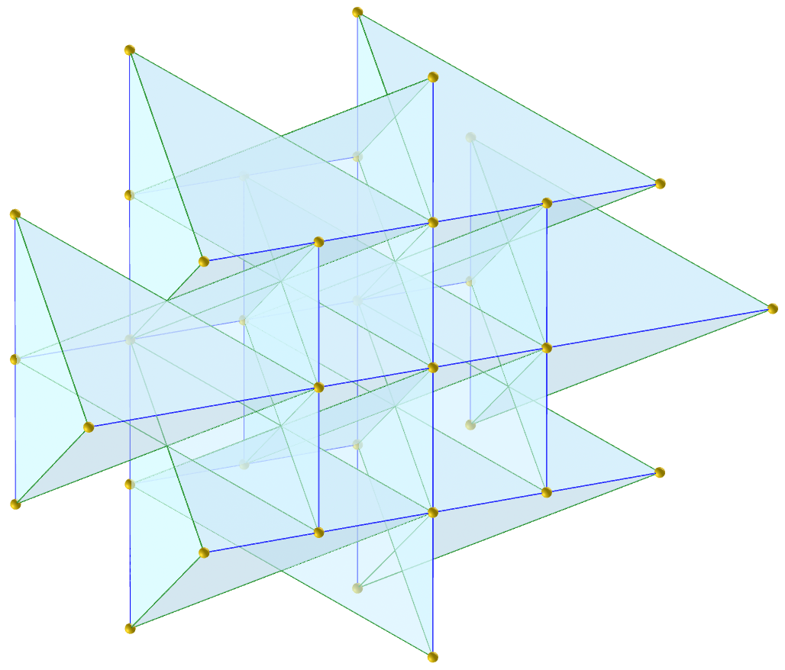

<link rel="stylesheet" href="../../scripts/style.css">
<meta charset="utf-8">

<link rel="icon" type="image/png" href="../vr/salas/imagens/icone.png">
<h2>Visualização de Poliedros com Realidade Virtual (RV) em A-frame</h2>
<b>autor:</b> Paulo Henrique Siqueira - Universidade Federal do Paraná
 <b>contato:</b> <a href="#"> paulohscwb@gmail.com </a>
 <a href="https://paulohscwb.github.io/polycompound/tetrahedra/">english version</a>
<form style="margin: 0 auto; float:right; text-align:right; width:100%; margin-bottom:15px;">
	<select id="url" onchange="urlHandler(this.value)" style="color:royalblue;">
		<option disabled selected>Mais sólidos:</option>
		<option value="../../compounds1/pt-br/">Família dos tetraedros</option>
		<option value="../../compounds2/pt-br/">Família dos cubos</option>
		<option disabled value="../../tetrahedra/pt-br/">Embalagens tetraédricas</option>
		<!--<option value="../../compounds3/pt-br/">Família dos octaedros</option>
		<option value="../../compounds4/pt-br/">Família dos dodecaedros e icosaedros 1</option>
		<option value="../../compounds5/pt-br/">Família dos dodecaedros e icosaedros 2</option>
		<option value="../../compounds6/pt-br/">Compostos de poliedros duais</option>
		<option value="../../compounds7/pt-br/">Compostos de dois poliedros</option>-->
	</select>
</form>

  <h2 align="center"> Embalagens tetraédricas</h2>
  A embalagem tetraédrica é um problema de organizar tetraedros idênticos no espaço tridimensional, com o objetivo de preencher a maior parte possível do espaço. Os arranjos destas embalagens incluem os formatos esférico, plano, prismático, antiprismático e cúbico.
 A estrutura de embalagem mais densa conhecida de tetraedros regulares é formada por um conjunto de bipirâmides triangulares, que preenche 85,63% do espaço em um formato esférico.
 Este trabalho mostra os compostos de tetraedros, modelados para visualização em Realidade Virtual.
 
<a href="#m3d">Modelos 3D</a>&nbsp;&nbsp;|&nbsp;&nbsp;<a href="../../pt-br/">Página Inicial</a>

  

 

<h3 id="m3d" align="center">Modelos 3D</h3>
<iframe width="560" height="315" style="max-width:100%" src="https://www.youtube.com/embed/videoseries?list=PLy0I_lGW8HxUBFOD4zwVl2mMkGU-phDxF" title="YouTube video player" frameborder="0" allow="accelerometer; autoplay; clipboard-write; encrypted-media; gyroscope; picture-in-picture; web-share" allowfullscreen></iframe>
<h4>1. Tetraedro de Baumgartner</h4>

  O tetraedro de Baumgartner (descoberto em 1968) pode ser usado para composição de embalagem em formato prismático.
  <b>medidas das arestas</b>: $\mathsf{ \sqrt{11} \over{2} }$, $\mathsf{ \sqrt{3} }$, $\mathsf{ \sqrt{3} \over{2} }$, $\mathsf{ 2 }$.
  <b>ângulos diédricos</b>: 106.74°, 30°, 60°, 73.26°, 90°.
  

<h4>2. Tetraedro alto irlandês</h4>

  O tetraedro alto irlandês (descoberto em 1994 por Denis Weaire e Robert Phelan) pode ser usado para composição de embalagem em formato plano.
  <b>medidas das arestas</b>: $\mathsf{ {1} \over{2} }$, $\mathsf{ \sqrt{6} \over{4} }$.
  <b>ângulos diédricos</b>: 53.13°, 78.46°.
  

<h4>3. Tetraedro medial irlandês</h4>

  O tetraedro medial irlandês (descoberto em 1994 por Denis Weaire e Robert Phelan) pode ser usado para composição de embalagem em formato plano.
  <b>medidas das arestas</b>: $\mathsf{ \sqrt{5} \over{4} }$, $\mathsf{ \sqrt{6} \over{4} }$.
  <b>ângulos diédricos</b>: 73.4°, 67.79°.
  

<h4>4. Tetraedro baixo irlandês</h4>

  O tetraedro baixo irlandês (descoberto em 1994 por Denis Weaire e Robert Phelan) pode ser usado para composição de embalagem em formato plano.
  <b>medidas das arestas</b>: $\mathsf{ \sqrt{5} \over{4} }$, $\mathsf{ {1} \over{2} }$, $\mathsf{ \sqrt{6} \over{4} }$.
  <b>ângulos diédricos</b>: 77.4°, 58.41°, 63.43°, 73°.
  

<h4>5. Tetraedro escocês</h4>

  O tetraedro escocês (descoberto em 1887 por Lord Kelvin) pode ser usado para composição de embalagem em formato antiprismático.
  <b>medidas das arestas</b>: $\mathsf{ \sqrt{3} \over{2} }$, $\mathsf{ {1} }$.
  <b>ângulos diédricos</b>: 60°, 90°.
  

<h4>6. Tetraedro escocês v2</h4>

  O tetraedro escocês (descoberto em 1887 por Lord Kelvin) pode ser usado para composição de embalagem em formato plano.
  <b>medidas das arestas</b>: $\mathsf{ \sqrt{3} \over{2} }$, $\mathsf{ {1} }$.
  <b>ângulos diédricos</b>: 60°, 90°.
  

<h4>7. Tetraedro de Sommerville 1</h4>

  O tetraedro de Sommerville (descoberto em 1923 por Duncan Sommerville) pode ser usado para composição de embalagem em formato prismático.
  <b>medidas das arestas</b>: $\mathsf{ {2} }$, $\mathsf{ \sqrt{3} }$.
  <b>ângulos diédricos</b>: 90°, 60°.
  

<h4>8. Tetraedro de Sommerville 1 v2</h4>

  O tetraedro de Sommerville (descoberto em 1923 por Duncan Sommerville) pode ser usado para composição de embalagem em formato plano.
  <b>medidas das arestas</b>: $\mathsf{ {2} }$, $\mathsf{ \sqrt{3} }$.
  <b>ângulos diédricos</b>: 90°, 60°.
  

<h4>9. Tetraedro de Sommerville 1 v3</h4>

  O tetraedro de Sommerville (descoberto em 1923 por Duncan Sommerville) pode ser usado para composição de embalagem em formato prismático.
  <b>medidas das arestas</b>: $\mathsf{ {2} }$, $\mathsf{ \sqrt{3} }$.
  <b>ângulos diédricos</b>: 90°, 60°.
  

<h4>10. Tetraedro de Sommerville 2</h4>

  O tetraedro de Sommerville (descoberto em 1923 por Duncan Sommerville) pode ser usado para composição de embalagem em formato prismático.
  <b>medidas das arestas</b>: $\mathsf{ {2} }$, $\mathsf{ \sqrt{2} }$, $\mathsf{ \sqrt{3} }$, $\mathsf{ 1 }$.
  <b>ângulos diédricos</b>: 45°, 90°, 60°.
  

<a href="#p1" class="topo">voltar ao topo</a>

<h4>11. Tetraedro de Sommerville 3</h4>

  O tetraedro de Sommerville (descoberto em 1923 por Duncan Sommerville) pode ser usado para composição de embalagem em formato cúbico.
  <b>medidas das arestas</b>: $\mathsf{ \sqrt{3} }$, $\mathsf{ {2} }$, $\mathsf{ 2 \sqrt{2} }$.
  <b>ângulos diédricos</b>: 120°, 60°, 45°, 90°.
  

<h4>12. Tetraedro de Sommerville 3 v2</h4>

  O tetraedro de Sommerville (descoberto em 1923 por Duncan Sommerville) pode ser usado para composição de embalagem em formato plano.
  <b>medidas das arestas</b>: $\mathsf{ \sqrt{3} }$, $\mathsf{ {2} }$, $\mathsf{ 2 \sqrt{2} }$.
  <b>ângulos diédricos</b>: 120°, 60°, 45°, 90°.
  

<h4>13. Tetraedro de Sommerville 4</h4>

  O tetraedro de Sommerville (descoberto em 1923 por Duncan Sommerville) pode ser usado para composição de embalagem em formato prismático.
  <b>medidas das arestas</b>: $\mathsf{ \sqrt{5} \over{2} }$, $\mathsf{ \sqrt{3} }$, $\mathsf{ {2} }$.
  <b>ângulos diédricos</b>: 131.8°, 114.1°, 30°, 45°.
  

<h4>14. Tetraedro de Sommerville 4 v2</h4>

  O tetraedro de Sommerville (descoberto em 1923 por Duncan Sommerville) pode ser usado para composição de embalagem em formato plano.
  <b>medidas das arestas</b>: $\mathsf{ \sqrt{5} \over{2} }$, $\mathsf{ \sqrt{3} }$, $\mathsf{ {2} }$.
  <b>ângulos diédricos</b>: 131.8°, 114.1°, 30°, 45°.
  

<h4>15. Tetraedro alto galês</h4>

  O tetraedro alto galês tem uma combinação de propriedades dos tetraedros irlandês e escocês e pode ser usado para composição de embalagem em formato plano. Este é o tetraedro regular de Platão.
  medida das arestas: $\mathsf{ \sqrt{2} \over{2} }$.
  <b>ângulo diédrico</b>: 70.53°.
  
 

<h4>16. Tetraedro medial galês</h4>

  O tetraedro medial galês tem uma combinação de propriedades dos tetraedros irlandês e escocês e pode ser usado para composição de embalagem em formato plano.
  <b>medidas das arestas</b>: $\mathsf{ \sqrt{11} \over{4} }$, $\mathsf{ \sqrt{2} \over{2} }$.
  <b>ângulos diédricos</b>: 67.12°, 74.2°.
  

<h4>17. Tetraedro baixo galês</h4>

  O tetraedro baixo galês tem uma combinação de propriedades dos tetraedros irlandês e escocês e pode ser usado para composição de embalagem em formato plano.
  <b>medidas das arestas</b>: $\mathsf{ \sqrt{3} \over{2} }$, $\mathsf{ \sqrt{11} \over{4} }$, $\mathsf{ \sqrt{3} \over{4} }$.
  <b>ângulos diédricos</b>: 90°, 73.22°, 33.57°, 60°.
  
 

<a href="#p1" class="topo">voltar ao topo</a>

  Polyhedral Compound - Tetrahedra packings: visualization with Virtual Reality de <a xmlns:cc="http://creativecommons.org/ns#" href="https://paulohscwb.github.io/polycompound/tetrahedra/pt-br/" property="cc:attributionName" rel="cc:attributionURL">Paulo Henrique Siqueira</a> está licenciado com uma Licença <a rel="license" href="http://creativecommons.org/licenses/by-nc-nd/4.0/">Creative Commons Atribuição-NãoComercial-SemDerivações 4.0 Internacional</a>.

<h4>Como citar este trabalho:</h4> 

Siqueira, P.H., "Polyhedral Compound - Tetrahedra packings: visualization with Virtual Reality". Disponível em: <https://paulohscwb.github.io/polycompound/tetrahedra/pt-br/>, Agosto de 2025.

<!---->
  <b>Referências:</b>
 Weisstein, Eric W. "Polyhedron Compound" From MathWorld-A Wolfram Web Resource. <a href="https://mathworld.wolfram.com/ArchimedeanDual.html" target="_blank">https://mathworld.wolfram.com/PolyhedronCompound.html</a>
 Conway, J. H., Torquato, S. "Packing, tiling, and covering with tetrahedra" <a href="https://www.pnas.org/doi/10.1073/pnas.0601389103" target="_blank">https://www.pnas.org/doi/10.1073/pnas.0601389103</a>
 McCooey, David I. "Visual Polyhedra". <a href="http://dmccooey.com/polyhedra/" target="_blank">http://dmccooey.com/polyhedra/</a>
