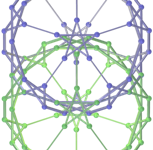
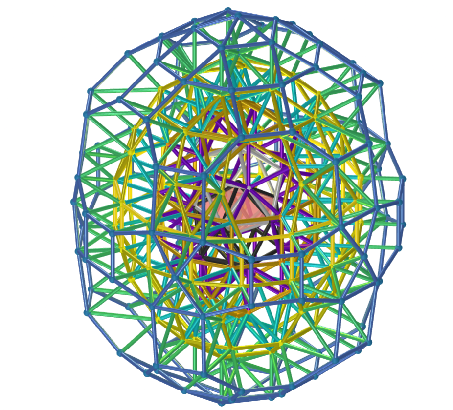
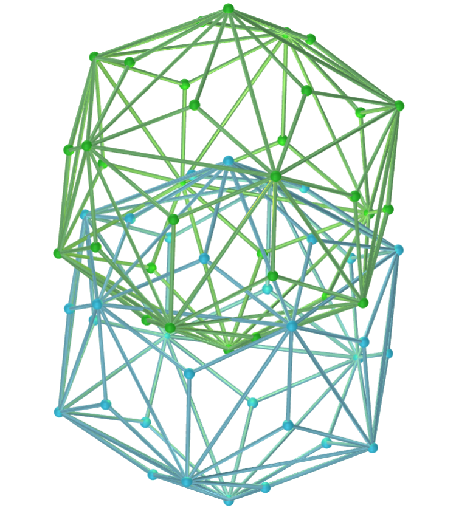
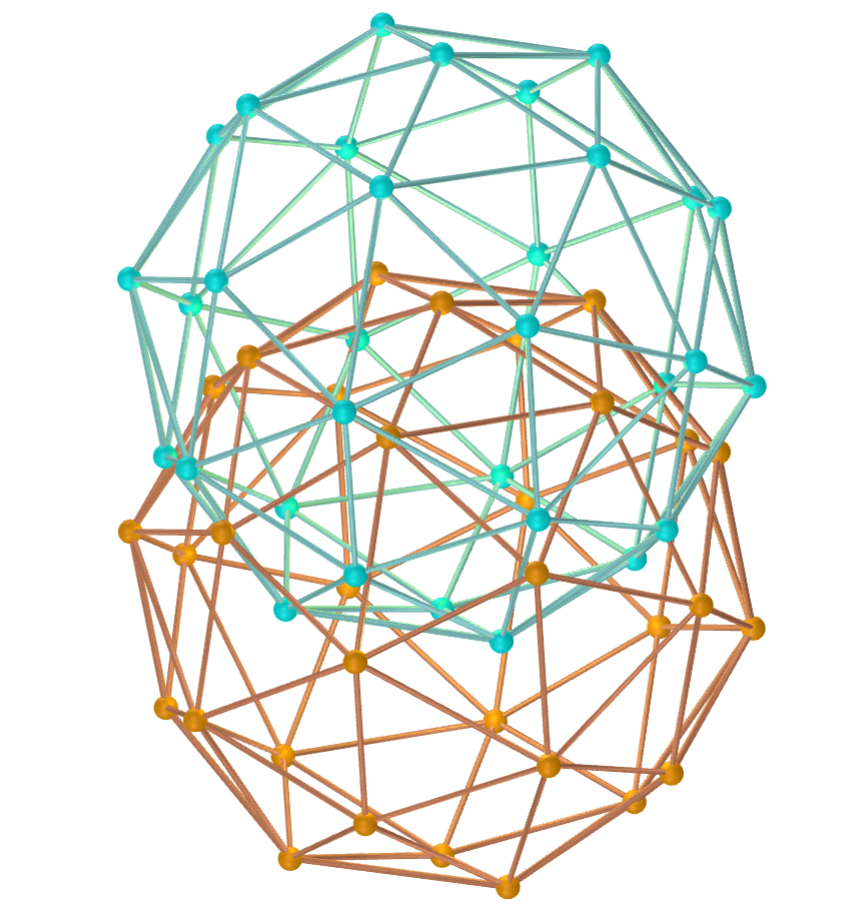
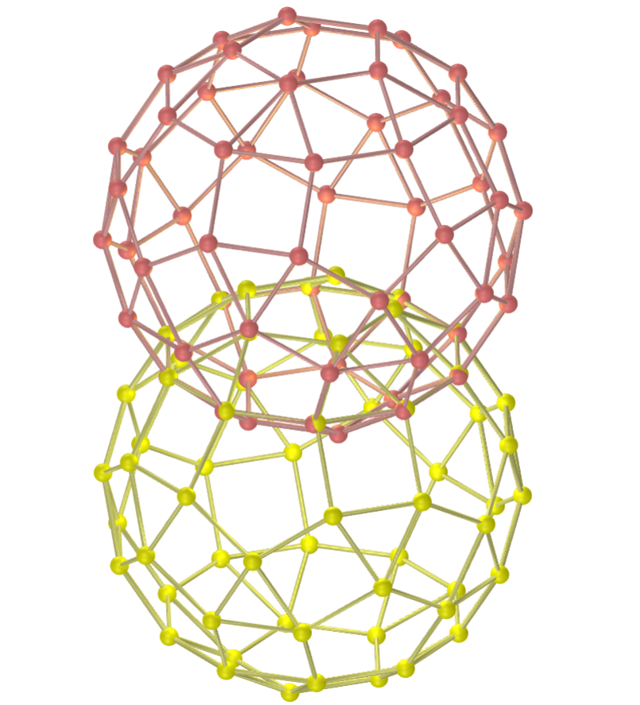
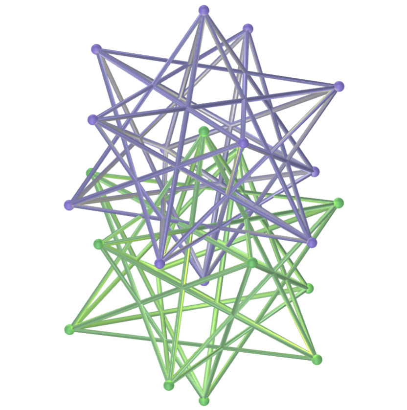
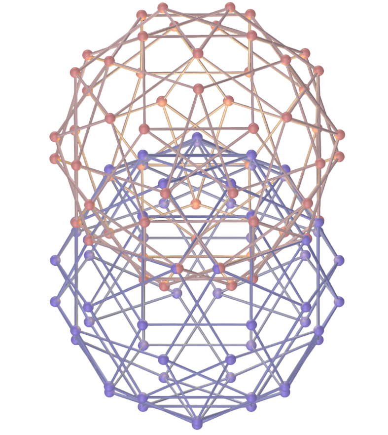
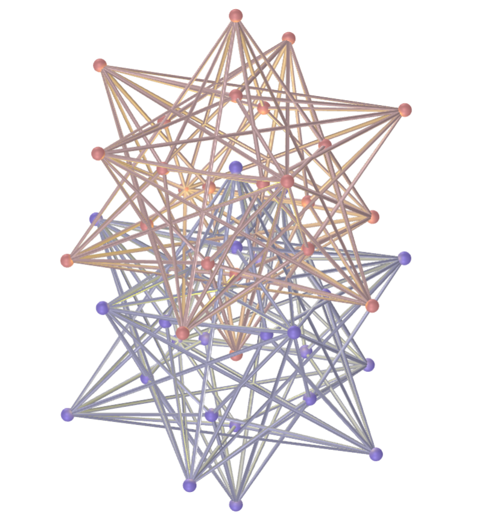
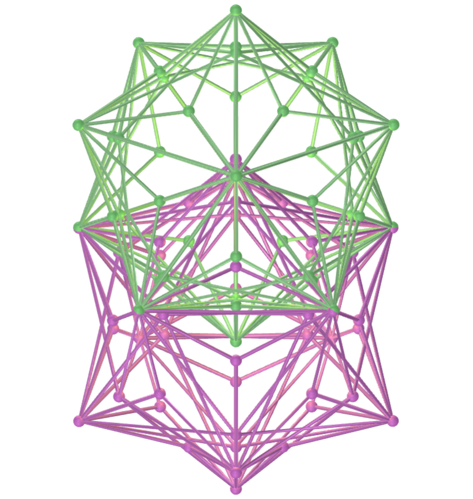

<link rel="stylesheet" href="../scripts/style.css">
<meta charset="utf-8">

<link rel="icon" type="image/png" href="vr/salas/imagens/icone.png">
<h2>Visualization of Polyhedra with Virtual Reality (VR) in A-frame</h2>
 <b>author:</b> Paulo Henrique Siqueira - Universidade Federal do Paraná
  <b>contact:</b> <a href="#">paulohscwb@gmail.com</a>
  <a href="https://paulohscwb.github.io/polycompound/vesica/pt-br/">versão em português</a>
 <form style="margin: 0 auto; float:right; text-align:right; width:100%; margin-bottom:15px;">
	<select id="url" onchange="urlHandler(this.value)" style="color:royalblue;">
		<option disabled selected value>More solids:</option>
		<option value="../compounds1/">Tetrahedra family</option>
		<option value="../compounds2/">Cube family</option>
		<option value="../tetrahedra/">Tetrahedra packings</option>
		<option disabled value="../vesica/">Vesica piscis and Trinexus</option>
		<!--<option value="../compounds3/">Octahedra family</option>
		<option value="../compounds4/">Dodecahedra and icosahedra family 1</option>
		<option value="../compounds5/">Dodecahedra and icosahedra family 2</option>
		<option value="../compounds6/">Compounds of dual polyhedra</option>
		<option value="../compounds7/">Compounds of two polyhedra</option>-->
	</select>
</form>

  <h2 align="center"> Vesica piscis and Trinexus</h2>
The Vesica Trinexus is a geometric prototype created by Ramiro Franceschin based on a simple question: what happens if we take the Vesica piscis to its next three-dimensional octave?
 Instead of using the construction with two flat circles, two intersecting icosahedrons are used. This intersection generates the seed, the zero point of the construction. From there, the geometry expands into successive octaves.
 This work shows the polyhedral compositions that form the Vesica Trinexus, as well as some Vesica piscis constructions using polyhedrons, all modeled for viewing in Virtual Reality.

<a href="#m3d">3D Models</a>&nbsp;&nbsp;|&nbsp;&nbsp;<a href="../">Home</a>

 

<h3 id="m3d" align="center">3D models</h3>
<iframe width="560" height="315" style="max-width:100%" src="https://www.youtube.com/embed/videoseries?list=PLy0I_lGW8HxW93CJp4QohK8HrCzKgM7t4" title="YouTube video player" frameborder="0" allow="accelerometer; autoplay; clipboard-write; encrypted-media; gyroscope; picture-in-picture; web-share" allowfullscreen></iframe>
<h4>1. Vesica Trinexus: 1st octave</h4>

  Instead of using a construction with two flat circles, two intersecting icosahedrons are used to form the first stage of the Vesica Trinexus. This intersection of icosahedrons generates the seed, the zero point of the construction. From there, the geometry expands in successive octaves.
  

<h4>2. Vesica Trinexus: 2nd octave</h4>

  In the second octave of the Vesica Trinexus, truncated icosidodecahedrons appear, along with an equatorial belt of cubes. This arrangement resembles a system of 12 centers or chakras around a 13th central node, consistent with multiple symbolic traditions.
  

<h4>3. Vesica Trinexus: 3rd octave</h4>

  In the third octave of the Vesica Trinexus, antiprisms and pentagonal domes appear, resembling arrows that direct energy first toward the root and crown and finally back to the center. The pattern of these polyhedrons reveals a cycle of expansion and return.
  

<h4>4. Vesica Trinexus: 4th octave</h4>

  In the fourth octave of the Vesica Trinexus, antiprisms, pyramids, and pentagonal domes appear. The pattern of these polyhedrons reveals a cycle of expansion and return. The result is a geometry that:
 1. Integrates Platonic and Archimedean solids in harmonic progression;
 2. Suggests a three-dimensional energy system (12+1) that dialogues with traditions such as Kabbalah, Mayan symbolism, and the thought of Rudolf Steiner; and
 3. Shows how energy circulates in octaves: from the center to the poles and from the poles back to the center.
  

<h4>5. Vesica piscis with triakis icosahedrons</h4>

  The Vesica piscis is a geometric figure formed by the intersection of two circles with the same radius, where the center of each circle is located on the circumference of the other. In this adaptation, we have the Vesica piscis constructed with two triakis icosahedrons.
  

<h4>6. Vesica piscis with pentakis dodecahedrons</h4>

  The Vesica piscis is used in a variety of fields, including mathematics (the construction of an equilateral triangle), art, architecture, and symbolism, representing union, creation, and duality. In this adaptation, the Vesica piscis is constructed with two pentakis dodecahedrons.
  

<h4>7. Vesica piscis with rhombicosidodecahedrons</h4>

  The Vesica piscis can be found in architecture, such as in the arches and vaulted ceilings of Gothic cathedrals, and in artistic representations, such as the outlines of images of saints. In this adaptation, we have the Vesica piscis constructed with two rhombicosidodecahedrons.
  

<h4>8. Vesica piscis with rhombicuboctahedrons</h4>

  The Vesica Piscis symbol represents the creation of the universe and the origin of life from duality. In this adaptation, the Vesica Piscis is constructed with two rhombicuboctahedrons.
  

<h4>9. Vesica piscis with small stellated dodecahedrons</h4>

  The Vesica Piscis symbol represents the union of opposites: masculine and feminine, spiritual and material. In this adaptation, the Vesica Piscis is constructed with two small stellated dodecahedrons.
  

<h4>10. Vesica piscis with rhombidodecadodecahedrons</h4>

  The Vesica Piscis symbol represents the alchemical marriage in the search for spiritual wholeness. In this adaptation, the Vesica Piscis is constructed of two rhombidodecadodecahedrons.
  

<a href="#p1" class="topo">back to top</a>

<h4>11. Vesica piscis with small icosicosidodecahedrons</h4>

  The Vesica piscis is a geometric figure formed by the intersection of two circles with the same radius, where the center of each circle is located on the circumference of the other. In this adaptation, we have the Vesica piscis constructed with two small icosicosidodecahedrons.
  

<h4>12. Vesica piscis with dodecadodecahedrons</h4>

  The Vesica piscis is used in a variety of fields, including mathematics (the construction of an equilateral triangle), art, architecture, and symbolism, representing union, creation, and duality. In this adaptation, the Vesica piscis is constructed with two dodecadodecahedrons.
  

<h4>13. Vesica piscis with great icosicosidodecahedrons</h4>

  The Vesica piscis can be found in architecture, such as in the arches and vaulted ceilings of Gothic cathedrals, and in artistic representations, such as the outlines of images of saints. In this adaptation, we have the Vesica piscis constructed with two great icosicosidodecahedrons.
  

<h4>14. Vesica piscis with great icosidodecahedrons</h4>

  The Vesica Piscis symbol represents the creation of the universe and the origin of life from duality. In this adaptation, the Vesica Piscis is constructed with two great icosidodecahedrons.
  

<h4>15. Vesica piscis with truncated great dodecahedrons</h4>

  The Vesica Piscis symbol represents the union of opposites: masculine and feminine, spiritual and material. In this adaptation, the Vesica Piscis is constructed with two truncated great dodecahedrons.
  

 <h4>16. Vesica piscis with small stellapentakis dodecahedrons</h4>

  The Vesica Piscis symbol represents the alchemical marriage in the search for spiritual wholeness. In this adaptation, the Vesica Piscis is constructed of two small stellapentakis dodecahedrons.
  

<h4>17. Vesica piscis with great truncated icosidodecahedrons</h4>

  The Vesica piscis is a geometric figure formed by the intersection of two circles with the same radius, where the center of each circle is located on the circumference of the other. In this adaptation, we have the Vesica piscis constructed with two great truncated icosidodecahedrons.
  

<h4>18. Vesica piscis with snub icosidodecadodecahedrons</h4>

  The Vesica piscis is used in a variety of fields, including mathematics (the construction of an equilateral triangle), art, architecture, and symbolism, representing union, creation, and duality. In this adaptation, the Vesica piscis is constructed with two snub icosidodecadodecahedrons.
  

<h4>19. Vesica piscis with Möbius hexakis icosahedrons</h4>

  The Vesica Piscis symbol represents the creation of the universe and the origin of life from duality. In this adaptation, the Vesica piscis is constructed with two Möbius hexakis icosahedrons.
  

<h4>20. Vesica piscis with Möbius 10-akis dodecahedrons</h4>

  The Vesica piscis is a geometric figure formed by the intersection of two circles with the same radius, where the center of each circle is located on the circumference of the other. In this adaptation, the Vesica piscis is constructed with two Möbius 10-akis dodecahedrons.
  

<a href="#p1" class="topo">back to top</a>

<h4>21. Vesica piscis with small icosacronic hexecontahedrons</h4>

  The Vesica piscis is used in a variety of fields, including mathematics (the construction of an equilateral triangle), art, architecture, and symbolism, representing union, creation, and duality. In this adaptation, the Vesica piscis is constructed with two small icosacronic hexecontahedrons.
  

<h4>22. Vesica piscis with small dodecacronic hexecontahedrons</h4>

  The Vesica piscis can be found in architecture, such as in the arches and vaulted ceilings of Gothic cathedrals, and in artistic representations, such as the outlines of images of saints. In this adaptation, the Vesica piscis is constructed with two small dodecacronic hexecontahedrons.
  

<h4>23. Vesica piscis with small hexagonal hexecontahedrons</h4>

  The Vesica Piscis symbol represents the union of opposites: masculine and feminine, spiritual and material. In this adaptation, the Vesica piscis is constructed with two small hexagonal hexecontahedrons.
  

<h4>24. Vesica piscis with icositruncated dodecadodecahedrons</h4>

  The Vesica Piscis symbol represents the alchemical marriage in the search for spiritual wholeness. In this adaptation, the Vesica piscis is constructed with two icositruncated dodecadodecahedrons.
  

<h4>25. Vesica piscis with great truncated icosahedrons</h4>

  The Vesica piscis is used in a variety of fields, including mathematics (the construction of an equilateral triangle), art, architecture, and symbolism, representing union, creation, and duality. In this adaptation, the Vesica piscis is constructed with two great truncated icosahedrons.
  

<h4>26. Vesica piscis with truncated dodecadodecahedrons</h4>

  The Vesica Piscis symbol represents the creation of the universe and the origin of life from duality. In this adaptation, the Vesica piscis is constructed with two truncated dodecadodecahedrons.
  

<h4>27. Vesica piscis with small snub icosicosidodecahedrons</h4>

  The Vesica piscis is a geometric figure formed by the intersection of two circles with the same radius, where the center of each circle is located on the circumference of the other. In this adaptation, the Vesica piscis is constructed with two small snub icosicosidodecahedrons.
  

<h4>28. Vesica piscis with rhombicosidodecahedrons of kites</h4>

  The Vesica piscis is used in a variety of fields, including mathematics (the construction of an equilateral triangle), art, architecture, and symbolism, representing union, creation, and duality. In this adaptation, the Vesica piscis is constructed with two rhombicosidodecahedrons of kites.
  

<h4>29. Vesica piscis with rhombicuboctahedrons of kites</h4>

  The Vesica piscis can be found in architecture, such as in the arches and vaulted ceilings of Gothic cathedrals, and in artistic representations, such as the outlines of images of saints. In this adaptation, the Vesica piscis is constructed with two rhombicuboctahedrons of kites.
  

<h4>30. Vesica piscis with icosidodecahedrons</h4>

  The Vesica Piscis symbol represents the union of opposites: masculine and feminine, spiritual and material. In this adaptation, the Vesica piscis is constructed with two icosidodecahedrons.
  

<a href="#p1" class="topo">back to top</a>

<h4>31. Vesica piscis with icosidodecahedrons of kites</h4>

  The Vesica piscis is used in a variety of fields, including mathematics (the construction of an equilateral triangle), art, architecture, and symbolism, representing union, creation, and duality. In this adaptation, the Vesica piscis is constructed with two icosidodecahedrons of kites.
  

<h4>32. Vesica piscis with deltoidal hexecontahedrons</h4>

  The Vesica piscis can be found in architecture, such as in the arches and vaulted ceilings of Gothic cathedrals, and in artistic representations, such as the outlines of images of saints. In this adaptation, the Vesica piscis is constructed with two deltoidal hexecontahedrons.
  

<h4>33. Vesica piscis with disdyakis triacontahedrons</h4>

  The Vesica Piscis symbol represents the union of opposites: masculine and feminine, spiritual and material. In this adaptation, the Vesica piscis is constructed with two disdyakis triacontahedrons.
  

<h4>34. Vesica piscis with deltoidal icositetrahedrons</h4>

  The Vesica Piscis symbol represents the alchemical marriage in the search for spiritual wholeness. In this adaptation, the Vesica piscis is constructed with two deltoidal icositetrahedrons.
  

<h4>35. Vesica piscis with truncated icosahedrons</h4>

  The Vesica piscis is used in a variety of fields, including mathematics (the construction of an equilateral triangle), art, architecture, and symbolism, representing union, creation, and duality. In this adaptation, the Vesica piscis is constructed with two truncated icosahedrons.
  

<h4>36. Vesica piscis with snub cubes</h4>

  The Vesica Piscis symbol represents the creation of the universe and the origin of life from duality. In this adaptation, the Vesica piscis is constructed with two snub cubes.
  

<h4>37. Vesica piscis with truncated icosahedrons of kites</h4>

  The Vesica piscis is a geometric figure formed by the intersection of two circles with the same radius, where the center of each circle is located on the circumference of the other. In this adaptation, the Vesica piscis is constructed with two truncated icosahedrons of kites.
  

<h4>38. Vesica piscis with snub cubes of kites</h4>

  The Vesica piscis is used in a variety of fields, including mathematics (the construction of an equilateral triangle), art, architecture, and symbolism, representing union, creation, and duality. In this adaptation, the Vesica piscis is constructed with two snub cubes of kites.
  

<a href="#p1" class="topo">back to top</a>

  Polyhedral Compound - Vesica piscis and Trinexus: visualization with Virtual Reality by <a xmlns:cc="http://creativecommons.org/ns#" href="https://paulohscwb.github.io/polycompound/vesica/" property="cc:attributionName" rel="cc:attributionURL">Paulo Henrique Siqueira</a> is licensed with a license <a rel="license" href="http://creativecommons.org/licenses/by-nc-nd/4.0/">Creative Commons Attribution-NonCommercial-NoDerivatives 4.0 International</a>.

<h4>How to cite this work:</h4> 

Siqueira, P.H., "Polyhedral Compound - Vesica piscis and Trinexus: visualization with Virtual Reality". Available in: <https://paulohscwb.github.io/polycompound/vesica/>, October 2025.

<!---->
  <b>References:</b>
 Weisstein, Eric W. "Polyhedron Compound" From MathWorld-A Wolfram Web Resource. <a href="https://mathworld.wolfram.com/ArchimedeanDual.html" target="_blank">https://mathworld.wolfram.com/PolyhedronCompound.html</a>
 Pardesco. "Sacred Geometry Art, Symbols & Meanings". <a href="https://pardesco.com/blogs/news/sacred-geometry-art-symbols-meanings" target="_blank">https://pardesco.com/blogs/news/sacred-geometry-art-symbols-meanings</a>
 McCooey, David I. "Visual Polyhedra". <a href="http://dmccooey.com/polyhedra/" target="_blank">http://dmccooey.com/polyhedra/</a>
