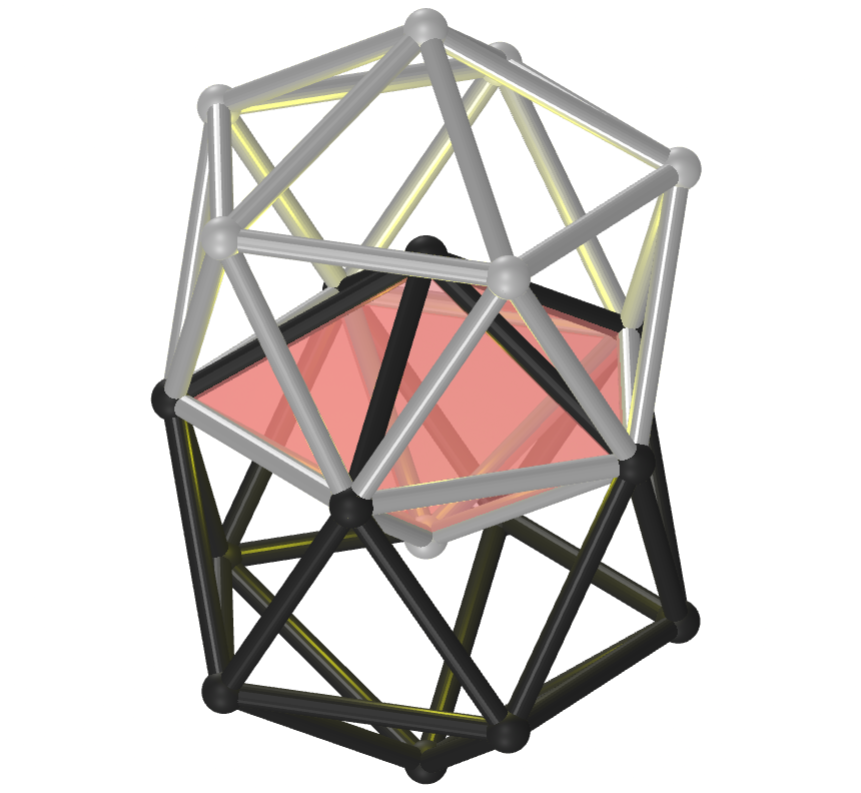
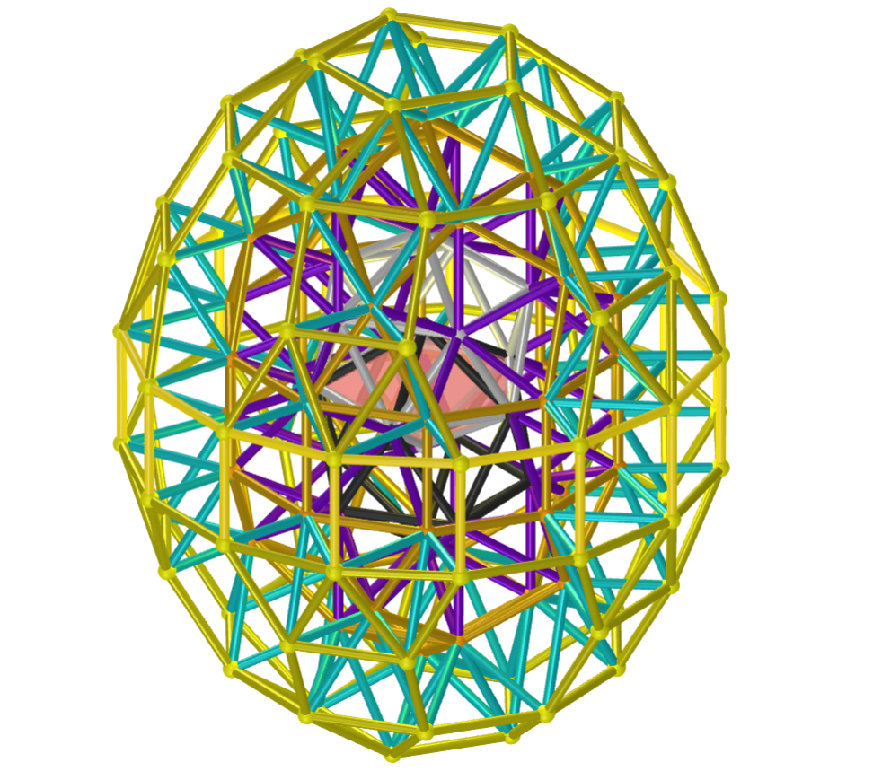
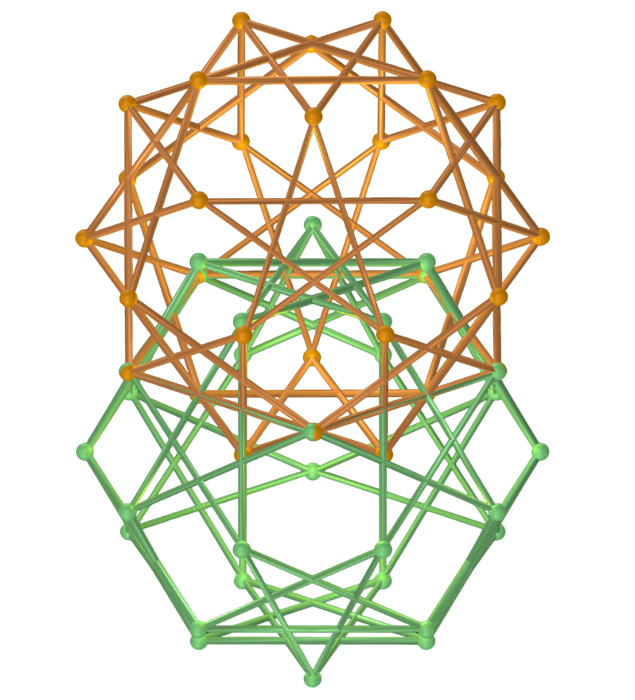
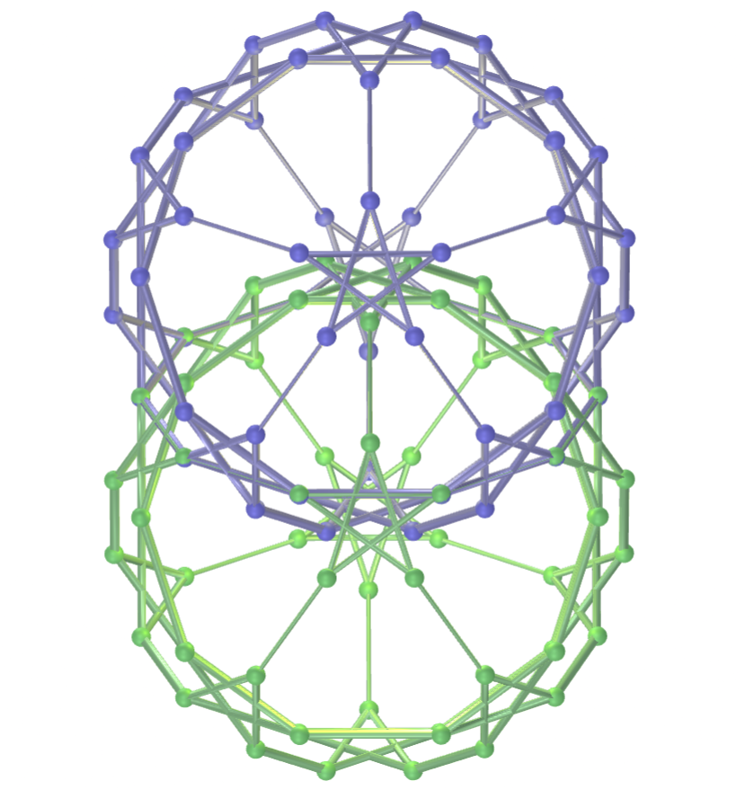
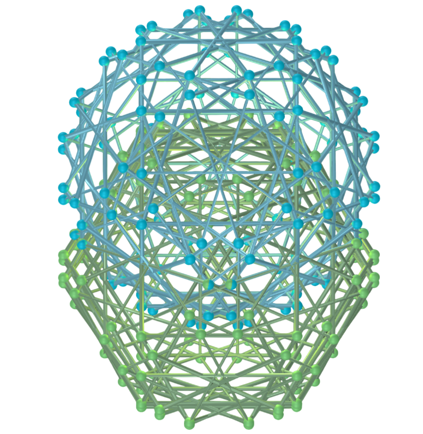
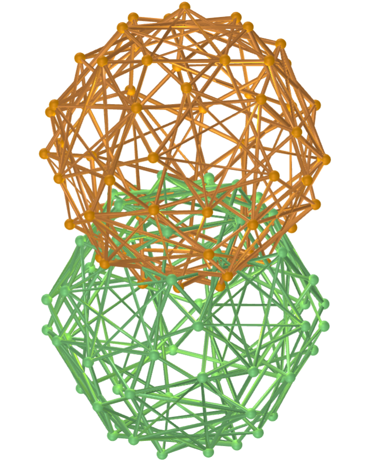

<link rel="stylesheet" href="../../scripts/style.css">
<meta charset="utf-8">

<link rel="icon" type="image/png" href="../vr/salas/imagens/icone.png">
<h2>Visualização de Poliedros com Realidade Virtual (RV) em A-frame</h2>
<b>autor:</b> Paulo Henrique Siqueira - Universidade Federal do Paraná
 <b>contato:</b> <a href="#"> paulohscwb@gmail.com </a>
 <a href="https://paulohscwb.github.io/polycompound/vesica/">english version</a>
<form style="margin: 0 auto; float:right; text-align:right; width:100%; margin-bottom:15px;">
	<select id="url" onchange="urlHandler(this.value)" style="color:royalblue;">
		<option disabled selected>Mais sólidos:</option>
		<option value="../../compounds1/pt-br/">Família dos tetraedros</option>
		<option value="../../compounds2/pt-br/">Família dos cubos</option>
		<option value="../../tetrahedra/pt-br/">Embalagens tetraédricas</option>
		<option disabled value="../../vesica/pt-br/">Vesica piscis e Trinexus</option>
		<!--<option value="../../compounds3/pt-br/">Família dos octaedros</option>
		<option value="../../compounds4/pt-br/">Família dos dodecaedros e icosaedros 1</option>
		<option value="../../compounds5/pt-br/">Família dos dodecaedros e icosaedros 2</option>
		<option value="../../compounds6/pt-br/">Compostos de poliedros duais</option>
		<option value="../../compounds7/pt-br/">Compostos de dois poliedros</option>-->
	</select>
</form>

  <h2 align="center"> Vesica piscis e Trinexus</h2>
  A Vesica Trinexus é um protótipo geométrico criado por Ramiro Franceschin a partir de uma inquietação simples: o que acontece se levarmos a Vesica piscis à sua próxima oitava tridimensional?
 Ao invés de utilizar a construção com dois círculos planos, são utilizados dois icosaedros intersectados. Essa interseção gera a semente, ponto zero da construção. A partir daí, a geometria se expande em oitavas sucessivas.
 Este trabalho mostra as composições de poliedros que formam a Vesica Trinexus, além de algumas construções de Vesica piscis utilizando poliedros, todos modelados para visualização em Realidade Virtual.
 
<a href="#m3d">Modelos 3D</a>&nbsp;&nbsp;|&nbsp;&nbsp;<a href="../../pt-br/">Página Inicial</a>

  

 

<h3 id="m3d" align="center">Modelos 3D</h3>
<!--<iframe width="560" height="315" style="max-width:100%" src="https://www.youtube.com/embed/videoseries?list=PLy0I_lGW8HxUBFOD4zwVl2mMkGU-phDxF" title="YouTube video player" frameborder="0" allow="accelerometer; autoplay; clipboard-write; encrypted-media; gyroscope; picture-in-picture; web-share" allowfullscreen></iframe>-->
<h4>1. Vesica Trinexus: 1&ordf; oitava</h4>

  Ao invés de utilizar a construção com dois círculos planos, são utilizados dois icosaedros intersectados para formar o primeiro estágio da Vesica Trinexus. Essa interseção de icosaedros gera a semente, ponto zero da construção. A partir daí, a geometria se expande em oitavas sucessivas.
  

<h4>2. Vesica Trinexus: 2&ordf; oitava</h4>

  Na segunda oitava da Vesica Trinexus surgem icosidodecaedros truncados, além de um cinturão equatorial de cubos. Nesse arranjo existe um padrão semelhante a um sistema de 12 centros ou chakras em torno de um 13&ordm; nó central, em coerência com múltiplas tradições simbólicas.
  

<h4>3. Vesica Trinexus: 3&ordf; oitava</h4>

  Na terceira oitava da Vesica Trinexus surgem antiprismas e cúpolas pentagonais, que parecem setas que orientam a energia primeiro em direção à raiz e à coroa e, finalmente, de volta ao centro.
  

<h4>4. Vesica Trinexus: 4&ordf; oitava</h4>

  Na quarta oitava da Vesica Trinexus surgem antiprismas, pirâmides e cúpolas pentagonais. O padrão destes poliedros revela um ciclo de expansão e retorno. O resultado é uma geometria que:
 1. Integra sólidos platônicos e arquimedianos em progressão harmônica;
 2. Sugere um sistema energético tridimensional (12+1) que dialoga com tradições como a Cabalá, o simbolismo maia e o pensamento de Rudolf Steiner; e
 3. Mostra como a energia circula em oitavas: do centro aos polos e dos polos de volta ao centro.
  

<h4>5. Vesica piscis com icosaedros triakis</h4>

  A Vesica piscis é uma figura geométrica formada pela interseção de dois círculos com o mesmo raio, onde o centro de cada círculo se localiza na circunferência do outro. Nesta adaptação, temos a Vesica piscis construída com dois icosaedros triakis. 
  

<h4>6. Vesica piscis com dodecaedros pentakis</h4>

  A Vesica piscis é utilizada em diversas áreas, como matemática (a construção do triângulo equilátero), arte, arquitetura e simbologia, representando a união, a criação e a dualidade. Nesta adaptação, temos a Vesica piscis construída com dois dodecaedros pentakis. 
  

<h4>7. Vesica piscis com rombicosidodecaedros</h4>

  A Vesica piscis pode ser encontrada na arquitetura, como em arcos e tetos abobadados de catedrais góticas, e em representações artísticas, como contornos de imagens de santos. Nesta adaptação, temos a Vesica piscis construída com dois rombicosidodecaedros. 
  

<h4>8. Vesica piscis com rombicuboctaedros</h4>

  O símbolo da Vesica piscis representa a criação do universo e a origem da vida a partir da dualidade. Nesta adaptação, temos a Vesica piscis construída com dois rombicuboctaedros. 
  

<h4>9. Vesica piscis com pequenos dodecaedros estrelados</h4>

  O símbolo da Vesica piscis representa a união de opostos: masculino e feminino, espiritual e material. Nesta adaptação, temos a Vesica piscis construída com dois pequenos dodecaedros estrelados. 
  

<h4>10. Vesica piscis com rombidodecadodecaedros</h4>

  O símbolo da Vesica piscis representa o casamento alquímico na busca pela totalidade espiritual. Nesta adaptação, temos a Vesica piscis construída com dois rombidodecadodecaedros.
  

<a href="#p1" class="topo">voltar ao topo</a>

<h4>11. Vesica piscis com pequenos icosicosidodecaedros</h4>

  A Vesica piscis é uma figura geométrica formada pela interseção de dois círculos com o mesmo raio, onde o centro de cada círculo se localiza na circunferência do outro. Nesta adaptação, temos a Vesica piscis construída com dois pequenos icosicosidodecaedros. 
  

<h4>12. Vesica piscis com dodecadodecaedros</h4>

  A Vesica piscis é uma figura geométrica formada pela interseção de dois círculos com o mesmo raio, onde o centro de cada círculo se localiza na circunferência do outro. Nesta adaptação, temos a Vesica piscis construída com dois dodecadodecaedros.
  

<h4>13. Vesica piscis com grandes icosicosidodecaedros</h4>

  A Vesica piscis é utilizada em diversas áreas, como matemática (a construção do triângulo equilátero), arte, arquitetura e simbologia, representando a união, a criação e a dualidade. Nesta adaptação, temos a Vesica piscis construída com dois grandes icosicosidodecaedros.
  

<h4>14. Vesica piscis com grandes icosidodecaedros</h4>

  A Vesica piscis pode ser encontrada na arquitetura, como em arcos e tetos abobadados de catedrais góticas, e em representações artísticas, como contornos de imagens de santos. Nesta adaptação, temos a Vesica piscis construída com dois grandes icosidodecaedros.
  

<h4>15. Vesica piscis com grandes dodecaedros truncados</h4>

  O símbolo da Vesica piscis representa a criação do universo e a origem da vida a partir da dualidade. Nesta adaptação, temos a Vesica piscis construída com dois grandes dodecaedros truncados.
  
 

<h4>16. Vesica piscis com pequenos dodecaedros stelapentakis</h4>

  O símbolo da Vesica piscis representa a união de opostos: masculino e feminino, espiritual e material. Nesta adaptação, temos a Vesica piscis construída com dois pequenos dodecaedros stelapentakis.
  

<h4>17. Vesica piscis com grandes icosidodecaedros truncados</h4>

  O símbolo da Vesica piscis representa o casamento alquímico na busca pela totalidade espiritual. Nesta adaptação, temos a Vesica piscis construída com dois grandes icosidodecaedros truncados.
  
 

 <h4>18. Vesica piscis com icosidodecadodecaedros snub</h4>

  A Vesica piscis é uma figura geométrica formada pela interseção de dois círculos com o mesmo raio, onde o centro de cada círculo se localiza na circunferência do outro. Nesta adaptação, temos a Vesica piscis construída com dois icosidodecadodecaedros snub.
  
 

<a href="#p1" class="topo">voltar ao topo</a>

  Polyhedral Compound - Vesica piscis and Trinexus: visualization with Virtual Reality de <a xmlns:cc="http://creativecommons.org/ns#" href="https://paulohscwb.github.io/polycompound/vesica/pt-br/" property="cc:attributionName" rel="cc:attributionURL">Paulo Henrique Siqueira</a> está licenciado com uma Licença <a rel="license" href="http://creativecommons.org/licenses/by-nc-nd/4.0/">Creative Commons Atribuição-NãoComercial-SemDerivações 4.0 Internacional</a>.

<h4>Como citar este trabalho:</h4> 

Siqueira, P.H., "Polyhedral Compound - Vesica piscis and Trinexus: visualization with Virtual Reality". Disponível em: <https://paulohscwb.github.io/polycompound/vesica/pt-br/>, Outubro de 2025.

<!---->
  <b>Referências:</b>
 Weisstein, Eric W. "Polyhedron Compound" From MathWorld-A Wolfram Web Resource. <a href="https://mathworld.wolfram.com/ArchimedeanDual.html" target="_blank">https://mathworld.wolfram.com/PolyhedronCompound.html</a>
 Pardesco. "Sacred Geometry Art, Symbols & Meanings". <a href="https://pardesco.com/blogs/news/sacred-geometry-art-symbols-meanings" target="_blank">https://pardesco.com/blogs/news/sacred-geometry-art-symbols-meanings</a>
 McCooey, David I. "Visual Polyhedra". <a href="http://dmccooey.com/polyhedra/" target="_blank">http://dmccooey.com/polyhedra/</a>
